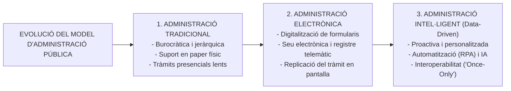
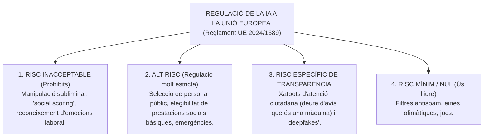
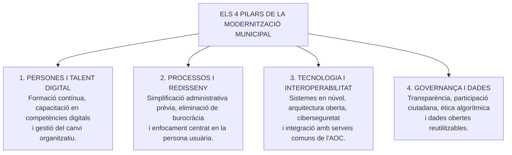

# Tema 21. El paper de les TIC en la modernització dels serveis públics. Impacte i potencial de les TIC en la gestió de l'Administració local: foment de l'eficàcia, l'eficiència i la innovació

> **Fonts normatives de referència:** [`CORPUS/Reglament_IA.pdf`](file:///home/oriol/Projectes/OPOS/CORPUS/Reglament_IA.pdf) (Reglament UE 2024/1689 sobre Intel·ligència Artificial), [`CORPUS/40_2015.pdf`](file:///home/oriol/Projectes/OPOS/CORPUS/40_2015.pdf) (Arts. 3 i 157) i Directiva (UE) 2019/1024.

---

## 1. La Transformació Digital de les Administracions Públiques Locals

La incorporació de les **Tecnologies de la Informació i la Comunicació (TIC)** a l'Administració local no és un simple canvi tecnològic de suport (passar del paper al document electrònic en PDF), sinó una **transformació estructural, organitzativa i cultural** profunda del model de gestió pública municipal.

---

## 2. Impacte i Potencial de les TIC en la Gestió Local

L'aplicació de les TIC en l'àmbit dels governs locals incideix directament en els principis d'**eficàcia**, **eficiència** i **innovació**:

### 2.1. Foment de l'Eficàcia i l'Agilitat Administrativa
1. **Reducció dràstica de terminis de tramitació:** L'eliminació del transport físic d'expedients i la tramitació simultània per múltiples departaments agilitza la resolució d'expedients.
2. **Disponibilitat 24/7/365:** La ciutadania pot presentar sol·licituds, consultar l'estat dels seus expedients o descarregar certificats en qualsevol moment i des de qualsevol lloc.
3. **El Principi de «Només una vegada» (*Once-Only Principle*):** Gràcies a la interoperabilitat, la ciutadania no ha d'aportar documents ni dades que ja estiguin en poder de qualsevol administració pública (padró, hisenda, seguretat social, títols acadèmics).

---

### 2.2. Foment de l'Eficiència i l'Optimització de Recursos
1. **Estalvi directe de costos materials:** Reducció radical del consum de paper, impressió, espai físic d'arxiu i despeses postals mitjançant la notificació electrònica.
2. **Automatització Robòtica de Processos (RPA - Robotic Process Automation):**
   - Execució mitjançant *bots* de programari de tasques repetitives i basades en regles predefinides sense valor afegit (ex. emissió automàtica de volants d'empadronament, comprovació d'estar al corrent de deutes tributaris, creuament de factures amb albarans).
   - Allibera els treballadors públics de tasques mecàniques perquè puguin dedicar el seu temps a l'atenció ciutadana directa, l'assessorament i la resolució de casos complexos.
3. **Gestió basada en Dades (*Data-Driven Administration*):**
   - Ús d'eines de **Business Intelligence (BI)** i quadres de comandament (*dashboards*) que permeten als responsables municipals monitoritzar en temps real els indicadors de gestió (temps mitjà de resolució de llicències, llistes d'espera en serveis socials, ocupació pressupostària) per a una presa de decisions objectiva.

---

## 3. La Intel·ligència Artificial a l'Administració Local (Reglament UE 2024/1689)

La **Intel·ligència Artificial (IA)** representa el salt cap a una administració local proactiva capaç d'anticipar necessitats ciutadanes (ex. concessió proactiva d'ajudes socials a famílies vulnerables sense sol·licitud prèvia, optimització de rutes de recollida de residus o manteniment predictiu d'enllumenat públic).

---

### 3.1. Requisits per als Sistemes d'IA d'Alt Risc en el Sector Públic
D'acord amb el Reglament (UE) 2024/1689, quan un ajuntament utilitzi sistemes d'IA en àmbits sensibles (accés a serveis socials, selecció d'empleats públics, gestió d'infraestructures crítiques), ha de garantir:
1. **Supervisió humana efectiva (*Human-in-the-loop*):** La decisió final que afecti drets de les persones mai no pot ser 100% autònoma de la màquina; sempre hi ha d'haver intervenció i control d'un funcionari responsable.
2. **Qualitat de les dades i absència de biaixos:** Els conjunts de dades d'entrenament han de ser representatius, pertinents i sotmesos a controls per evitar biaixos discriminatoris per raó de gènere, origen o edat.
3. **Transparència i explicabilitat (*White-box AI*):** L'algorisme ha de ser comprensible i ha de permetre explicar a la persona afectada quins criteris han portat a una determinada decisió o valoració.
4. **Ciberseguretat i robustesa:** Resistència davant d'errors i atacs informàtics.

---

## 4. Innovació Pública, Canvi Cultural i Governança

La modernització tecnològica no és viable sense una estratègia de transformació integral de les persones i l'organització municipal:

- **Innovació GovTech:** Col·laboració entre l'Ajuntament i empreses emergents (*startups*) tecnològiques per desenvolupar solucions digitals innovadores per als reptes municipals (mobilitat sostenible, eficiència energètica, gestió d'aforaments).
- **Inclusió digital i lluita contra la bretxa digital:** Obligació municipal d'oferir assistència i suport presencial a la ciutadania amb dificultats digitals (persones grans, col·lectius vulnerables) a través de l'Oficina d'Atenció Ciutadana (OAC) i la figura del funcionari habilitat.

---

## 5. Quadre Resum i Preguntes Típiques d'Examen Tipus Test

| Pregunta / Concepte Clau | Resposta Correcta / Trampa Freqüent |
| :--- | :--- |
| **Quina norma europea regula la Intel·ligència Artificial?** | El **Reglament (UE) 2024/1689** del Parlament Europeu i del Consell. |
| **Què és el principi 'Once-Only' (només una vegada)?** | La ciutadania **no està obligada a aportar documents o dades** que ja estiguin en poder de qualsevol Administració Pública. |
| **Què és l'RPA en la gestió pública?** | **Automatització Robòtica de Processos** (programari que executa tasques repetitives i basades en regles fixes). |
| **Com es qualifica la IA utilitzada en selecció de personal o serveis socials?** | Com a sistema d'**Alt Risc** segons el Reglament UE 2024/1689. |
| **Què exigeix el principi de supervisió humana (*human-in-the-loop*)?** | Que les decisions administratives d'alt risc **han de ser supervisades i validades per una persona humana responsable**. |
| **Què cal fer ABANS de digitalitzar un procediment administratiu?** | La **simplificació i redisseny del procés**, per evitar automatitzar ineficiències burocràtiques. |
| **Com es garanteix l'atenció als afectats per la bretxa digital?** | Mitjançant **canals presencials d'atenció assistida (OAC)** i funcionaris habilitats (Art. 12 Llei 39/2015). |
