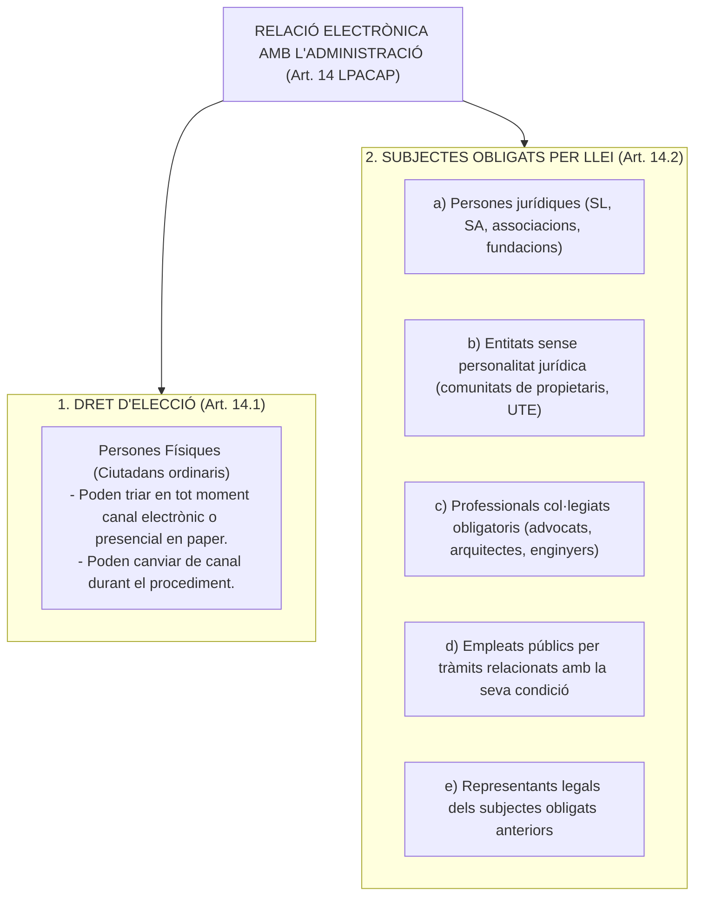
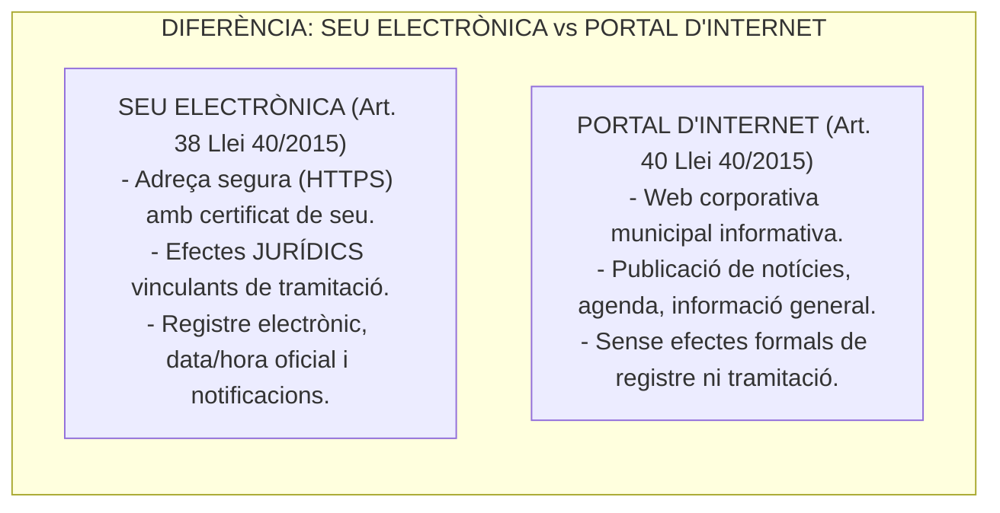
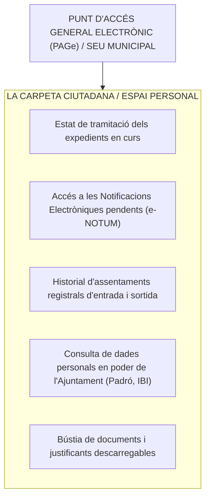

# Tema 22. Accés electrònic dels ciutadans als serveis públics. El dret dels ciutadans a relacionar-se amb les administracions públiques per mitjans electrònics. Règim jurídic de l'administració electrònica. Seu electrònica

> **Fonts normatives de referència:** [`CORPUS/39_2015.pdf`](file:///home/oriol/Projectes/OPOS/CORPUS/39_2015.pdf) (Arts. 12, 13, 14, 16, 41-43, 68), [`CORPUS/40_2015.pdf`](file:///home/oriol/Projectes/OPOS/CORPUS/40_2015.pdf) (Arts. 38 a 46) i Reial Decret 203/2021, pel qual s'aprova el Reglament d'actuació i funcionament del sector públic per mitjans electrònics.

---

## 1. El Dret i l'Obligació de Relacionar-se Electrònicament (Art. 14 Llei 39/2015)

L'article 14 de la Llei 39/2015 (LPACAP) estableix la distinció fonamental entre els subjectes que tenen el **dret d'opció** i els subjectes que estan **legalment obligats** a tramitar per via exclusivament electrònica:

---

### 1.1. Conseqüència de la Presentació Presencial per un Subjecte Obligat (Art. 68.4 LPACAP)
- Si un subjecte obligat a relacionar-se electrònicament (o el seu representant) presenta una sol·licitud o document presencialment en paper a l'OAC, l'Administració l'ha de **requerir perquè l'esmeni mitjançant la presentació per via electrònica**.
- ⚠️ **Regla fonamental d'examen:**  
  A tots els efectes legals, **es considera com a data de presentació de la sol·licitud la data en què s'hagi produït l'esmena electrònica**, i NO pas la data de la presentació inicial en paper.

---

### 1.2. Assistència en l'Ús de Mitjans Electrònics i Funcionaris Habilitats (Art. 12 LPACAP)
- Les administracions han de garantir que les persones físiques no obligades puguin ser assistides per a la seva tramitació electrònica.
- Si un ciutadà no disposa de mitjans electrònics d'identificació o signatura, la seva identificació o signatura electrònica pot ser vàlidament efectuada per un **funcionari públic habilitat** mitjançant el sistema de signatura del qual disposi la corporació, previ consentiment exprés de l'interessat.
- Cada administració manté un **Registre de Funcionaris Habilitats (RFH)** actualitzat.

---

## 2. La Seu Electrònica (Arts. 38 i 39 Llei 40/2015 i RD 203/2021)

La **Seu Electrònica** és aquella adreça electrònica, disponible per a la ciutadania a través de xarxes de telecomunicacions, la titularitat de la qual correspon a una Administració Pública, o bé a una o diversos organismes públics o entitats de dret públic en l'exercici de les seves competències.

---

### 2.1. Contingut Mínim Obligatori de la Seu Electrònica (Art. 11 RD 203/2021)
Tota seu electrònica municipal ha de posar a disposició de la ciutadania com a mínim:
1. **Identificació de la seu:** Indicació de l'adreça electrònica i de l'òrgan o entitat titular (Ajuntament).
2. **Identificació segura:** Enllaç per a la comprovació de la validesa del **Certificat de Seu Electrònica**.
3. **Data i hora oficials:** Sincronitzades amb el Reial Institut i Observatori de l'Armada (ROA).
4. **Calendari de dies inhàbils:** Calendari oficial aplicable al municipi a efectes del còmput de terminis.
5. **Catàleg de tràmits i serveis:** Relació exhaustiva de procediments disponibles amb la informació sobre terminis, silenci i requisits.
6. **Relació de sistemes d'identificació i signatura admesos:** Certificats qualificats, sistemes de clau concertada (*idCAT Mòbil*, *Cl@ve*).
7. **Accés al Registre Electrònic General:** Per a la presentació de documents 24 hores al dia.
8. **Bústia de queixes i suggeriments:** Canal de recepció de queixes relatives al servei.
9. **Tauler d'edictes electrònic (*e-TAULER*):** Per a la publicació d'actes que hagin de ser notificats per edicte.
10. **Avís d'interrupcions programades o no programades:** Informació sobre caigudes de servei o manteniment tècnic.

---

### 2.2. Interrupció no planificada del servei i ampliació de terminis (Art. 32.4 Llei 39/2015)
Quan una incidència tècnica a la seu electrònica municipal impossibiliti el funcionament ordinari del sistema i es produeixi una **interrupció no planificada durant el darrer dia d'un termini**, l'Administració ha de:
1. Publicar una incidència a la seu electrònica informant del succés.
2. **Disposar l'ampliació del termini pel temps que hagi durat la interrupció** (com a mínim fins a l'endemà hàbil).

---

## 3. El Punt d'Accés General electrònic (PAGe) i la Carpeta Ciutadana

- **Punt d'Accés General (PAGe):** Portal únic que facilita l'accés als serveis, tràmits i informació de l'Administració.
- **La Carpeta Ciutadana:** Àrea privada segura que garanteix a cada usuari la visió unificada de tots els seus procediments i relacions amb l'Ajuntament.

---

## 4. El Registre Electrònic General i l'Arxiu Únic

### 4.1. El Registre Electrònic General (Art. 16 Llei 39/2015)
- Cada Administració disposa d'un **únic Registre Electrònic General**, plenament interoperable amb la resta de registres del sector públic (SIR - Sistema d'Interconnexió de Registres / MUX de l'AOC).
- **Emissió automàtica del rebut de registre:** Tot assentament registral genera immediatament un **rebut oficial justificatiu** que conté:
  - Número de registre individualitzat.
  - Data i hora oficial de presentació.
  - Identificació del remitent i òrgan destinatari.
  - Relació de documents adjunts amb la seva respectiva empremta digital (*hash*).

---

### 4.2. L'Arxiu Electrònic Únic (Art. 46 Llei 40/2015)
- Cada Administració manté un **Arxiu Electrònic Únic** que emmagatzema tots els documents electrònics corresponents a procediments finalitzats.
- **Garanties de preservació:** Ha d'assegurar la seva **autenticitat, integritat, confidencialitat, traçabilitat, custòdia i conservació a llarg termini**, complint els estàndards de l'Esquema Nacional d'Interoperabilitat (ENI) i de l'Esquema Nacional de Seguretat (ENS).

---

## 5. Quadre Resum i Preguntes Típiques d'Examen Tipus Test

| Pregunta / Concepte Clau | Resposta Correcta / Trampa Freqüent |
| :--- | :--- |
| **Quins subjectes estan obligats a relacionar-se electrònicament?** | Les **persones jurídiques, entitats sense personalitat, professionals col·legiats i empleats públics** (Art. 14.2 LPACAP). |
| **Quina data computa si un obligat presenta la sol·licitud en paper?** | La **data en què es realitzi l'esmena electrònica**, NO pas la data de presentació en paper (Art. 68.4 LPACAP). |
| **Com s'identifica una Seu Electrònica davant la ciutadania?** | Mitjançant un **Certificat de Dispositiu Segur o Certificat de Seu Electrònica (protocol HTTPS)** (Art. 38 Llei 40/2015). |
| **Quina diferència hi ha entre seu electrònica i portal d'internet?** | La **Seu té efectes jurídics formals de tramitació i fefaença**, mentre que el Portal és merament informatiu. |
| **Què cal fer si la seu cau l'últim dia de termini per presentar una sol·licitud?** | L'Administració ha de **disposar l'ampliació del termini** pel temps equivalent (Art. 32.4 LPACAP). |
| **Quina informació conté obligatòriament el rebut de registre electrònic?** | Número de registre, data/hora oficials, remitent, destinatari i **empremta digital dels documents adjunts** (Art. 16.3 LPACAP). |
| **Qui pot signar electrònicament per un ciutadà sense certificat?** | Un **funcionari públic habilitat** inscrit al Registre de Funcionaris Habilitats, previ consentiment (Art. 12 LPACAP). |
