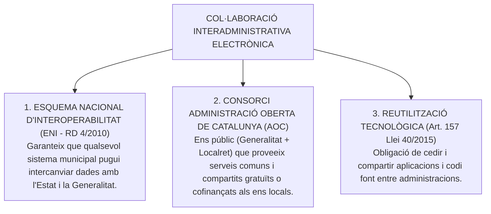
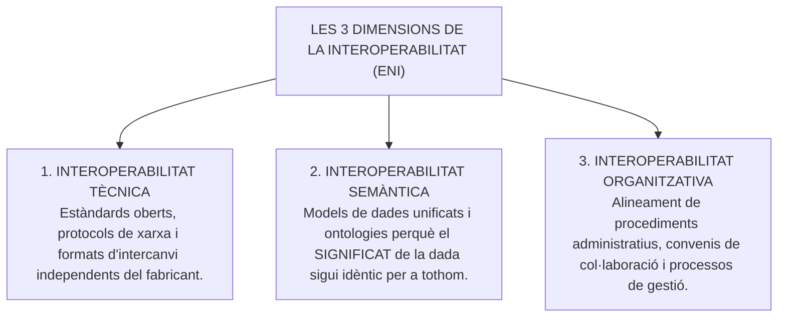
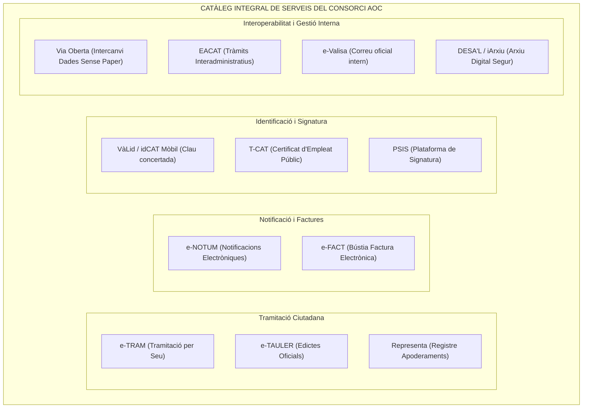

# Tema 23. Col·laboració interadministrativa i la integració amb serveis d'administració electrònica d'altres administracions. Infraestructura, serveis comuns i compartits. El Consorci d'Administració Oberta de Catalunya

> **Fonts normatives de referència:** [`CORPUS/ENI.pdf`](file:///home/oriol/Projectes/OPOS/CORPUS/ENI.pdf) (Reial Decret 4/2010, Esquema Nacional d'Interoperabilitat - ENI), [`CORPUS/40_2015.pdf`](file:///home/oriol/Projectes/OPOS/CORPUS/40_2015.pdf) (Arts. 155 a 158) i Llei 29/2010, de l'ús dels mitjans electrònics al sector públic de Catalunya.

---

## 1. El Marc de Col·laboració Tecnològica Interadministrativa

La transformació digital de l'Administració local no és viable de forma aïllada per a cada municipi. Els articles 155 a 158 de la Llei 40/2015 imposen el deure de **cooperació, reutilització de solucions tecnològiques i transferència de programari** entre totes les administracions públiques per evitar la duplicitat de costos i garantir serveis interoperables a la ciutadania.

---

## 2. L'Esquema Nacional d'Interoperabilitat (ENI - RD 4/2010)

L'**Esquema Nacional d'Interoperabilitat (ENI)** estableix els criteris i directrius que han de seguir les administracions per permetre l'intercanvi segur i homogeni d'informació:

### 2.1. Normes Tècniques d'Interoperabilitat (NTI)
L'ENI es desplega a través de Normes Tècniques d'obligat compliment per a tots els ajuntaments:
- **NTI de Document Electrònic:** Estructura de fitxer (contingut, metadades mínimes obligatòries i signatura electrònica).
- **NTI d'Expedient Electrònic:** Índex electrònic signat que garanteix la integritat de tots els documents que formen l'expedient.
- **NTI de Digitalització de Documents:** Requisits tècnics (resolució mínima de 200 ppp, formats estàndard) per obtenir còpies electròniques autèntiques a partir de documents en paper.
- **NTI de Model de Dades per a l'intercanvi d'assentaments registrals (SICRES 3.0):** Permet enviar documents entre el registre municipal i qualsevol registre d'Espanya (a través del SIR).

---

## 3. El Consorci Administració Oberta de Catalunya (Consorci AOC)

### 3.1. Naturalesa, Missió i Composició
- **Què és?** És un consorci públic creat l'any 2002, integrat al **50% per la Generalitat de Catalunya** i al **50% pel Consorci Localret** (en representació dels ajuntaments, diputacions i consells comarcals catalans).
- **Missió:** Liderar la transformació digital dels governs locals de Catalunya, oferint serveis comuns d'administració electrònica d'alta disponibilitat que estalvien als municipis haver de desenvolupar plataformes individuals costoses.

---

## 4. Anàlisi Detallada dels Serveis Comuns de l'AOC

| Servei AOC | Funció Principal i Característiques Operatives | Àmbit d'Aplicació Municipal |
| :--- | :--- | :--- |
| **e-TRAM** | Mòdul de tramitació electrònica ciutadana integrat a la Seu. Permet presentar instàncies genèriques i formularis específics (obres menors, guals, ajuts) des de qualsevol dispositiu. | Atenció ciutadana i finestreta digital 24/7. |
| **e-NOTUM** | Plataforma d'emissió i gestió de **notificacions electròniques fefaents**. Envia un avís per SMS i correu electrònic a l'interessat; genera evidències fefaents d'acceptació o rebuig (termini de 10 dies naturals). | Actes administratius, decrets d'alcaldia i resolucions sancionadores. |
| **e-FACT** | Punt general d'entrada de **factures electròniques** de les administracions catalanes (en format *Facturae*), interconnectat amb el punt estatal FACe. | Recepció i registre automàtic de factures de proveïdors. |
| **Via Oberta** | Plataforma d'interoperabilitat que permet a l'Ajuntament **consultar telemàticament dades ciutadanes** en poder d'altres organismes (AEAT, Seguretat Social, Cadastre, DGT, títols educatius) per aplicar el principi *Once-Only*. | Tramitació de beques, llicències i subvencions sense demanar certificats en paper. |
| **EACAT** | Extranet de les Administracions Catalanes. Plataforma per a la **tramitació electrònica interadministrativa** entre ajuntaments, consells comarcals, diputacions i departaments de la Generalitat. | Tramitació de subvencions de la Generalitat, trameses de convenis i enviaments d'actes del Ple. |
| **e-TAULER** | Tauler electrònic oficial d'edictes i anuncis públics de l'Ajuntament amb signatura electrònica i segell de temps que garanteix la integritat i el període d'exposició pública. | Exposició d'ordenances, aprovació de pressupostos, llistes d'admesos a oposicions. |
| **Representa** | Registre electrònic d'apoderaments compartit per a tot el sector públic de Catalunya. Permet inscriure i consultar poders de representació administrativa de persones físiques o jurídiques. | Validació automàtica de la capacitat de representants legals en tràmits municipals. |
| **idCAT Mòbil / VàLid** | Passarel·la d'autenticació i signatura no criptogràfica basada en codi d'un sol ús via SMS (OTP) que no requereix instal·lar cap programari ni certificat previ. | Identificació i signatura àgil per a la ciutadania des del telèfon mòbil. |
| **T-CAT** | Certificat digital en targeta criptogràfica (*Smart Card*) o en programari per a electes i empleats públics de les administracions catalanes. | Signatura de decrets d'alcaldia, informes tècnics, actes del Ple i propostes. |
| **DESA'L / iArxiu** | Plataforma de preservació i custòdia digital d'arxiu electrònic a llarg termini segons l'ENI. | Conservació permanent i arxiu d'expedients municipals finalitzats. |

---

## 5. Quadre Resum i Preguntes Típiques d'Examen Tipus Test

| Pregunta / Concepte Clau | Resposta Correcta / Trampa Freqüent |
| :--- | :--- |
| **Quins organismes integren el Consorci AOC?** | La **Generalitat de Catalunya (50%)** i el **Consorci Localret (50%)**. |
| **Quina norma regula l'Esquema Nacional d'Interoperabilitat?** | El **Reial Decret 4/2010 (ENI)**. |
| **Quines són les 3 dimensions de la interoperabilitat a l'ENI?** | **Tècnica, Semàntica i Organitzativa**. |
| **Quin servei de l'AOC permet consultar dades d'altres administracions sense demanar papers?** | **Via Oberta** (aplicació del principi *Once-Only*). |
| **Quin servei de l'AOC gestiona la recepció de factures electròniques?** | **e-FACT** (connectat amb el punt general FACe). |
| **Quin servei permet la tramitació electrònica entre ajuntaments i la Generalitat?** | **EACAT** (Extranet de les Administracions Catalanes). |
| **Quin és el sistema d'identificació ciutadana per SMS de l'AOC?** | **idCAT Mòbil** (integrat dins la passarel·la *VàLid*). |
| **Quin servei de l'AOC gestiona el registre electrònic d'apoderaments?** | **Representa**. |
