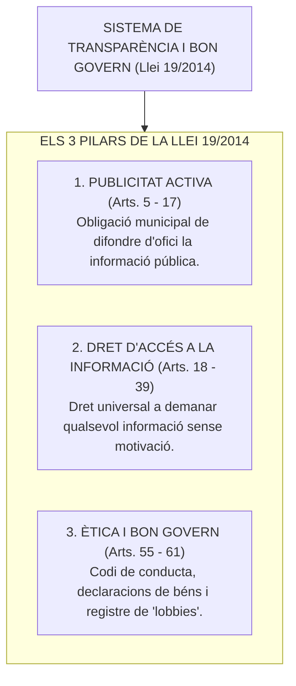
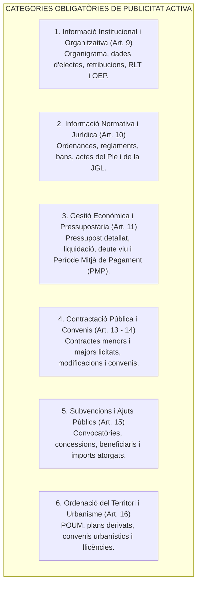
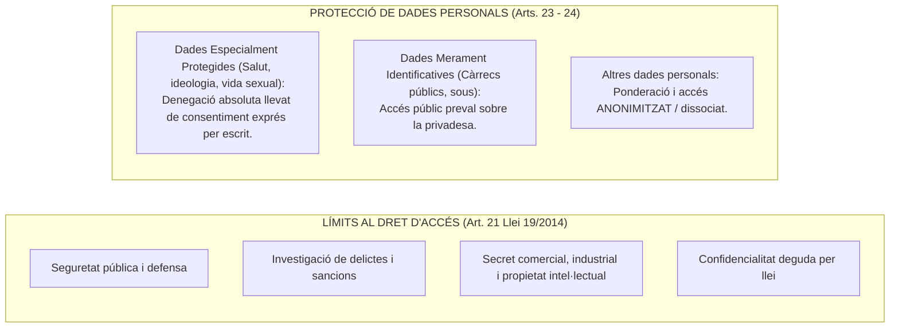
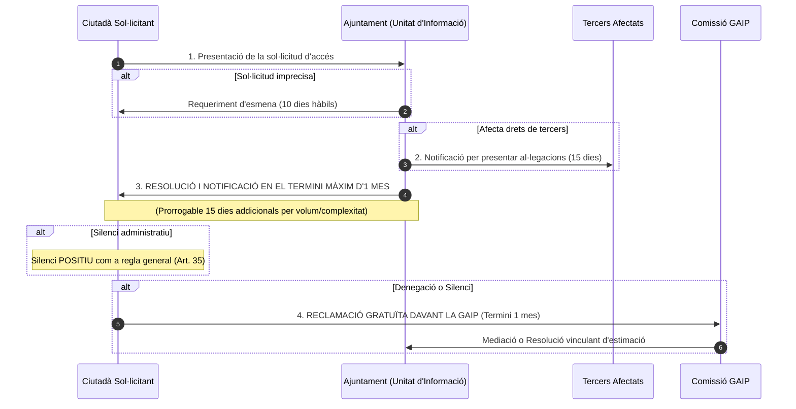

# Tema 24. Ètica pública, accés a la informació pública i bon govern. El portal de transparència. Adaptació dels sistemes d'informació per a la difusió i l'accés a la informació administrativa

> **Font normativa de referència:** [`CORPUS/Transparencia.pdf`](file:///home/oriol/Projectes/OPOS/CORPUS/Transparencia.pdf)  
> **Text:** Llei 19/2014, del 29 de desembre, de transparència, accés a la informació pública i bon govern de Catalunya. Text consolidat.

---

## 1. Objecte, Principis i Àmbit Subjectiu (Arts. 1 a 4 Llei 19/2014)

La **Llei 19/2014** de Catalunya té per objecte regular i garantir la **transparència** de l'activitat pública, el **dret d'accés** de la ciutadania a la informació i la documentació públiques, i establir els principis d'**ètica pública i bon govern** que han de guiar els càrrecs electes i empleats públics.

- **Subjectes obligats (Art. 3):** L'Administració de la Generalitat, tots els **Ajuntaments i entitats locals de Catalunya**, organismes autònoms, societats municipals 100% públiques, fundacions públiques, i persones privades que percebin subvencions públiques de més de 100.000 € anuals.

---

## 2. La Publicitat Activa i el Portal de Transparència (Arts. 5 a 17)

La **publicitat activa** és l'obligació dels ajuntaments de publicar de forma permanent, actualitzada, accessible, entenedora i en formats reutilitzables la informació pública rellevant als seus portals web.

---

### 2.1. Adaptació dels Sistemes d'Informació Municipals
- **Portal de Transparència (Art. 5):** Espai digital estructurat (habitualment gestionat mitjançant el servei *Seu-e i Transparència* del Consorci AOC).
- **Criteris d'integració tècnica:**
  - Publicació periòdica automatitzada des dels sistemes de gestió municipal (ERP de comptabilitat, gestor d'expedients, perfil de contractant).
  - Cercadors avançats, metadades descriptives i navegació intuïtiva.
  - Disponibilitat en **formats oberts i reutilitzables** (CSV, XML, JSON).

---

## 3. El Dret d'Accés a la Informació Pública (Arts. 18 a 39)

### 3.1. Titularitat i Característiques Fonamentals
- **Caràcter Universal (Art. 18):** Tenen dret a accedir a la informació pública totes les persones **a partir dels 16 anys**, a títol individual o en representació de qualsevol entitat.
- **Sense motivació:** El sol·licitant **NO té l'obligació de motivar la seva petició** ni d'acreditar cap interès personal directe (tot i que pot exposar els motius si ho desitja).
- **Gratuïtat:** La consulta d'informació i l'expedició per mitjans electrònics és **gratuïta** (només es poden cobrar taxes per l'expedició de còpies en paper o canvi de suport).

---

### 3.2. Límits del Dret d'Accés i Protecció de Dades (Arts. 21 a 24)

---

### 3.3. Causes d'Inadmissió de la Sol·licitud (Art. 29 Llei 19/2014)
L'Ajuntament pot inadmetre la sol·licitud motivadament únicament si:
- **a)** Es refereix a informació que es troba en **fase d'elaboració o a esborranys preparatoris**.
- **b)** Es tracta d'informació de consulta o de suport intern.
- **c)** Requereix una **tasca complexa de reelaboració prèvia** (quan no sigui possible extreure la informació mitjançant tractament informàtic ordinari).
- **d)** És una sol·licitud manifestament repetitiva o amb caràcter abusiu injustificat.

---

### 3.4. Procediment de Tramitació del Dret d'Accés (Arts. 26 a 35)

---

## 4. La Comissió de Garantia del Dret d'Accés (GAIP - Arts. 38 a 44)

- **Què és la GAIP?** És l'òrgan independent i col·legiat adscrit al Departament de la Presidència de la Generalitat que vetlla pel compliment de la Llei 19/2014 a Catalunya.
- **La Reclamació davant la GAIP (Art. 42):**
  - És un recurs administratiu **gratuït i potestatiu** que substitueix els recursos administratius ordinaris.
  - Termini d'interposició: **1 mes** des de la notificació de la resolució denegatòria o des que s'hagi produït el silenci.
  - Ofereix un procediment de **mediació voluntària** i, si no hi ha acord, dicta una **resolució vinculant** per a l'Ajuntament que esgota la via administrativa (impugnable només davant el Tribunal Superior de Justícia de Catalunya - TSJC).

---

## 5. Ètica Pública i Bon Govern (Arts. 55 a 61)

1. **Codi de Conducta:** Els ajuntaments han d'aprovar un Codi de Conducta per als alts càrrecs i regidors que fixi els estàndards de comportament ètic, integritat, imparcialitat i transparència.
2. **Conflictes d'Interessos:** Deure d'abstenció immediata en assumptes amb interès personal o familiar directe.
3. **Registre de Grups d'Interès (*Lobbies*):** Registre públic obligatori on s'han d'inscriure totes les empreses, associacions i consultores que vulguin reunir-se amb electes o directius municipals per influir en la presa de decisions o ordenances.

---

## 6. Quadre Resum i Preguntes Típiques d'Examen Tipus Test

| Pregunta / Concepte Clau | Resposta Correcta / Trampa Freqüent |
| :--- | :--- |
| **Quina edat mínima es requereix per demanar informació pública?** | **16 anys** (Art. 18 Llei 19/2014). |
| **Cal motivar la sol·licitud d'accés a la informació pública?** | **No**, la motivació no és necessària ni exigible (Art. 18.2 Llei 19/2014). |
| **Quin termini té l'Ajuntament per resoldre una sol·licitud d'accés?** | Com a màxim **1 mes** (prorrogable 15 dies per raons justificades) (Art. 33 Llei 19/2014). |
| **Quin sentit té el silenci administratiu en el dret d'accés?** | Com a regla general és **ESTIMATORI / POSITIU** (Art. 35 Llei 19/2014). |
| **Davant de quin òrgan es reclama la denegació d'informació pública a Catalunya?** | Davant la **Comissió de Garantia del Dret d'Accés a la Informació Pública (GAIP)** (Art. 38). |
| **Quin termini hi ha per interposar la reclamació davant la GAIP?** | **1 mes** des de la notificació de la resolució o des del silenci (Art. 42 Llei 19/2014). |
| **On s'inscriuen les entitats que fan gestió d'influència davant l'Ajuntament?** | Al **Registre de Grups d'Interès (*Lobbies*)** (Art. 45 Llei 19/2014). |
| **Es poden denegar dades sobre retribucions d'alts càrrecs per privadesa?** | **No**, la publicitat de retribucions públiques preval sobre la privadesa (Art. 24.1). |
