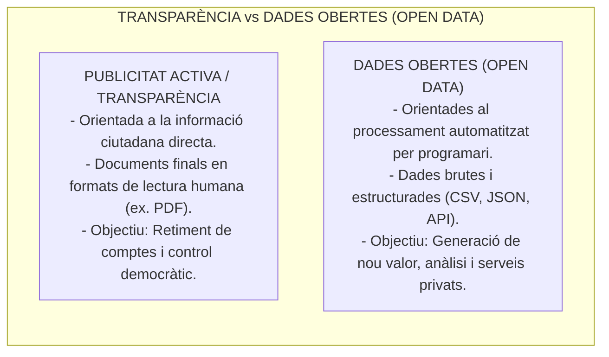
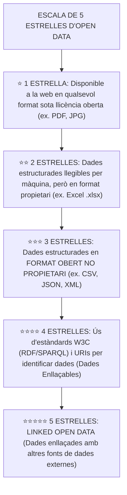
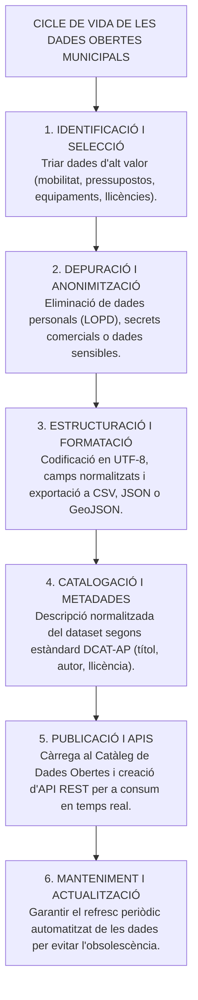
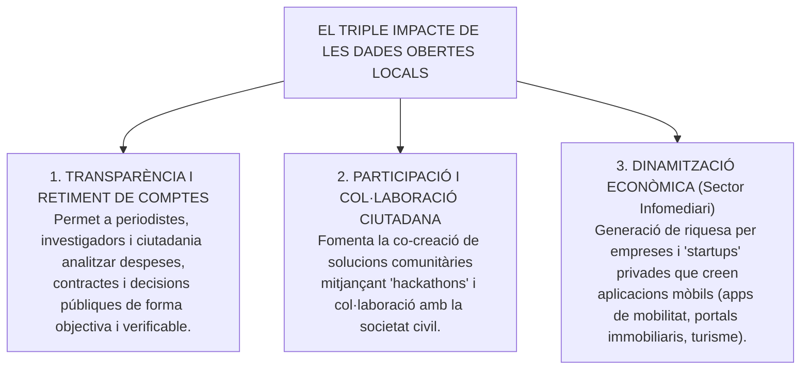

# Tema 25. El catàleg de dades obertes: creació d'un conjunt de dades obertes i com reutilitzar-los amb l'objectiu de fomentar la transparència, la participació i la generació d'activitat econòmica

> **Fonts normatives de referència:** Directiva (UE) 2019/1024 relativa a les dades obertes i la reutilització de la informació del sector públic, Llei 37/2007 de reutilització de la informació del sector públic, i [`CORPUS/Transparencia.pdf`](file:///home/oriol/Projectes/OPOS/CORPUS/Transparencia.pdf) (Llei 19/2014, Arts. 5 i 7).

---

## 1. Concepte i Fonaments de les Dades Obertes (Open Data)

Les **Dades Obertes (*Open Data*)** són aquelles dades digitals generades, recopilades o custodiades per les administracions públiques que es posen a disposició de la ciutadania i de les empreses en formats oberts, estructurats i llegibles per màquines, de manera que **poden ser lliurement utilitzades, reutilitzades, redistribuïdes i combinades** per a qualsevol finalitat (comercial o no comercial).

---

## 2. L'Escala de les 5 Estrelles de Dades Obertes (Tim Berners-Lee)

L'escala de cinc estrelles, formulada pel creador de la World Wide Web, mesura el grau de maduresa i reutilització d'un conjunt de dades públiques:

> 🎯 **Objectiu mínim per als ajuntaments:**  
> Tots els catàlegs municipals de dades obertes han d'assolir com a mínim el nivell de **3 estrelles (⭐⭐⭐)** (formats oberts com **CSV**, **JSON** o **GeoJSON**).

---

## 3. El Cicle de Vida per a la Creació d'un Conjunt de Dades Obertes

El procés tècnic i administratiu per publicar conjunts de dades (*datasets*) al portal de dades obertes municipal segueix sis fases successives:

---

### 3.1. Conjunts de Dades d'Alt Valor (*High-Value Datasets*)
D'acord amb la Directiva (UE) 2019/1024, les administracions han de prioritzar la publicació gratuïta i mitjançant **APIs (Interfícies de Programació d'Aplicacions)** de les següents categories de dades d'alt impacte:
1. **Dades geoespacials:** Cartografia municipal, xarxa viària, zones verdes, parcel·les cadastrals.
2. **Dades d'observació de la terra i medi ambient:** Qualitat de l'aire, estacions meteorològiques, nivells acústics, zones de baixes emissions (ZBE).
3. **Dades meteorològiques:** Precipitacions, temperatures, alertes climàtiques.
4. **Dades estadístiques:** Dades demogràfiques del padró d'habitants per edats i barris (anonimitzades).
5. **Dades sobre societats i propietat:** Registres de comerços, activitats econòmiques i empreses locals.
6. **Mobilitat i transport:** Posició en temps real d'autobusos urbans, ocupació d'aparcaments públics, parades de transport i talls de carrer.

---

## 4. Llicències d'Ús i Marc Jurídic de Reutilització

La reutilització de dades públiques es regeix per la **Llei 37/2007**. Perquè una dada sigui legalment oberta, ha d'anar acompanyada d'una llicència oberta reconeguda internacionalment:

| Tipus de Llicència | Condicions d'Ús | Permet ús comercial? |
| :--- | :--- | :---: |
| **Domini Públic (Creative Commons Zero - CC0)** | Lliure utilització sense cap restricció ni obligació d'atribució. | **Sí** |
| **Reconeixement (Creative Commons Attribution - CC-BY)** *(Model recomanat)* | Permet copiar, redistribuir, transformar i crear obres derivades per a qualsevol fi, amb l'**única obligació de citar l'origen de les dades (l'Ajuntament)**. | **Sí** |
| **Reconeixement - Compartir Igual (CC-BY-SA)** | Permet qualsevol ús sempre que les obres derivades es publiquin sota la mateixa llicència oberta. | **Sí** |

---

## 5. El Triple Impacte de les Dades Obertes

- **El Sector Infomediari:** Conjunt d'empreses que reutilitzen la informació generada pel sector públic per crear productes i serveis amb valor afegit (ex. aplicacions de rutes d'autobús en temps real, serveis de recomanació d'aparcament, plataformes d'estudis de mercat).

---

## 6. Quadre Resum i Preguntes Típiques d'Examen Tipus Test

| Pregunta / Concepte Clau | Resposta Correcta / Trampa Freqüent |
| :--- | :--- |
| **Quina és la diferència clau entre transparència i dades obertes?** | La transparència publica documents per a humans (PDF); les dades obertes publiquen **dades brutes estructurades per a màquines (CSV/JSON)**. |
| **Què caracteritza el nivell 3 estrelles d'Open Data?** | Dades estructurades en un **format obert no propietari (ex. CSV, JSON, XML)**. |
| **Què és una llicència CC-BY?** | Permet qualsevol ús (inclòs comercial) amb l'única condició de **citar la font (atribució)**. |
| **Com han de publicar-se les dades d'alt valor segons la UE?** | De forma **gratuïta, llegible per màquines i a través d'APIs**. |
| **Quina norma estatal regula la reutilització d'informació pública?** | La **Llei 37/2007**, de reutilització de la informació del sector públic. |
| **Què és el sector infomediari?** | Les empreses privades que **creguen productes i valor econòmic reutilitzant dades del sector públic**. |
| **Quina precaució és obligatòria abans de publicar un dataset?** | L'**anonimització i eliminació de dades de caràcter personal (LOPD/RGPD)**. |
