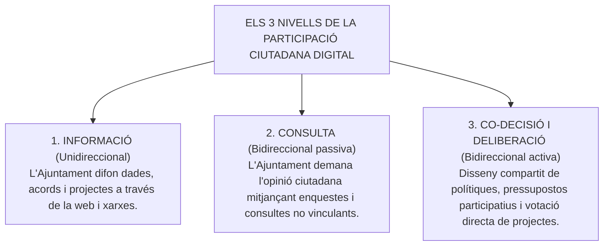
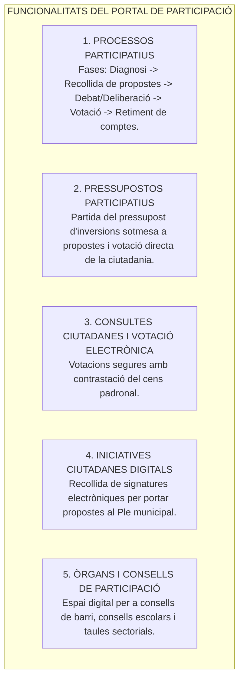
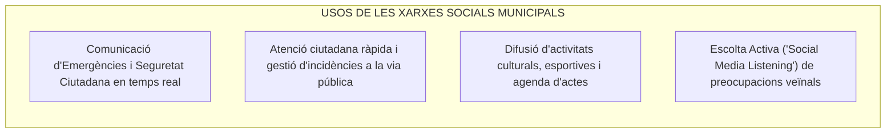

# Tema 26. Impacte de les TIC en l'àmbit de la vida democràtica. Els portals de participació i les xarxes socials com a eines de participació democràtica

> **Fonts normatives de referència:** [`CORPUS/LOPD.pdf`](file:///home/oriol/Projectes/OPOS/CORPUS/LOPD.pdf) (Llei Orgànica 3/2018 - LOPDGDD), [`CORPUS/Transparencia.pdf`](file:///home/oriol/Projectes/OPOS/CORPUS/Transparencia.pdf) (Llei 19/2014, Títol IV) i Reial Decret 1112/2018 sobre accessibilitat dels llocs web i aplicacions per a dispositius mòbils del sector públic.

---

## 1. L'Impacte de les TIC en la Vida Democràtica: La e-Democràcia

La transformació digital ha revolucionat la relació entre la ciutadania i l'Administració local, evolucionant des d'un model de democràcia purament representativa (basat exclusivament en el vot cada quatre anys) cap a un model de **Democràcia Deliberativa, Oberta i Participativa (*e-Democràcia*)**.

---

## 2. Els Portals de Participació Ciutadana i la Plataforma Decidim

Els **portals de participació ciutadana** són plataformes web interactives que institucionalitzen i ordenen els processos de diàleg, debat i presa de decisions compartides entre el consistori i el veïnatge.

A Catalunya i a nivell internacional, la plataforma pública de codi lliure de referència és **Decidim** (impulsada inicialment a Barcelona i adoptada per desenes de municipis catalans i diputacions).

---

### 2.1. Fases d'un Procés Participatiu Municipal
1. **Fase d'Informació i Diagnosi:** Publicació dels documents de partida, objectius i marc normatiu o pressupostari del projecte.
2. **Fase de Propostes:** La ciutadania (individualment o mitjançant entitats) presenta propostes d'actuació a través del portal.
3. **Fase de Deliberació i Validació Tècnica:** Debats presencials i virtuals; els serveis tècnics municipals avaluen la viabilitat jurídica, econòmica i competencial de les propostes.
4. **Fase de Votació / Priorització:** La ciutadania empadronada vota les propostes finalistes mitjançant identificació segura (*idCAT Mòbil*, padró).
5. **Fase de Retiment de Comptes (*Feedback*):** L'Ajuntament publica l'estat d'execució dels projectes guanyadors i justifica les propostes desestimades.

---

## 3. Les Xarxes Socials com a Eina de Comunicació i Participació

Les xarxes socials institucionals (Instagram, X/Twitter, Facebook, WhatsApp/Telegram, YouTube) permeten a l'Ajuntament establir un **canal directe, àgil i bidireccional** amb la comunitat local:

### 3.1. Bones Pràctiques i Guia d'Estil a les Xarxes Municipals:
- **Neutralitat institucional absoluta:** Els canals oficials representen la corporació en el seu conjunt i **no poden ser utilitzats per a missatges partidistes** ni per a la promoció política personal dels governants.
- **Llenguatge clar, accessible i inclusiu:** Ús preferent del català com a llengua d'ús institucional, amb redactat clar i suport multimèdia subtitulat.
- **Política de moderació transparent:** Publicació visible de les normes de convivència a les xarxes (prohibició d'insults, delictes d'odi, publicitat comercial o difusió de dades personals de tercers).

---

## 4. Garanties Democràtiques i Reptes de la Participació Digital

### 4.1. Accessibilitat Universal (Reial Decret 1112/2018)
Tots els portals de participació, seus electròniques i webs municipals han de complir obligatòriament els requisits d'**accessibilitat universal** basats en la norma europea EN 301 549 i les directrius **WCAG 2.1 (Nivell AA)** del W3C:
- **Perceptibilitat:** Textos alternatius per a imatges, subtítols en vídeos, contrast cromàtic suficient.
- **Operabilitat:** Navegació completa possible mitjançant teclat (sense necessitat de ratolí).
- **Comprensibilitat:** Textos clars, estructura lògica de pàgina i assistència davant d'errors en formularis.
- **Robustesa:** Compatibilitat amb lectors de pantalla per a persones cegues o amb baixa visió.

---

### 4.2. Inclusió Digital i Evitació de la Bretxa Digital
- **Principi d'Omnicanalitat:** La participació electrònica mai no pot ser l'única via de participació municipal; s'han de mantenir **tallers participatius presencials** i punts d'assistència digital a les biblioteques i a l'OAC perquè les persones grans o sense competències digitals no quedin excloses de la presa de decisions.

---

### 4.3. Protecció de Dades Personals i Privadesa (LO 3/2018 - LOPDGDD)
- **Minimització de dades:** En les consultes i votacions ciutadanes només s'han de recollir les dades estrictament necessàries per comprovar l'empadronament i evitar la duplicitat de vot.
- **Anonimització del vot:** Els sistemes de votació electrònica han de desacoblar de forma irreversible la identitat del votant respecte del sentit del seu vot per garantir el **secret del vot**.

---

## 5. Quadre Resum i Preguntes Típiques d'Examen Tipus Test

| Pregunta / Concepte Clau | Resposta Correcta / Trampa Freqüent |
| :--- | :--- |
| **Quins són els 3 nivells de participació ciutadana digital?** | **Informació, Consulta i Co-decisió / Deliberació activa**. |
| **Quina és la plataforma de codi obert de referència a Catalunya?** | La plataforma **Decidim**. |
| **Què són els pressupostos participatius?** | Un procés pel qual la ciutadania **proposa i vota directament el destí d'una part del pressupost d'inversions**. |
| **Quina norma regula l'accessibilitat web del sector públic?** | El **Reial Decret 1112/2018** (Directrius WCAG 2.1 Nivell AA). |
| **Com han d'actuar les xarxes socials municipals davant el debat polític?** | Amb **estricta neutralitat institucional**, sense contingut partidista. |
| **Com s'evita l'exclusió per bretxa digital en processos participatius?** | Combinant la via digital amb **canals presencials i punts d'assistència assistida**. |
| **Com es garanteix el secret del vot en una consulta electrònica?** | Mitjançant el **desacoblament i dissociació tecnològica entre la identitat del votant i el sentit del vot**. |
