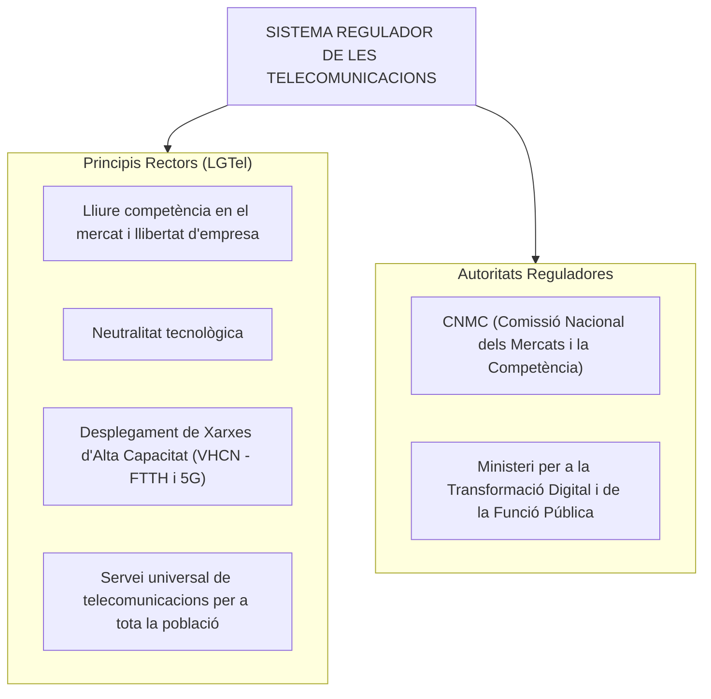
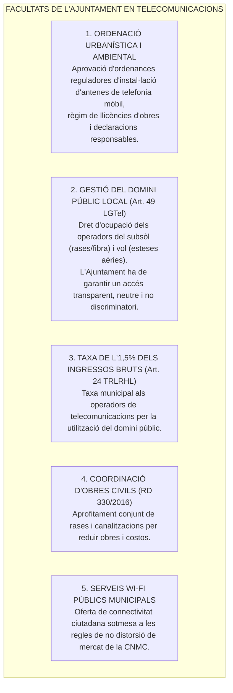
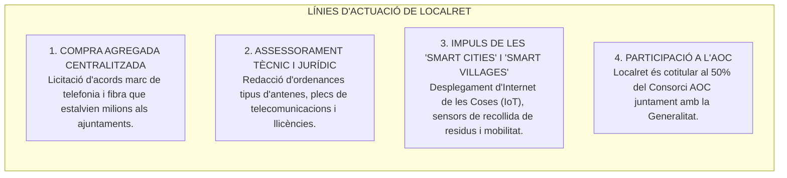
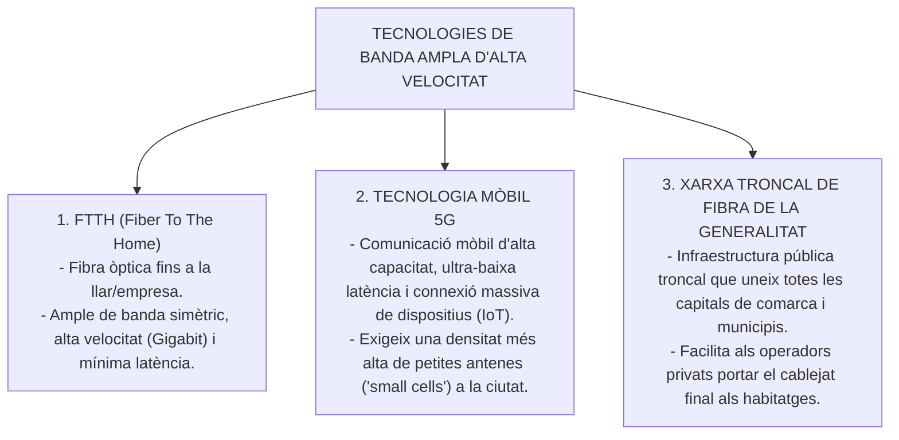

# Tema 27. Regulació del mercat de les telecomunicacions. El Consorci Localret. El marc d'actuació de les administracions públiques locals. Desplegament de xarxes de banda ampla territorials

> **Fonts normatives de referència:** Llei 11/2022, de 28 de juny, General de Telecomunicacions (LGTel), Reial Decret 330/2016 relatiu a mesures per reduir el cost del desplegament de les xarxes de comunicacions electròniques d'alta velocitat, i [`CORPUS/Hisenda.pdf`](file:///home/oriol/Projectes/OPOS/CORPUS/Hisenda.pdf) (Art. 24.1.c TRLRHL).

---

## 1. El Marc Regulador del Mercat de les Telecomunicacions (Llei 11/2022, LGTel)

El sector de les telecomunicacions està regulat a l'Estat espanyol per la **Llei 11/2022 (LGTel)**, que transposa la Directiva (UE) 2018/1972 (Codi Europeu de les Comunicacions Electròniques).

---

## 2. El Marc d'Actuació de les Administracions Locals (Ajuntaments)

Tot i que la legislació bàsica de telecomunicacions és competència exclusiva de l'Estat (**Art. 149.1.21a CE**), els ajuntaments juguen un paper clau en el territori com a titulars del domini públic local i autoritats urbanístiques i ambientals:

---

### 2.1. Condicions de la CNMC per a les Xarxes Wi-Fi Municipals
Quan un ajuntament ofereix serveis d'accés gratuït a Internet (Wi-Fi municipal en places, parcs, biblioteques o equipaments públics), ha de complir les directrius de la **Comissió Nacional dels Mercats i la Competència (CNMC)**:
- L'accés a l'interior d'edificis públics municipals és lliure i sense restriccions de velocitat.
- L'accés a la via pública i espais oberts ha d'estar concebut com a servei de cobertura bàsica i suport ciutadà, garantint que **no s'actua com a operador comercial competidor deslleial** de les operadores privades.

---

## 3. El Consorci Localret

### 3.1. Origen, Naturalesa i Missió
- **Què és?** El **Consorci Localret** és una entitat pública associativa creada l'any 1997 per les entitats municipalistes de Catalunya (Federació de Municipis de Catalunya - FMC i Associació Catalana de Municipis - ACM) que agrupa més de 800 ajuntaments catalans, consells comarcals i les 4 diputacions.
- **Objectiu:** Acompanyar i defensar els interessos dels governs locals en el desenvolupament de les telecomunicacions i la societat de la informació.

---

## 4. Desplegament de Xarxes de Banda Ampla Territorials

El desplegament de xarxes de banda ampla ultraràpida és essencial per a la cohesió social i territorial, evitant el despoblament rural i afavorint l'activitat econòmica local:

- **Objectiu europeu de la Dècada Digital 2030:** Cobertura del 100% de la població amb connectivitat de velocitat Gigabit i cobertura 5G a totes les zones poblades.

---

## 5. Quadre Resum i Preguntes Típiques d'Examen Tipus Test

| Pregunta / Concepte Clau | Resposta Correcta / Trampa Freqüent |
| :--- | :--- |
| **A qui correspon la competència legislativa bàsica en telecomunicacions?** | Exclusivament a l'**Estat** (Art. 149.1.21a CE i Llei 11/2022). |
| **Quina facultat té l'Ajuntament en el desplegament de xarxes?** | **L'ordenació de l'ús del sòl, llicències d'instal·lació d'antenes i gestió del domini públic**. |
| **Quina taxa cobren els ajuntaments a les operadores de telefonia mòbil?** | La taxa del **1,5% dels ingressos bruts de facturació** obtinguts al municipi (Art. 24.1.c TRLRHL). |
| **Què és el Consorci Localret?** | El consorci públic del **món local català per al desenvolupament de les telecomunicacions i compra agregada**. |
| **Qui són els socis fundadors del Consorci AOC?** | La **Generalitat de Catalunya (50%)** i el **Consorci Localret (50%)**. |
| **Què és una xarxa FTTH?** | Xarxa de **Fibra Òptica fins a la Llar** (*Fiber To The Home*). |
| **Quin organisme regula la lliure competència en telecomunicacions a Espanya?** | La **Comissió Nacional dels Mercats i la Competència (CNMC)**. |
