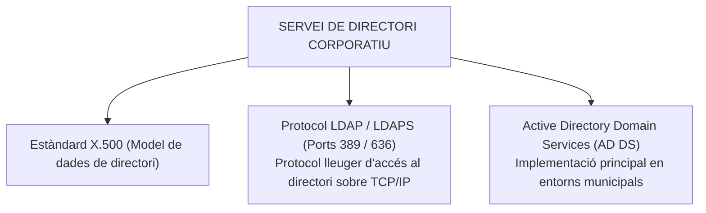
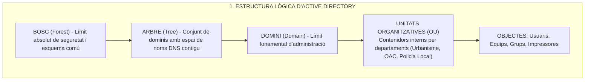
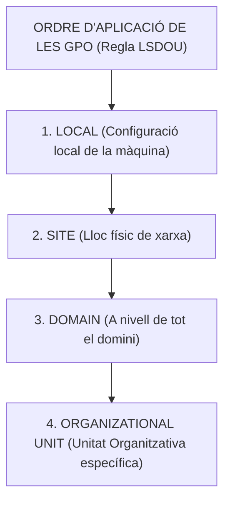
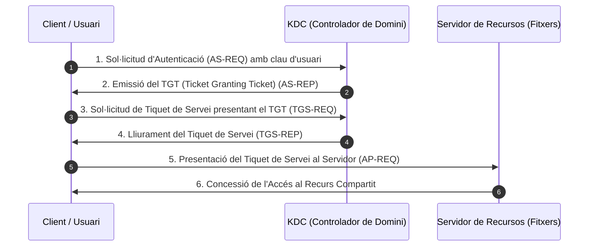
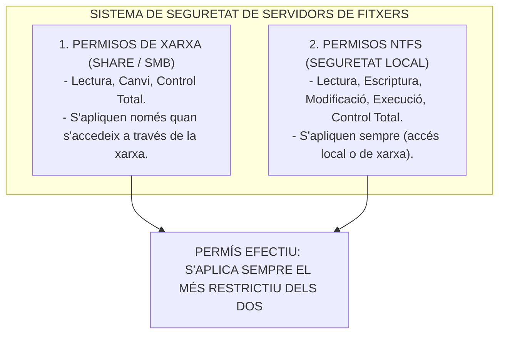

# Tema 28. Serveis de directoris actius i gestió de recursos

> **Fonts tècniques de referència:** Estàndards IETF (RFC 4511 per a LDAP, RFC 4120 per a Kerberos), arquitectura de sistemes Microsoft Active Directory Domain Services (AD DS) i [`CORPUS/ENS_2022.pdf`](file:///home/oriol/Projectes/OPOS/CORPUS/ENS_2022.pdf) (RD 311/2022, Mesures de control d'accés).

---

## 1. Concepte i Fonaments dels Serveis de Directori

Un **servei de directori** és una base de dades jeràrquica, distribuïda i altament optimitzada per a operacions de lectura que centralitza la informació, autenticació i gestió de tots els usuaris, grups, equips, servidors i recursos d'una xarxa corporativa municipal.

---

## 2. Arquitectura d'Active Directory Domain Services (AD DS)

L'Active Directory s'estructura en dos nivells: l'**estructura lògica** (com s'organitzen els recursos) i l'**estructura física** (com es distribueixen els servidors i xarxes):

---

### 2.1. Objectes i Tipus de Grups a l'Active Directory
- **Usuaris:** Comptes individuals d'inici de sessió de cada treballador públic.
- **Equips:** Ordinadors de sobretaula, portàtils i servidors membres del domini.
- **Tipus de Grups:**
  1. **Grups de Seguretat:** S'utilitzen per assignar permisos d'accés a carpetes, impressores i recursos compartits.
  2. **Grups de Distribució:** Utilitzats exclusivament per enviar llistes de correu electrònic (no admeten assignació de permisos).
- **Àmbits de Grup:** *Locals de domini*, *Globals* i *Universals*.
- **Metodologia AGDLP:** Bones pràctiques per assignar permisos:  
  $$\mathbf{A}\text{ccounts} \longrightarrow \mathbf{G}\text{lobal Groups} \longrightarrow \mathbf{D}\text{omain }\mathbf{L}\text{ocal Groups} \longrightarrow \mathbf{P}\text{ermissions}$$

---

### 2.2. Estructura Física i Rols Mestres d'Operacions (FSMO)
- **Controladors de Domini (DC - Domain Controllers):** Servidors que allotgen la base de dades del directori (`ntds.dit`) i executen el procés d'autenticació.
- **Llocs (Sites):** Agrupació de subxarxes IP físiques que defineixen seus interconnectades (Edifici consistorial, Policia Local, Biblioteca) per optimitzar el tràfic de replicació i inici de sessió.
- **Rols FSMO (Flexible Single Master Operation):** Funcions crítiques no replicades simultàniament:
  - **A nivell de Bosc:** *Schema Master* (defineix la classe d'objectes) i *Domain Naming Master*.
  - **A nivell de Domini:** *PDC Emulator* (sincronització horària i canvi de claus), *RID Master* (assignació d'identificadors únics de seguretat SID) i *Infrastructure Master*.

---

## 3. Les Polítiques de Grup (GPO - Group Policy Objects)

Les **GPO** permeten als administradors de sistemes de l'Ajuntament gestionar i aplicar configuracions de seguretat, restriccions de programari i entorns d'escriptori de forma massiva i centralitzada sobre milers d'usuaris i equips.

- **Prevalença:** La darrera GPO aplicada en la jerarquia **LSDOU** és la que té prioritat (la GPO d'OU sobreescriu la de Domini), llevat que s'apliqui la propietat d'obligatorietat (*Enforced*).
- **Funcionalitats habituals mitjançant GPO en un Ajuntament:**
  - Imposició de polítiques de contrasenyes i bloqueig automàtic de pantalla als 5 minuts.
  - Bloqueig de ports USB per a memòries d'emmagatzematge extern per seguretat.
  - Mapeig automàtic d'unitats de xarxa compartides (`H:`, `Z:`) segons el departament de l'empleat.
  - Desplegament silent d'actualitzacions de seguretat i antivirus corporatiu.

---

## 4. Protocols d'Autenticació: Kerberos v5

El protocol principal d'autenticació en dominis Active Directory és **Kerberos v5** (RFC 4120, port **88 TCP/UDP**), basat en una arquitectura de tiquets xifrats amb criptografia simètrica emesos pel **KDC (Key Distribution Center)** resident al controlador de domini:

- **Avantatges de Kerberos:** Evita transmetre contrasenyes per la xarxa, ofereix autenticació mútua (client i servidor) i proporciona suport natiu per a **Single Sign-On (SSO)**.

---

## 5. Gestió de Recursos Compartits i Permisos d'Accés

La gestió de servidors d'arxius municipals es basa en la interacció de dos sistemes de permisos independents:

- **Principi del Mínim Privilegi:** Cada empleat públic només ha de tenir permisos d'accés i modificació a les carpetes estrictament necessàries per a les funcions del seu lloc de treball.

---

## 6. Quadre Resum i Preguntes Típiques d'Examen Tipus Test

| Pregunta / Concepte Clau | Resposta Correcta / Trampa Freqüent |
| :--- | :--- |
| **Quin protocol estàndard utilitza Active Directory per consultar dades?** | El protocol **LDAP (port 389)** i **LDAPS (port 636 xifrat amb SSL/TLS)**. |
| **Quin és el límit absolut de seguretat a l'Active Directory?** | El **Bosc (*Forest*)**. |
| **Quin és l'ordre d'aplicació de les Polítiques de Grup (GPO)?** | **LSDOU: Local -> Site -> Domain -> Organizational Unit** (preval la darrera). |
| **Quin protocol d'autenticació basat en tiquets utilitza AD per defecte?** | **Kerberos v5 (port 88 TCP/UDP)** mitjançant el centre KDC. |
| **Quin permís preval si hi ha conflicte entre permisos de xarxa i NTFS?** | S'aplica **sempre el permís MÉS RESTRICTIU**. |
| **Quin rol FSMO s'encarrega de la sincronització horària al domini?** | L'**Emulador PDC (*PDC Emulator*)**. |
| **Quina és la diferència entre un grup de seguretat i un de distribució?** | Els de seguretat permeten **assignar permisos a recursos**; els de distribució només serveixen com a **llistes de correu**. |
