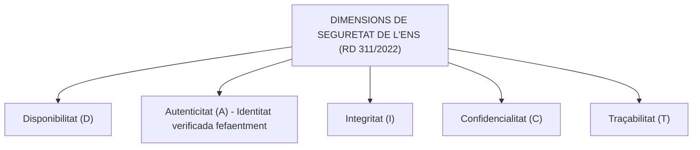
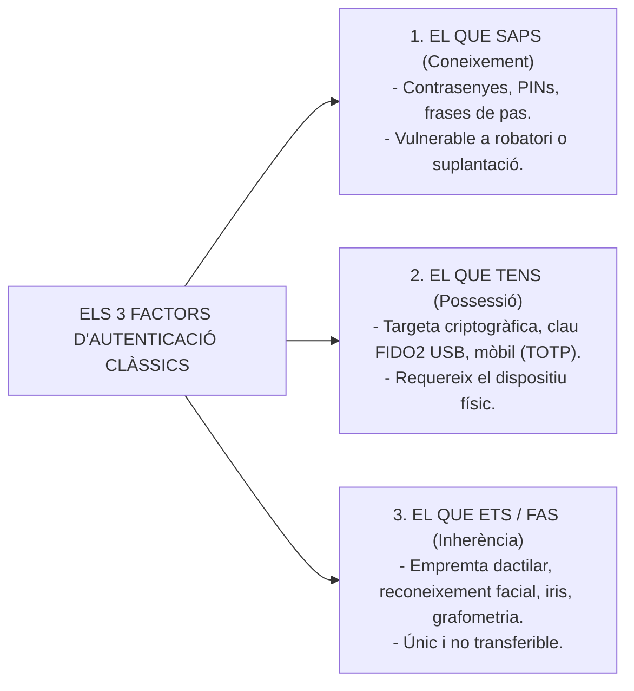
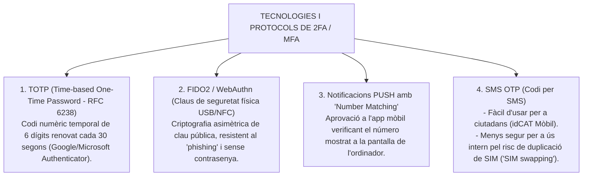
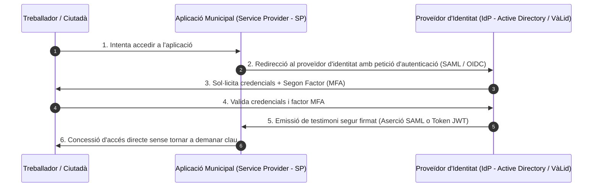

# Tema 29. Polítiques de mots de pas i autentificació amb doble factor (2FA / MFA)

> **Fonts normatives i tècniques de referència:** [`CORPUS/ENS_2022.pdf`](file:///home/oriol/Projectes/OPOS/CORPUS/ENS_2022.pdf) (Reial Decret 311/2022, Esquema Nacional de Seguretat - ENS), Guies de seguretat CCN-STIC del Centre Criptològic Nacional (Sèrie 800) i estàndard NIST SP 800-63B.

---

## 1. Fonaments de l'Autenticació i el Marc de l'ENS

L'**autenticació** és el procés mitjançant el qual el sistema d'informació verifica i confirma la identitat reclamada per un usuari o procés.

D'acord amb l'**Esquema Nacional de Seguretat (RD 311/2022)**, l'autenticació és la primera línia de defensa per garantir les cinc dimensions de la seguretat (**DAICT**):

---

## 2. Els Tres Factors d'Autenticació

La seguretat d'un mecanisme d'accés es fonamenta en la combinació de diferents tipus de factors:

---

## 3. Polítiques de Mots de Pas Robustes segons l'ENS i CCN-STIC

Els comptes d'usuari i especialment els comptes amb **privilegis d'administració** han de complir regles estrictes de configuració:

| Paràmetre de Seguretat | Requisit per a Usuaris Generals | Requisit per a Comptes d'Administrador |
| :--- | :--- | :--- |
| **Longitud mínima** | Mínim **10 a 12 caràcters**. | Mínim **14 a 16 caràcters** (o ús obligatori de MFA). |
| **Complexitat de caràcters** | Combinació d'almenys 3 tipus: majúscules, minúscules, números i símbols (`!@#$%^&*`). | Combinació dels 4 tipus de caràcters. |
| **Historial de contrasenyes** | Prohibició de repetir les darreres **5 a 10 contrasenyes**. | Prohibició de repetir les darreres **12 a 24 contrasenyes**. |
| **Bloqueig de compte per intents fallits** | Bloqueig automàtic després de **3 a 5 intents infructuosos** (evita atacs de força bruta). | Bloqueig immediat i alerta al SIEM / SOC. |
| **Bloqueig per inactivitat** | Bloqueig automàtic de pantalla als **5 a 10 minuts** d'inactivitat. | Bloqueig automàtic als **5 minuts**. |
| **Emmagatzematge a la base de dades** | **Prohibició absoluta de text pla**. Xifrat *hash* amb sal (*salted hash*) mitjançant algorismes robustos (**Argon2, bcrypt o PBKDF2**). | *Hash* amb sal forta i custòdia en mòdul HSM. |

---

## 4. Autenticació de Doble Factor (2FA) i Multifactor (MFA)

L'**Autenticació Multifactor (MFA)** requereix la presentació de **dos o més factors independents de diferent categoria** per concedir l'accés.

> 🛡️ **Obligatorietat segons l'ENS:**  
> L'MFA és obligatori per a:
> 1. Accés remot o teletreball (connexions VPN externes).
> 2. Tots els accessos a comptes amb privilegis d'administració de xarxa i servidors.
> 3. Gestió de dades i sistemes qualificats de categoria Mitjana o Alta a l'ENS.

---

## 5. Federació d'Identitats i Single Sign-On (SSO)

Per evitar que els treballadors i ciutadans hagin de recordar desenes de contrasenyes per a cada aplicació municipal, s'utilitzen arquitectures d'**Inici de Sessió Únic (*Single Sign-On - SSO*)** basades en la federació d'identitats:

### 5.1. Protocols Estàndard de Federació d'Identitats:
1. **SAML 2.0 (Security Assertion Markup Language):** Estàndard basat en XML molt estès en entorns corporatius i governamentals.
2. **OpenID Connect (OIDC) / OAuth 2.0:** Estàndard modern basat en JSON i tokens **JWT (JSON Web Tokens)**, lleuger i àmpliament utilitzat en aplicacions web i mòbils.

---

## 6. Quadre Resum i Preguntes Típiques d'Examen Tipus Test

| Pregunta / Concepte Clau | Resposta Correcta / Trampa Freqüent |
| :--- | :--- |
| **Quins són els 3 factors d'autenticació?** | **Coneixement** (el que saps), **Possessió** (el que tens) i **Inherència** (el que ets/fas). |
| **Quan és obligatori l'MFA segons l'ENS?** | En **accessos remots (teletreball/VPN), comptes d'administrador i sistemes de nivell Mitjà/Alt** (RD 311/2022). |
| **Què és el protocol TOTP?** | **Contrasenya temporal d'un sol ús basada en temps** (es renova típicament cada 30 segons) (RFC 6238). |
| **Quin estàndard MFA ofereix màxima resistència contra el phishing?** | **FIDO2 / WebAuthn** mitjançant claus de maquinari físiques USB/NFC. |
| **Com s'han d'emmagatzemar les contrasenyes a la base de dades?** | Mitjançant **resums criptogràfics amb sal (*salted hash*) forts com bcrypt, PBKDF2 o Argon2** (mai en text pla). |
| **Quina mesura evita els atacs de força bruta sobre contrasenyes?** | El **bloqueig temporal o definitiu del compte després d'un nombre limitat d'intents fallits**. |
| **Què és el Single Sign-On (SSO)?** | Un sistema que permet a l'usuari **autenticar-se una sola vegada i accedir a múltiples serveis i aplicacions**. |
| **Quins protocols s'utilitzen habitualment per a la federació d'identitats?** | **SAML 2.0** i **OpenID Connect (OIDC) / OAuth 2.0**. |
