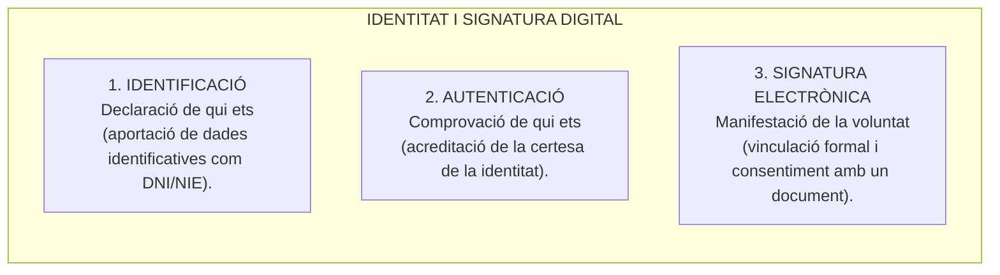
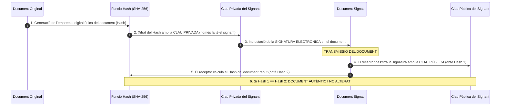
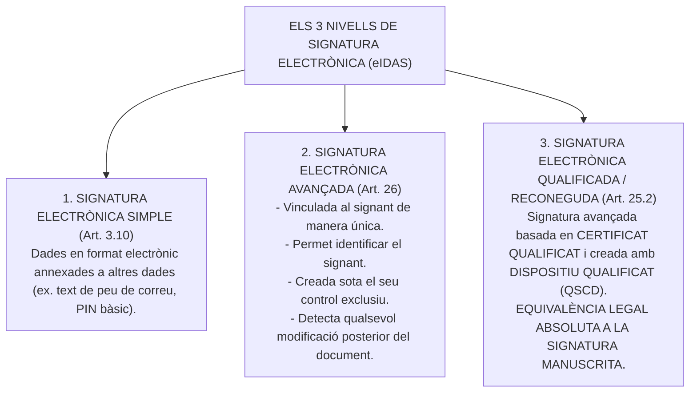
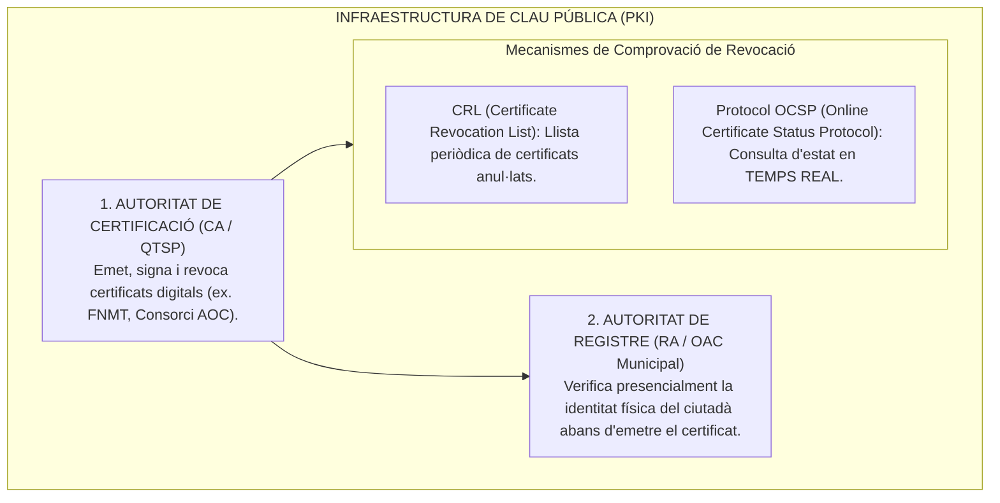
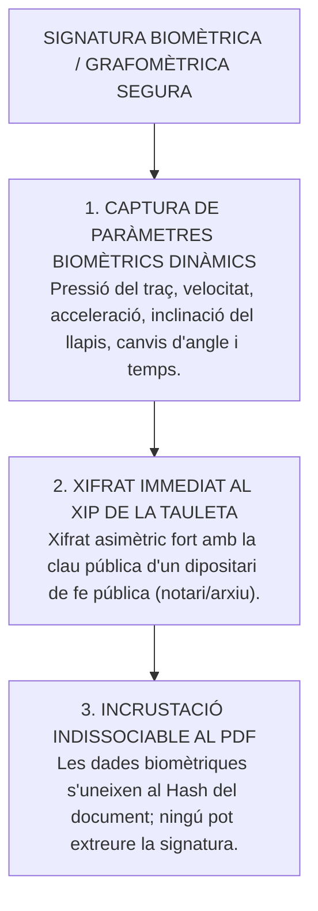

# Tema 30. Signatura electrònica: Identificació i autenticació, el rol dels certificats digitals, les claus públiques i privades, "Smart Cards", DNI electrònic i solucions de signatura biomètrica

> **Fonts normatives de referència:** [`CORPUS/EiDAS.pdf`](file:///home/oriol/Projectes/OPOS/CORPUS/EiDAS.pdf) (Reglament UE 910/2014, eIDAS), Llei 6/2020 reguladora de determinats aspectes dels serveis electrònics de confiança, i [`CORPUS/40_2015.pdf`](file:///home/oriol/Projectes/OPOS/CORPUS/40_2015.pdf) (Arts. 38 a 45).

---

## 1. Identificació, Autenticació i Signatura Electrònica

El marc europeu i estatal distingeix amb precisió aquests tres conceptes fonamentals:

---

## 2. Fonaments Criptogràfics de la Signatura Digital

La signatura electrònica es fonamenta en la **criptografia asimètrica de clau pública** i en l'ús de **funcions resum (*hash*)**:

### 2.1. Les Tres Propietats Garantides per la Signatura Digital:
1. **Autenticitat:** Acredita amb certesa la identitat de l'autor o signant del document.
2. **Integritat:** Garanteix que el contingut del document **no ha estat modificat ni alterat** des del moment de la signatura (si es canvia una sola lletra, el *hash* no coincideix i la signatura esdevé invàlida).
3. **No-repudi:** El signant no pot negar haver signat el document, ja que la clau privada està sota el seu control exclusiu.

---

## 3. Tipus de Signatura segons el Reglament eIDAS (Reglament UE 910/2014)

L'article 3 i els articles 25 a 29 del **Reglament eIDAS** defineixen tres nivells de signatura electrònica:

> ⚖️ **Efecte jurídic clau (Art. 25.2 eIDAS):**  
> La **signatura electrònica qualificada** té el mateix valor i **equivalència jurídica que la signatura manuscrita sobre paper** en tots els estats membres de la Unió Europea.

---

## 4. El Rol dels Certificats Digitals i la Infraestructura de Clau Pública (PKI)

Un **certificat digital** (segons l'estàndard **X.509 v3**) és un document electrònic signat per una Autoritat de Certificació que vincula unes dades de verificació de signatura (clau pública) amb la identitat d'una persona física o jurídica:

---

## 5. Dispositius Segurs de Creació de Signatura (QSCD)

Perquè una signatura sigui qualificada, ha de generar-se dins d'un **Dispositiu Qualificat de Creació de Signatures (QSCD)**, que garanteix que la clau privada mai no surt del dispositiu ni pot ser copiada:

| Dispositiu Criptogràfic | Característiques i Funcionament | Ús Principal a l'Administració |
| :--- | :--- | :--- |
| **Smart Card (Targeta intel·ligent)** | Targeta plàstica amb xip criptogràfic segur que requereix lector de targetes i codi PIN d'accés. | **Targeta T-CAT de l'AOC** per a funcionaris i electes municipals. |
| **DNI electrònic (DNIe / 3.0 / 4.0)** | Document d'identitat oficial amb xip criptogràfic dual (contacte i interfície **NFC sense contacte**). Conté el certificat d'autenticació i el de signatura qualificada. | Identificació i signatura de ciutadans davant la seu municipal. |
| **Signatura al Núvol / HSM (*Cloud Signature*)** | Les claus privades es custodien de forma centralitzada en mòduls segurs de maquinari (**HSM - Hardware Security Module**) d'alta seguretat als servidors del prestador de confiança. | Signatura mòbil i remota d'expedients per part de regidors i tècnics des de tauletes o telèfons. |

---

## 6. Solucions de Signatura Biomètrica / Grafomètrica

La **signatura biomètrica** (o grafomètrica) consisteix en la captura digital del traç de la signatura manuscrita sobre una tauleta digitalitzadora especialitzada a les Oficines d'Atenció Ciutadana (OAC):

- **Requisits de validesa:** Les dades biomètriques xifrades només es poden desxifrar per ordre judicial en cas de litigi pericial cal·ligràfic, garantint la plena protecció de la privadesa segons la LOPDGDD.

---

## 7. Quadre Resum i Preguntes Típiques d'Examen Tipus Test

| Pregunta / Concepte Clau | Resposta Correcta / Trampa Freqüent |
| :--- | :--- |
| **Quina clau s'utilitza per signar electrònicament un document?** | La **Clau Privada** del signant (sota el seu control exclusiu). |
| **Quina clau s'utilitza per verificar la validesa d'una signatura?** | La **Clau Pública** del signant (accessible a través del certificat digital). |
| **Quina signatura té equivalència legal absoluta a la signatura manuscrita?** | La **Signatura Electrònica Qualificada** (Art. 25.2 Reglament eIDAS). |
| **Quines 3 propietats garanteix la signatura electrònica?** | **Autenticitat, Integritat i No-repudi**. |
| **Què és el protocol OCSP?** | Protocol de consulta per comprovar l'**estat de validesa o revocació d'un certificat en temps real** (RFC 6960). |
| **Quins dos certificats incorpora el DNI electrònic?** | El certificat d'**Autenticació** i el certificat de **Signatura Electrònica**. |
| **Com es protegeixen les dades biomètriques en la signatura grafomètrica?** | Es **xifren directament a la tauleta capturadora i s'incrusten al PDF** de forma indissociable. |
