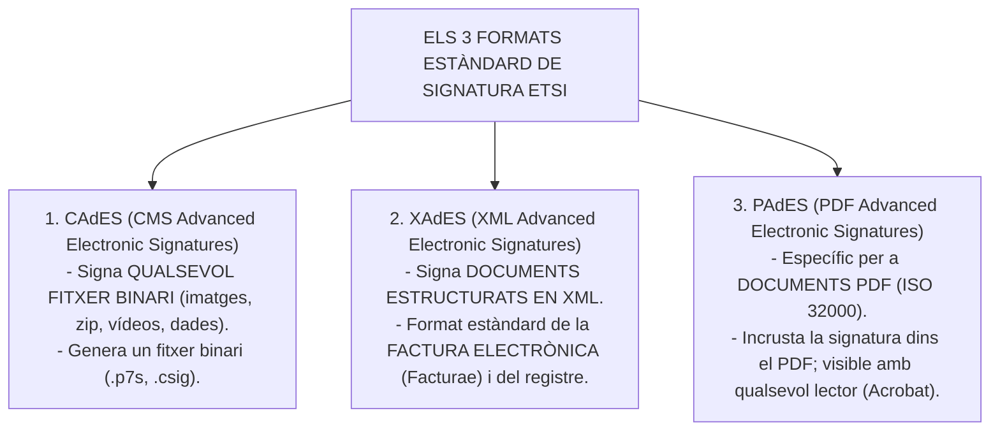
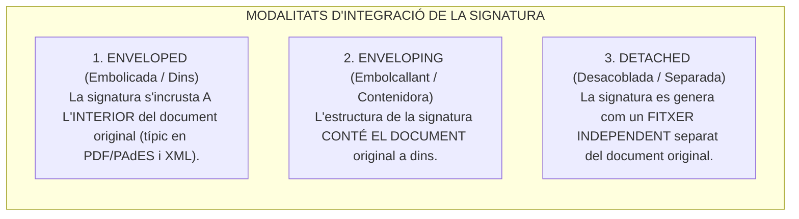
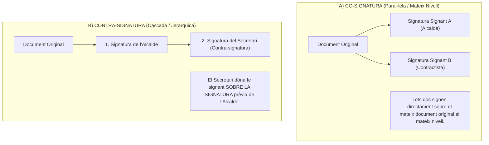
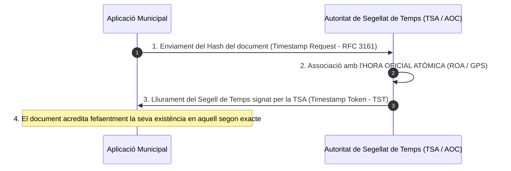
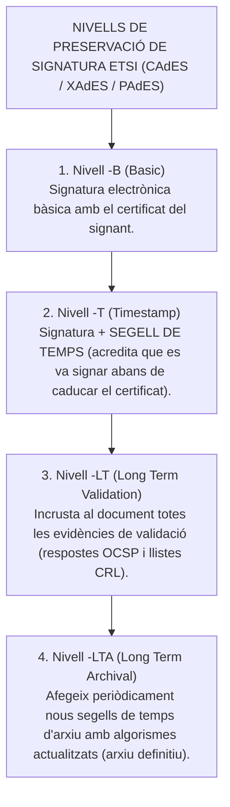

# Tema 31. Formats de signatura electrònica: definició i tipus, signatures múltiples, signatures de llarg termini i segells de temps

> **Fonts normatives i tècniques de referència:** [`CORPUS/EiDAS.pdf`](file:///home/oriol/Projectes/OPOS/CORPUS/EiDAS.pdf) (Reglament UE 910/2014, eIDAS - Arts. 41 i 42), [`CORPUS/ENI.pdf`](file:///home/oriol/Projectes/OPOS/CORPUS/ENI.pdf) (Norma Tècnica d'Interoperabilitat de Política de Signatura i Segells) i Estàndards ETSI (EN 319 122, EN 319 132 i EN 319 142).

---

## 1. Els Tres Formats Avançats de Signatura Electrònica (Estàndards ETSI)

L'Institut Europeu de Normes de Telecomunicacions (**ETSI**) defineix tres formats estàndard de signatura avançada per garantir la plena interoperabilitat transfronterera a la Unió Europea:

---

## 2. Modalitats d'Integració de la Signatura respecte al Document

La relació estructural entre el fitxer de signatura i el document original pot adoptar tres modalitats:

---

## 3. Signatures Múltiples: Co-signatura vs. Contra-signatura

Quan un procediment administratiu requereix la intervenció de més d'un signant, es distingeixen dues estructures de signatura múltiple:

| Criteri de Comparació | Co-signatura (*Co-signature*) | Contra-signatura (*Counter-signature*) |
| :--- | :--- | :--- |
| **Estructura** | **Paral·lela** (al mateix nivell). | **Seqüencial / En cascada** (jeràrquica). |
| **Objecte signat** | Cadascú signa directament el **document original**. | El segon signant **signa la signatura del primer**. |
| **Finalitat típica** | Contractes bilaterals, convenis entre administracions. | **Donar fe pública**, visats tècnics o vistiplaus (Secretari/Interventor). |

---

## 4. El Segell de Temps (Time Stamping / TSA - RFC 3161)

El **Segell de Temps** (o cronodatació electrònica) són dades en format electrònic emeses per una **Autoritat de Segellat de Temps (TSA - Time Stamping Authority)** qualificada que vincula de manera indissociable un document o una signatura a una **data i hora oficials precises**:

- **Efectes jurídics (Arts. 41 i 42 eIDAS):** Gaudeix de la **presumpció d'exactitud de la data i hora que indica i de la integritat de les dades** a tota la Unió Europea.

---

## 5. Signatures de Llarg Termini (LTV - Long Term Validation) i Preservació

Els certificats digitals ordinaris tenen una validesa limitada (de 2 a 5 anys). Un cop caduca el certificat o si la CA desapareix, una signatura bàsica no es pot verificar de forma fiable.

Per garantir que un document administratiu municipal pugui ser verificat vàlidament d'aquí a **20, 50 o 100 anys** a l'Arxiu Electrònic Únic, s'utilitzen els **nivells de signatura de llarg termini (LTV)** definits per l'ETSI:

---

## 6. Quadre Resum i Preguntes Típiques d'Examen Tipus Test

| Pregunta / Concepte Clau | Resposta Correcta / Trampa Freqüent |
| :--- | :--- |
| **Quin format s'utilitza exclusivament per a la signatura de documents PDF?** | El format **PAdES** (ETSI EN 319 142). |
| **Quin format de signatura utilitza la factura electrònica (Facturae)?** | El format **XAdES** (basat en XML). |
| **Quin format permet signar qualsevol tipus de fitxer binari?** | El format **CAdES** (generant un fitxer binari `.p7s`). |
| **Quina diferència hi ha entre co-signatura i contra-signatura?** | La **co-signatura és paral·lela** (al document); la **contra-signatura és sobre la signatura prèvia** (donar fe). |
| **Quina és la modalitat de signatura en un fitxer separat?** | Modalitat **Detached** (desacoblada / separada). |
| **Què acredita un Segell de Temps (Time Stamping)?** | L'**existència d'un document en un instant precís de data i hora i la seva no alteració** (RFC 3161). |
| **Com es garanteix la validesa d'un document signat durant dècades a l'arxiu?** | Mitjançant el perfil de signatura de **Llarg Termini (LTV / Nivell -LTA)** amb incrustació d'OCSP/CRL i ressegellat. |
