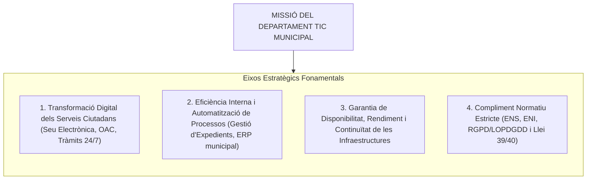

# Tema 32. Organització d'un departament TIC: infraestructura informàtica i comunicacions, estratègia

> **Fonts i marcs de referència:** Esquema Nacional de Seguretat ([`CORPUS/ENS_2022.pdf`](file:///home/oriol/Projectes/OPOS/CORPUS/ENS_2022.pdf)), Esquema Nacional d'Interoperabilitat ([`CORPUS/ENI.pdf`](file:///home/oriol/Projectes/OPOS/CORPUS/ENI.pdf)), Llei 40/2015 i estàndards internacionals de governança TIC (**ITIL v4**, **COBIT 2019**, **ISO/IEC 20000** i **ISO/IEC 27001**).

---

## 1. El Rol Estratègic del Departament TIC a l'Administració Local

En l'administració local contemporània, el Departament de Tecnologies de la Informació i les Comunicacions (TIC) ha deixat de ser una simple unitat de suport tècnic ("manteniment d'ordinadors") per esdevenir un **motor estratègic i transversal de transformació digital** de tota l'organització municipal.

---

## 2. Marcs de Governança i Gestió de Serveis TIC

Per garantir que les inversions tecnològiques aportin valor públic i es gestionin amb estàndards de qualitat auditables, els departaments TIC locals s'estructuren sobre la base de marcs de bones pràctiques reconeguts internacionalment:

### 2.1. ITIL v4 (Information Technology Infrastructure Library)
Marc de referència per a la **Gestió de Serveis de TI (ITSM)** enfocat en la cocreació de valor mitjançant el *Sistema de Valor del Servei (SVS)*:
- **Gestió d'Incidents:** Restablir la prestació normal del servei al més aviat possible amb el mínim impacte operatiu.
- **Gestió de Problemes:** Identificar i analitzar les causes arrel dels incidents per evitar-ne la recurrència.
- **Gestió de Canvis (Enablement):** Assegurar que els canvis en servidors, xarxes o aplicacions s'avaluïn, autoritzin i planifiquin minimitzant el risc de caiguda del servei.
- **Gestió de la Configuració i Actius (CMDB):** Mantenir informació precisa i actualitzada sobre tots els elements de configuració (CI) del sistema municipal.
- **Gestió de Nivells de Servei (SLA / OLA):** Fixació d'Acords de Nivell de Servei (*Service Level Agreements*) per mesurar la qualitat i els temps de resposta tècnica.

### 2.2. COBIT 2019 (Control Objectives for Information and Related Technologies)
Marc de **governança de les TI corporatives** que alinea la tecnologia amb els objectius estratègics de l'equip de govern municipal, establint mecanismes de control intern, avaluació del rendiment i gestió de riscos.

---

## 3. Estructura Organitzativa i Àrees Funcionals del Departament TIC

En un ajuntament o consell comarcal, el departament TIC s'organitza en diferents àrees funcionals interconnectades:

```mermaid
flowchart TD
    DIR["DIRECCIÓ / CAP DE SERVEI TIC"]
    
    subgraph A1["1. Àrea de Sistemes, Infraestructures i CPD"]
        direction TB
        S1["Servidors (Físics/Virtuals) i Emmagatzematge (SAN/NAS)"]
        S2["Còpies de Seguretat i Pla de Recuperació (DRP)"]
        S3["Climatització, SAI/UPS i Instal·lacions del CPD"]
    end

    subgraph A2["2. Àrea de Xarxes i Comunicacions"]
        direction TB
        X1["Xarxa Local (LAN), Wi-Fi corporatiu i Enllaços WAN/FTTH"]
        X2["Seguretat Perimetral (Firewalls, VPN corporativa, VLANs)"]
        X3["Telefonia IP (VoIP) i Comunicacions Unificades"]
    end

    subgraph A3["3. Àrea d'Aplicacions i Administració Digital"]
        direction TB
        AP1["Gestor d'Expedients i Plataforma d'Admin Electrònica"]
        AP2["ERP Municipal (Comptabilitat, Padró, RRHH, Urbanisme)"]
        AP3["Interoperabilitat (AOC, Via Oberta, SIR/SICRES 3.0)"]
    end

    subgraph A4["4. Àrea de Suport i Lloc de Treball (Service Desk)"]
        direction TB
        U1["Atenció d'incidències a usuaris (Nivell 1 i 2)"]
        U2["Desplegament i manteniment de PC, portàtils i impressores"]
        U3["Inventari de maquinari i distribució de programari"]
    end

    DIR --> A1
    DIR --> A2
    DIR --> A3
    DIR --> A4
```

---

## 4. El Pla Estratègic TIC Municipal

El **Pla Director / Estratègic TIC** és l'instrument de planificació plurianual (habitualment a 3-4 anys) que defineix el full de ruta tecnològic de l'Ajuntament:

| Fase del Pla Estratègic | Contingut i Objectiu Operatiu |
| :--- | :--- |
| **1. Diagnosi de la situació actual (As-Is)** | Auditoria d'infraestructures, mapa d'aplicacions, nivell d'obsolescència del maquinari, grau de compliment de l'ENS i satisfacció dels usuaris. |
| **2. Definició del model objectiu (To-Be)** | Visió estratègica a mig termini: migració al núvol híbrid, renovació de llocs de treball, integració de nous serveis telemàtics a la Seu Electrònica. |
| **3. Pla d'Acció i Full de Ruta** | Desglossament en projectes concrets prioritzats (per impacte, urgència i cost), amb cronograma i assignació de recursos. |
| **4. Pla Econòmic i Pressupostari** | Previsió pressupostària d'inversions (Capítol 6) i de manteniments/llicències corrents (Capítol 2). |
| **5. Governança i Seguiment (KPIs)** | Quadre de comandament amb indicadors de compliment: temps de resolució d'incidents (MTTR), disponibilitat de serveis (99,9%), grau d'ús ciutadà de la Seu. |

---

## 5. Gestió de Proveïdors i Contractació Pública TIC (LCSP)

Donada la limitació de personal propi als ens locals, molts serveis d'infraestructura i desenvolupament es contracten a empreses especialitzades mitjançant la **Llei 9/2017 de Contractes del Sector Públic (LCSP)**:

- **Plec de Prescripcions Tècniques (PPT):** Document clau elaborat pel responsable TIC on es defineixen de forma neutra els requisits funcionals, tecnològics, estàndards oberts (ENI) i nivells de servei exigits (SLA).
- **Clàusules de Compliment de Seguretat (Art. 2 RD 311/2022 - ENS):** Els contractes han d'incorporar preceptivament l'obligació que el proveïdor extern acrediti la conformitat amb l'ENS i apliqui mesures de protecció equivalents a les de l'administració.
- **Deure de Confidencialitat i Protecció de Dades (Art. 28 RGPD):** Formalització obligatòria del contracte d'**Encarregat del Tractament** quan el proveïdor accedeixi a dades personals municipals (manteniment de servidors, suport d'aplicacions).
- **Evitar el Bloqueig del Proveïdor (*Vendor Lock-In*):** Exigir sempre la titularitat pública de les dades, ús de formats oberts i clàusules de reversió ordenada de serveis al final del contracte.

---

## 6. Quadre Resum i Preguntes Típiques d'Examen Tipus Test

| Pregunta / Concepte Clau | Resposta Correcta / Trampa Freqüent |
| :--- | :--- |
| **Quin és el marc internacional de referència per a la Gestió de Serveis TI?** | **ITIL (Information Technology Infrastructure Library)** (actualment versió 4). |
| **Quina diferència hi ha entre un Incident i un Problema segons ITIL?** | L'**Incident** és una interrupció no planificada d'un servei; el **Problema** és la *causa desconeguda subjacent* d'un o més incidents. |
| **Què és un SLA (Service Level Agreement)?** | Un **Acord de Nivell de Servei** que fixa compromisos quantitatius de qualitat i temps de resposta entre el proveïdor TIC i l'Ajuntament. |
| **Què és una CMDB en la gestió d'infraestructures?** | Una **Base de Dades de Gestió de la Configuració** (*Configuration Management Database*) que registra tots els actius i les seves interrelacions. |
| **Quina obligació té un proveïdor TIC extern contractat per un ajuntament segons l'ENS?** | Ha d'**aplicar i acreditar mesures de seguretat conformes a l'ENS** d'acord amb la categoria del sistema tractat (Art. 2 RD 311/2022). |
| **Què s'ha d'evitar expressament en els plecs tècnics de contractació TIC?** | La **dependència exclusiva d'un únic proveïdor (*Vendor Lock-in*)** mitjançant estàndards oberts i reversibilitat de dades. |
