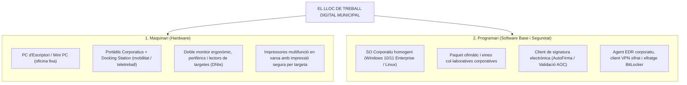
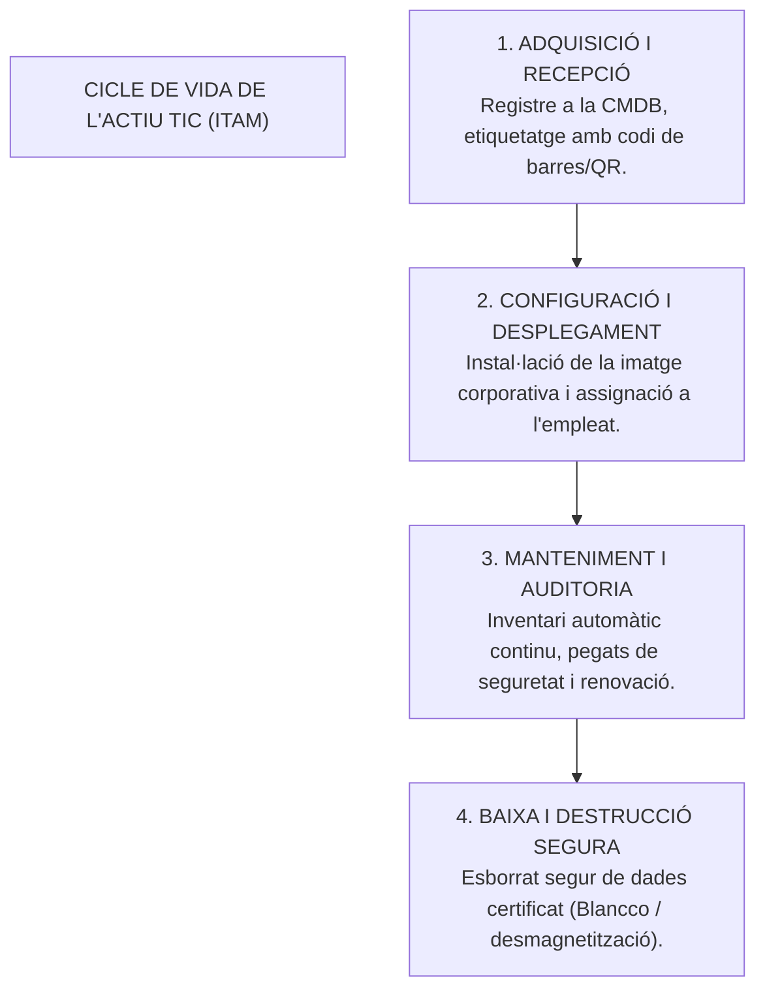

# Tema 33. Equipament del lloc de treball. Maquinari i programari. Gestió d’inventari i distribució de programari

> **Fonts i marcs de referència:** Esquema Nacional de Seguretat ([`CORPUS/ENS_2022.pdf`](file:///home/oriol/Projectes/OPOS/CORPUS/ENS_2022.pdf) - Mesures `[mp.eq]` Protecció d'equips i `[op.acc]` Control d'accés), Guies CCN-STIC i bones pràctiques d'ITSM/ITIL.

---

## 1. El Lloc de Treball Digital a l'Administració Local

El lloc de treball de l'empleat públic local ha evolucionat cap a un entorn **híbrid, flexible i segur**, que combina el treball presencial a les oficines municipals amb el teletreball:

---

## 2. Virtualització del Lloc de Treball (VDI / RDS)

En lloc de desplegar tot el programari directament a l'equip físic (*Fat Client*), molts ajuntaments utilitzen tecnologies de virtualització centralitzada des del CPD:

| Model de Treball | Descripció Tecnològica | Avantatges Principals | Inconvenients / Riscos |
| :--- | :--- | :--- | :--- |
| **Equip Tradicional (*Fat Client*)** | El sistema operatiu i les aplicacions s'executen localment al maquinari del PC/portàtil. | Rendiment autònom sense dependre de la xarxa; ideal per a tasques pesades (CAD/SIG). | Major esforç de manteniment; risc de fuga de dades si l'equip es perd o s'infecta. |
| **Virtual Desktop Infrastructure (VDI)** | Cada usuari disposa d'una **màquina virtual (VM) completa i dedicada** allotjada al servidor del CPD (VMware Horizon, Citrix). | Màxim aïllament i seguretat; les dades mai surten del CPD; recuperació instantània. | Elevat cost de llicenciament i d'infraestructura de servidors/emmagatzematge al CPD. |
| **Remote Desktop Services (RDS / Terminal Server)** | Múltiples usuaris comparteixen sessions concurrents sobre el mateix sistema operatiu de servidor. | Molt eficient en consum de recursos; gestió de programari 100% centralitzada. | Menor personalització per a l'usuari; si el servidor falla, cauen tots els usuaris. |

---

## 3. Gestió d'Inventari i Gestió d'Actius TIC (IT Asset Management - ITAM)

La mesura `[mp.eq.1] Inventari d'equips` de l'ENS obliga a mantenir un **inventari permanentment actualitzat** de tots els actius tecnològics corporatius:

### 3.1. Eines d'Inventari i Gestió de Parcs Informàtics
- **GLPI (Gestionnaire Libre de Parc Informatique):** Plataforma de codi obert líder en el sector públic per a la gestió d'inventari, gestió de llicències, contractes de garantia i sistema de tiquets d'incidències (*Service Desk*).
- **Agents d'Inventari Automàtic (OCS Inventory / FusionInventory / GLPI Agent):** Programari resident a cada equip que recull periòdicament les dades de maquinari (CPU, RAM, disc, monitors) i programari instal·lat i les envia al servidor central mitjançant protocols segurs (HTTPS/SNMP).
- **Microsoft Intune / Configuration Manager (SCCM):** Plataformes de gestió unificada de dispositius (*UEM - Unified Endpoint Management*) tant per a equips d'oficina com per a mòbils i portàtils remots.

---

## 4. Distribució Automatitzada de Programari i Gestió de Pegats

La instal·lació manual d'aplicacions equip per equip és inviable i insegura. Els departaments TIC empren tècniques de desplegament massiu:

### 4.1. Creació d'Imatges Corporatives Mestres (*Master / Gold Image*)
- **Sysprep (System Preparation Tool):** Eina de Microsoft que elimina la informació específica del sistema (SID, nom de màquina) d'una instal·lació configurada prèviament per permetre la seva clonació massiva en altres equips.
- **Arrencada per xarxa PXE (Preboot Execution Environment):** Permet arrencar equips verges des de la xarxa local i instal·lar automàticament el sistema operatiu complet des d'un servidor WDS (*Windows Deployment Services*) o servidors de clonació (Clonezilla Server, FOG Project).

### 4.2. Gestió de Pedassos i Actualitzacions (*Patch Management*)
D'acord amb la mesura `[op.pl.5] Gestió de vulnerabilitats` de l'ENS, els equips han de rebre periòdicament les actualitzacions crítiques de seguretat:
- **WSUS (Windows Server Update Services):** Servidor local municipal que descarrega els pegats de Microsoft i els distribueix controladament als PCs de l'ajuntament, estalviant amplada de banda d'Internet i permetent provar les actualitzacions abans del desplegament general.
- **Gestió de vulnerabilitats en programari de tercers:** Eines com *MicroCLAUDIA* (desenvolupada pel CCN-CERT per vacunar contra ransomware i gestionar pegats d'aplicacions com Chrome, Adobe Reader o Java).

---

## 5. Mesures de Seguretat Obligatòries al Lloc de Treball (ENS)

1. **Principi de Mínim Privilegi (LUA - Least User Access):** Els treballadors públics **mai han de disposar de permisos d'administrador local** en el seu ús diari per evitar la instal·lació de programari no autoritzat o l'execució inadvertida de malware.
2. **Xifratge de Discs (Mesura `[mp.eq.2]`):** Tots els portàtils han de tenir el disc dur complet xifrat mitjançant **BitLocker** (amb xip TPM 2.0) o **LUKS** per evitar la fuga de dades en cas de robatori o pèrdua.
3. **Bloqueig de Ports USB:** Deshabilitació o control estricte d'emmagatzematge extern USB per prevenir fugues d'informació i infeccions per memòries USB (*badUSB*).
4. **Bloqueig Automàtic de Sessió:** Configuració per política de grup (GPO) del bloqueig automàtic de pantalla després de **5 a 10 minuts d'inactivitat**.

---

## 6. Quadre Resum i Preguntes Típiques d'Examen Tipus Test

| Pregunta / Concepte Clau | Resposta Correcta / Trampa Freqüent |
| :--- | :--- |
| **Què és GLPI en l'àmbit de la gestió TIC municipal?** | Una eina de **codi obert per a la gestió d'inventari (ITAM), actius i Service Desk**. |
| **Quina utilitat té l'eina Sysprep de Microsoft?** | **Generalitzar una instal·lació de Windows** eliminant el SID i dades úniques per crear una imatge clonable. |
| **Com s'anomena la tecnologia que permet arrencar i instal·lar un PC des de la xarxa?** | **PXE (Preboot Execution Environment)**. |
| **Per què és obligatori el xifratge BitLocker en portàtils corporatius segons l'ENS?** | Per garantir la **confidencialitat de les dades davant robatori, pèrdua o extracció del disc dur**. |
| **Què és WSUS?** | Un servidor corporatiu que **centralitza, valida i distribueix actualitzacions de seguretat de Microsoft**. |
| **Han de tenir els usuaris permisos d'administrador local al seu ordinador?** | **No, s'aplica el principi de mínim privilegi (LUA)** per evitar riscos d'instal·lació de malware. |
