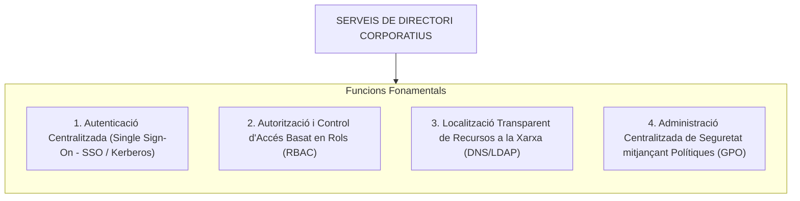
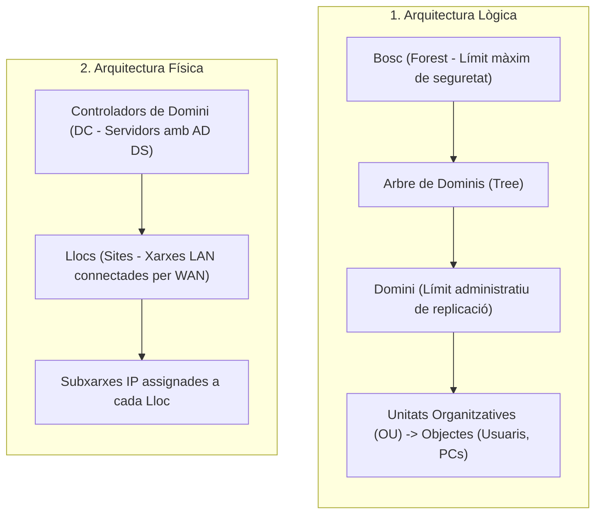

# Tema 34. Serveis de directori: disseny, infraestructura, implementació, gestió i manteniment

> **Fonts i marcs de referència:** Esquema Nacional de Seguretat ([`CORPUS/ENS_2022.pdf`](file:///home/oriol/Projectes/OPOS/CORPUS/ENS_2022.pdf) - Mesures `[op.acc]` Control d'accés i `[mp.if]` Protecció de la informació), estàndards **RFC 4510 (LDAP)**, **RFC 4120 (Kerberos)** i especificacions oficials de Microsoft AD DS i OpenLDAP.

---

## 1. Concepte i Fonaments dels Serveis de Directori

Un **servei de directori** és una base de dades jeràrquica, distribuïda i altament optimitzada per a **lectures i consultes ràpides**, que centralitza la informació de tots els recursos d'una xarxa corporativa (usuaris, grups, equips, servidors, impressores, polítiques de seguretat i permisos).

---

## 2. Protocols Estàndard: LDAP i Kerberos

Els serveis de directori moderns combinen dos protocols clau: **LDAP** per a la consulta d'informació i **Kerberos** per a l'autenticació segura.

### 2.1. LDAP (Lightweight Directory Access Protocol - RFC 4510)
Versió optimitzada del protocol X.500 que s'executa directament sobre TCP/IP:
- **Ports estàndard:** Port **389 TCP/UDP** (LDAP no segur / StartTLS) i Port **636 TCP** (**LDAPS** xifrat amb TLS).
- **Estructura del Nom Distingit (DN - Distinguished Name):** Identifica unívocament qualsevol objecte a l'arbre jeràrquic (DIT - *Directory Information Tree*):
  $$\text{DN} = \text{CN=Oriol Martinez,OU=Informatica,OU=Ajuntament,DC=municipi,DC=cat}$$
  * `DC` (*Domain Component*): Component del domini (`municipi.cat`).
  * `OU` (*Organizational Unit*): Unitat organitzativa contenidora.
  * `CN` (*Common Name*): Nom comú de l'objecte o usuari.

### 2.2. Protocol d'Autenticació Kerberos v5 (RFC 4120 - Port 88)
Mecanisme d'autenticació d'identitat basat en criptografia de claus simètriques i emissió de tiquets temporals mitjançant el **KDC (Key Distribution Center)**, evitant transmetre contrasenyes per la xarxa:
1. L'usuari sol·licita autenticació al servidor d'autenticació (AS).
2. El KDC valida les credencials i emet un **TGT (Ticket Granting Ticket)**.
3. Amb el TGT, el client sol·licita al TGS (*Ticket Granting Service*) un **Tiquet de Servei** per accedir a carpetes compartides, impressores o aplicacions municipals sense haver de tornar a introduir la contrasenya (**Single Sign-On - SSO**).

---

## 3. Microsoft Active Directory Domain Services (AD DS)

És la implementació de servei de directori més estesa a les administracions públiques:

### 3.1. Arquitectura Lògica vs. Arquitectura Física

### 3.2. Rols FSMO (Flexible Single Master Operations)
Tot i que Active Directory utilitza un model de replicació multimestre (*multi-master*), determinades operacions crítiques només poden ser executades per un únic controlador de domini designat (rols FSMO):

| Nivell d'Abast | Rol FSMO | Funció Tècnica Exclusiva |
| :--- | :--- | :--- |
| **Nivell de Bosc (*Forest-wide*)** (1 sol per bosc) | **1. Schema Master** | Gestiona les modificacions a l'esquema de l'AD (classes i atributs d'objectes). |
| | **2. Domain Naming Master** | Autoritza l'addició o eliminació de dominis dins del bosc. |
| **Nivell de Domini (*Domain-wide*)** (1 per cada domini) | **3. PDC Emulator** | Sincronització horària de tot el domini (NTP), compatibilitat amb eines heretades i prioritat en canvis de contrasenyes. |
| | **4. RID Master** | Assigna blocs d'identificadors relatius (RID) als controladors de domini perquè puguin crear nous usuaris amb un SID únic. |
| | **5. Infrastructure Master** | Responsable d'actualitzar les referències entre objectes de dominis diferents. |

- **Catàleg Global (GC - Global Catalog / Port 3268):** Controlador de domini que emmagatzema una còpia completa dels objectes del seu domini i una rèplica parcial dels atributs més consultats de la resta de dominis del bosc per accelerar cerques globals.

---

## 4. Polítiques de Grup (GPO - Group Policy Objects)

Les GPO són el mecanisme principal per aplicar configuracions homogènies i mesures de seguretat obligatòries a tots els equips i usuaris del domini:

### 4.1. Ordre d'Aplicació i Processament de les GPO: Regla LSDOU
Les polítiques s'apliquen en un ordre seqüencial estricte; en cas de conflicte, **la darrera política aplicada sobreescriu les anteriors**:
1. **L**ocal (Directiva local de la màquina).
2. **S**ite (Lloc de xarxa).
3. **D**omain (Directiva de tot el domini).
4. **OU** (Unitats Organitzatives, processades de la més superior a la més niada).

- **Excepcions:**
  - **Bloqueig d'herència (*Block Inheritance*):** Impedeix que una OU rebi les polítiques definides als nivells superiors.
  - **Forçat (*Enforced*):** Preval per sobre de qualsevol bloqueig d'herència i s'aplica obligatòriament.

---

## 5. Serveis de Directori de Codi Obert i Entorns Híbrids

- **OpenLDAP / FreeIPA / Samba 4:** Solucions lliures d'ús comú en entorns Linux per centralitzar la gestió d'usuaris i servidors sense cost de llicenciament de Microsoft.
- **Entorns Híbrids amb Microsoft Entra ID (Azure AD):** Sincronització dels usuaris locals de l'Ajuntament amb el núvol mitjançant **Microsoft Entra Connect** (*Password Hash Sync / Pass-through Authentication*), permetent utilitzar la mateixa identitat municipal per accedir al lloc de treball físic i als serveis de núvol (Office 365, Teams, portals al núvol).

---

## 6. Manteniment, Còpia de Seguretat i Recuperació del Directori

D'acord amb l'ENS, el servei de directori requereix alta disponibilitat i protecció davant desastres:
1. **Redundància de Controladors de Domini:** Com a mínim han d'existir **dos Controladors de Domini (DC)** en funcionament per cada domini municipal per garantir la tolerància a fallades.
2. **Còpia de Seguretat de l'Estat del Sistema (*System State Backup*):** Inclou la base de dades d'Active Directory (`NTDS.dit`), el registre del sistema i la carpeta `SYSVOL` (amb les GPO i scripts d'inici de sessió).
3. **Paperera de Reciclatge d'Active Directory (*AD Recycle Bin*):** Permet restaurar usuaris o grups esborrats accidentalment amb tots els seus atributs i permisos intactes de forma instantània.

---

## 7. Quadre Resum i Preguntes Típiques d'Examen Tipus Test

| Pregunta / Concepte Clau | Resposta Correcta / Trampa Freqüent |
| :--- | :--- |
| **Quins ports utilitza el protocol LDAP per defecte?** | Port **389 TCP/UDP** per a LDAP estàndard i Port **636 TCP** per a **LDAPS (xifrat)**. |
| **Quin protocol s'encarrega de l'autenticació per tiquets a Active Directory?** | El protocol **Kerberos v5** (Port **88**). |
| **Quina és la unitat organitzativa més petita a la qual es pot vincular una GPO?** | A una **Unitat Organitzativa (OU)** (no es poden vincular directament a usuaris o grups individuals). |
| **Quin és l'ordre d'aplicació de les polítiques de grup GPO?** | **LSDOU:** Local → Site → Domain → OU (l'última aplicada preval). |
| **Quin rol FSMO s'encarrega de la sincronització horària oficial del domini?** | El **PDC Emulator** (Domain-wide). |
| **Com es diu el fitxer físic que conté la base de dades d'Active Directory?** | **`NTDS.dit`** (ubicat a `%SystemRoot%\NTDS`). |
| **Quin component emmagatzema una còpia parcial de tots els objectes del bosc?** | El **Catàleg Global (GC)** (Port **3268**). |
