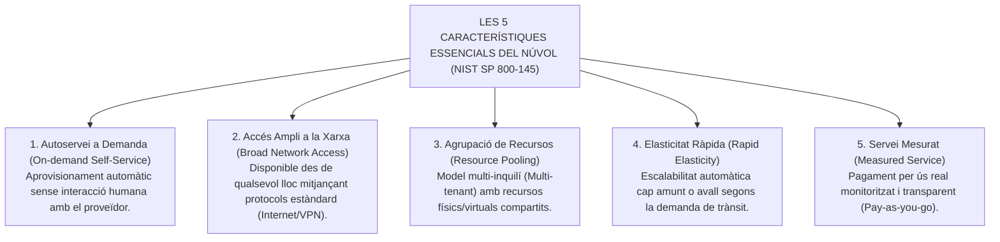
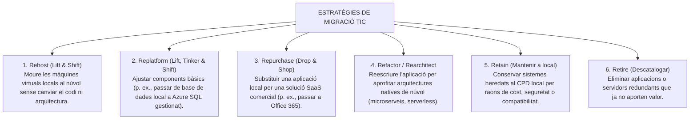

# Tema 35. Infraestructura local, al núvol o híbrida. Comparativa, avantatges i inconvenients

> **Fonts i marcs de referència:** Esquema Nacional de Seguretat ([`CORPUS/ENS_2022.pdf`](file:///home/oriol/Projectes/OPOS/CORPUS/ENS_2022.pdf) - Art. 2 i Guia CCN-STIC 823 per a serveis al núvol), Reglament General de Protecció de Dades (RGPD) i definició de *Cloud Computing* del **NIST SP 800-145**.

---

## 1. Concepte de Computació al Núvol (*Cloud Computing*)

Segons la definició estàndard del **NIST (National Institute of Standards and Technology - SP 800-145)**, la computació al núvol és un model que permet l'accés ubic, còmode i sota demanda a través de la xarxa a un conjunt compartit de recursos de computació configurables (xarxes, servidors, emmagatzematge, aplicacions i serveis) que es poden aprovisionar ràpidament amb un esforç mínim de gestió:

---

## 2. Models de Servei al Núvol: IaaS, PaaS i SaaS

La responsabilitat de gestió tecnològica i de seguretat varia radicalment en funció del model de servei contractat (**Model de Responsabilitat Compartida**):

```mermaid
flowchart TD
    subgraph IAAS["1. IaaS (Infrastructure as a Service)"]
        direction TB
        I1["El proveïdor gestiona: Servidors físics, xarxes, hipervisor i emmagatzematge."]
        I2["L'Ajuntament gestiona: Sistema Operatiu (Windows/Linux), Pegats, Middleware, Dades i Aplicacions."]
        I3["Exemples: AWS EC2, Microsoft Azure VMs, Google Compute Engine."]
    end

    subgraph PAAS["2. PaaS (Platform as a Service)"]
        direction TB
        P1["El proveïdor gestiona: Maquinari, SO, motor de base de dades i entorn d'execució."]
        P2["L'Ajuntament gestiona: El codi de les aplicacions i les dades."]
        P3["Exemples: Azure SQL Database, AWS Elastic Beanstalk, Kubernetes gestionat."]
    end

    subgraph SAAS["3. SaaS (Software as a Service)"]
        direction TB
        S1["El proveïdor gestiona: TOTA la infraestructura, aplicació i manteniment tècnic."]
        S2["L'Ajuntament només gestiona: Configuració d'usuaris, rols i les seves pròpies dades."]
        S3["Exemples: Microsoft 365, Google Workspace, ERP municipal SaaS (Aytos, e-SET)."]
    end
```

---

## 3. Models de Desplegament: Local (On-premises), Núvol i Híbrid

| Model de Desplegament | Descripció de la Infraestructura |
| :--- | :--- |
| **Local (*On-premises / Núvol Privat*)** | Infraestructura física propietat de l'Ajuntament ubicada al seu propi Centre de Processament de Dades (CPD municipal). |
| **Núvol Públic (*Public Cloud*)** | Infraestructura propietat d'un proveïdor extern (Microsoft, Amazon, Google) compartida entre múltiples clients mitjançant aïllament lògic. |
| **Núvol Comunitari (*Community Cloud*)** | Infraestructura compartida exclusivament per entitats amb finalitats comunes (p. ex., el núvol públic de l'**AOC** per als ajuntaments catalans o el de la Diputació). |
| **Núvol Híbrid (*Hybrid Cloud*)** | **Combinació d'infraestructura local privada i serveis al núvol públic**, interconnectats mitjançant enllaços segurs dedicats (VPN IPsec / ExpressRoute) funcionant com un entorn únic. |

---

## 4. Taula Comparativa Integral: On-Premises vs. Núvol Públic vs. Núvol Híbrid

| Criteri d'Avaluació | Infraestructura Local (*On-Premises*) | Núvol Públic (*Public Cloud*) | Model Híbrid (*Hybrid Cloud - Model Recomanat*) |
| :--- | :--- | :--- | :--- |
| **Model Financer** | **CapEx (Inversió de Capital):** Compra inicial elevada de servidors, llicències i CPD (Capítol 6). | **OpEx (Despesa Operativa):** Pagament per subscripció mensual/anual sense inversió inicial (Capítol 2). | Mixt: Inversió optimitzada en equips crítics locals + despesa operativa al núvol. |
| **Escalabilitat** | Rígida i lenta: cal tramitar licitacions públiques per comprar més servidors (mesos). | **Immediata i elàstica:** Aprovisionament de nous servidors en minuts. | Flexible: absorbeix pics de demanda al núvol mantenint la base a local. |
| **Control Físic i Sobirania** | Control físic total de l'Ajuntament sobre els servidors i discos al CPD propi. | Sense accés físic; depèn dels compromisos contractuals del proveïdor. | Control directe de dades crítiques a local i serveis auxiliars al núvol. |
| **Disponibilitat i Redundància** | Depèn de la inversió municipal (costós mantenir alta disponibilitat i doble línia). | **Molt alta (SLA 99,95% - 99,99%):** Centres de dades hiperconnectats i redundants. | Alta resiliència: continuïtat del servei davant caiguda de qualsevol dels dos entorns. |
| **Compliment ENS i RGPD** | Responsabilitat 100% de l'Ajuntament en totes les mesures de seguretat. | El proveïdor ha d'acreditar el **Certificat ENS de nivell ALTA** i ubicació a la UE. | L'Ajuntament i el proveïdor comparteixen el compliment segons el rol. |

---

## 5. Requisits Obligatoris per a la Contractació de Núvol a l'Administració Pública

Quan un ajuntament contracta serveis al núvol (*Cloud*), la normativa imposa obligacions taxatives:

1. **Certificació de Conformitat amb l'ENS (Art. 2 RD 311/2022):** El proveïdor de núvol (IaaS, PaaS o SaaS) ha d'estar **formalment certificat en l'Esquema Nacional de Seguretat** en la categoria corresponent (habitualment Nivell ALT) per una entitat acreditada per ENAC (recollit a la *Guia CCN-STIC 823*).
2. **Ubicació i Sobirania de les Dades a la UE (RGPD / LOPDGDD):** Els centres de dades del proveïdor on s'allotgen o processen les dades dels ciutadans han d'estar ubicats físicament dins de l'**Espai Econòmic Europeu (EEE)**, prohibint les transferències internacionals no autoritzades.
3. **Clàusules de Reversió i Portabilitat:** El contracte públic ha de garantir que, en finalitzar la relació, l'Ajuntament pugui **recuperar totes les seves dades i bases de dades en formats oberts i estàndards (ENI)** sense costos abusius ni bloquejos (*Vendor Lock-in*).

---

## 6. Estratègies de Migració al Núvol: El Model de les 6 'R' de Gartner

---

## 7. Quadre Resum i Preguntes Típiques d'Examen Tipus Test

| Pregunta / Concepte Clau | Resposta Correcta / Trampa Freqüent |
| :--- | :--- |
| **Quina diferència bàsica hi ha entre CapEx i OpEx en finançament TIC?** | **CapEx** és despesa d'inversió en actius físics (servidors/CPD local); **OpEx** és despesa operativa recurrent per consum de serveis al núvol. |
| **En quin model de servei el client només gestiona les seves dades i la configuració d'usuaris?** | En el model **SaaS (Software as a Service)**. |
| **Què és un Núvol Híbrid?** | La integració segura i coordinada d'**infraestructura local privada (on-premises) amb un o més serveis de núvol públic**. |
| **Què exigeix l'ENS a un proveïdor de Cloud contractat per un ajuntament?** | Disposar del **Certificat de Conformitat amb l'ENS** emès per una entitat acreditada per ENAC (Guia CCN-STIC 823). |
| **On han d'estar ubicats físicament els centres de dades dels proveïdors al núvol de l'administració?** | Dins del territori de la **Unió Europea / Espai Econòmic Europeu (EEE)** per complir el RGPD. |
| **Què és l'estratègia 'Rehost' o 'Lift and Shift'?** | Migrar servidors o màquines virtuals al núvol **sense modificar-ne el sistema ni l'aplicació**. |
