# Tema 36. Centres de Procés de Dades (CPD): descripció i característiques físiques

> **Fonts i marcs de referència:** Esquema Nacional de Seguretat ([`CORPUS/ENS_2022.pdf`](file:///home/oriol/Projectes/OPOS/CORPUS/ENS_2022.pdf) - Mesures `[mp.if]` Protecció de les instal·lacions), estàndard **ANSI/TIA-942**, classificació **Tier de l'Uptime Institute** i normatives de seguretat contra incendis (**CTE-DB-SI**).

---

## 1. Concepte i Funció del Centre de Processament de Dades (CPD)

El **Centre de Processament de Dades (CPD)** o *Data Center* és l'espai físic especialment dissenyat i condicionat per allotjar de forma centralitzada, segura i ininterrompuda tots els equips informàtics, servidors, cabines d'emmagatzematge i sistemes de xarxa i comunicacions de l'Ajuntament:

```mermaid
flowchart TD
    CPD_BOX["SUBSISTEMES CLAU D'UN CPD MUNICIPAL"]
    
    subgraph S1["1. Condicionament Constructiu i Físic"]
        direction TB
        C1["Ubicació segura (mai sota canonades d'aigua ni zones inundables)"]
        C2["Terra tècnic elevat (Raised Floor) i sostre tècnic"]
        C3["Sectorització i parets tallafocs d'alta resistència (EI-90 / EI-120)"]
    end

    subgraph S2["2. Climatització de Precisió"]
        direction TB
        CL1["Temperatura controlada (18 °C - 27 °C segons ASHRAE)"]
        CL2["Humitat relativa constant (40% - 60% per evitar estàtica)"]
        CL3["Arquitectura de passadís fred / passadís calent"]
    end

    subgraph S3["3. Subministrament Elèctric i Continuïtat"]
        direction TB
        E1["Doble escomesa elèctrica redundant (A+B)"]
        E2["Sistemes d'Alimentació Ininterrompuda (SAI / UPS) en línia"]
        E3["Grup electrogen dièsel d'emergència amb commutador automàtic (ATS)"]
    end

    subgraph S4["4. Seguretat Física i Extinció d'Incendis"]
        direction TB
        F1["Control d'accés biomètric / targeta i registre CCTV 24/7"]
        F2["Detecció precoç de fums per aspiració (VESDA)"]
        F3["Extinció automàtica per gasos nets inerts (Novec 1230 / Inergen)"]
    end

    CPD_BOX --> S1
    CPD_BOX --> S2
    CPD_BOX --> S3
    CPD_BOX --> S4
```

---

## 2. Condicionament Ambiental i Gestió Tèrmica

Els equips de computació concentrats generen una gran quantitat de calor (densitat tèrmica) que s'ha d'extreure contínuament per evitar aturades tèrmiques (*thermal shutdown*):

### 2.1. Paràmetres Ambientals Recomanats (Norma ASHRAE TC 9.9)
- **Temperatura de l'aire a l'entrada dels servidors:** Entre **18 °C i 27 °C** (recomanació òptima: **20-22 °C**).
- **Humitat Relativa:** Entre el **40% i el 60%**.
  - Si la humitat és **massa baixa (< 30%)**: es genera **electricitat estàtica (ESD)** que pot danyar circuits electrònics.
  - Si la humitat és **massa alta (> 70%)**: es produeix **condensació d'aigua** sobre les plaques electròniques, provocant curtcircuits.

### 2.2. Distribució en Passadís Fred / Passadís Calent (*Hot/Cold Aisle*)
Per maximitzar l'eficiència dels equips de climatització (CRAC - *Computer Room Air Conditioner*), els racks de servidors es disposen en files enfrontades:
- **Passadís Fred:** Els servidors agafen l'aire fred impulsat des del terra tècnic per la seva part davantera.
- **Passadís Calent:** L'aire calent expulsat per la part posterior dels servidors s'extreu cap al sostre de retorn sense barrejar-se amb l'aire fred.

---

## 3. Subministrament Elèctric i Sistemes de Continuïtat

La fallada del subministrament elèctric és una de les principals causes d'indisponibilitat d'un CPD:

1. **Doble Escomesa Elèctrica (Línies A i B):** Cada rack rep dues línies elèctriques independents connectades a fonts diferents.
2. **Sistema d'Alimentació Ininterrompuda (SAI / UPS):** Equips electrònics amb banc de bateries que filtren les pertorbacions elèctriques i proporcionen energia de forma instantània (0 mil·lisegons) durant els primers 15-30 minuts de tall elèctric.
3. **Grup Electrogen (Generador Dièsel d'Emergència):** S'activa automàticament mitjançant un quadre de commutació automàtica (**ATS - Automatic Transfer Switch**) en menys de 30-60 segons, assegurant autonomia elèctrica indefinida (mentre hi hagi combustible) per a tot el CPD.

---

## 4. Seguretat Física i Protecció Contra Incendis (ENS `[mp.if]`)

### 4.1. Detecció i Extinció d'Incendis
- **Detecció Precoç per Aspiració (Sistemes VESDA):** Mostregen contínuament l'aire de la sala analitzant partícules microscòpiques de combustió molt abans que el fum sigui visible a simple vista.
- **Sistemes d'Extinció per Gasos Nets (Inerts / Sintètics):**
  - **Prohibició d'aigua directa per aspersió convencional** a la sala de servidors (arruïnaria els equips).
  - Utilització de gasos com **Novec 1230**, **FM-200** o **Inergen (Argó + Nitrogen + CO₂)**, que extingeixen el foc per sufocació/absorció de calor **sense deixar cap residu químic, sense conduir l'electricitat i essent segurs per a les persones**.

### 4.2. Control d'Accessos i Vigilància (Mesures `[mp.if.1]` i `[mp.if.2]`)
- **Accés restringit exclusiu:** Només autoritzat al personal tècnic acreditat mitjançant identificació de doble factor (Targeta xip RFID + Biometria d'empremta/facial).
- **Registre físic i lògic de visites:** Registre informatitzat d'entrades i sortides amb data, hora i motiu.
- **Circuit Tancat de Televisió (CCTV):** Enregistrament continu 24/7 amb retenció d'imatges segons la normativa de seguretat privada (habitualment 30 dies).

---

## 5. Classificació de Disponibilitat: Els 4 Nivells TIER (ANSI/TIA-942)

La norma **ANSI/TIA-942** i l'**Uptime Institute** classifiquen els CPDs en 4 nivells (*Tiers*) segons el seu grau de redundància i disponibilitat:

| Nivell TIER | Disponibilitat | Temps màxim d'indisponibilitat anual | Característiques de Redundància i Manteniment |
| :--- | :--- | :--- | :--- |
| **TIER I (Bàsic)** | **99,671%** | **28,8 hores / any** | Component únic sense redundància ($N$). Per fer manteniment cal aturar el CPD. |
| **TIER II (Redundància Parcial)** | **99,741%** | **22,0 hores / any** | Components redundants ($N+1$) en climatització i SAI, però un sol camí elèctric. |
| **TIER III (Manteniment Concurrent)** | **99,982%** | **1,6 hores / any** | Múltiples camins de distribució (un actiu i un passiu). **Permet fer qualsevol manteniment sense aturar els serveis**. |
| **TIER IV (Tolerant a Fallades)** | **99,995%** | **26,3 minuts / any** | Totes les topologies redundants en actiu-actiu ($2(N+1)$). El CPD tolera la fallada catastròfica de qualsevol component sense cap tall. |

---

## 6. Eficiència Energètica: La Mètrica PUE (Power Usage Effectiveness)

El **PUE** és l'estàndard internacional per mesurar l'eficiència energètica d'un CPD:

$$\text{PUE} = \frac{\text{Energia Total consumida pel CPD (Servidors + Clima + SAI + Enllumenat)}}{\text{Energia consumida exclusivament pels Equips IT (Servidors, Emmagatzematge, Xarxa)}}$$

- **PUE ideal = 1,0** (Tota l'electricitat es destina exclusivament a la computació).
- **PUE típic d'un CPD tradicional antic:** 1,8 – 2,2 (Gairebé la meitat de l'energia es perd en refredament).
- **PUE d'un CPD modern eficient:** 1,2 – 1,4.

---

## 7. Quadre Resum i Preguntes Típiques d'Examen Tipus Test

| Pregunta / Concepte Clau | Resposta Correcta / Trampa Freqüent |
| :--- | :--- |
| **Quin nivell TIER permet fer tasques de manteniment sense aturar els sistemes?** | El **TIER III (Manteniment Concurrent)** (Disponibilitat 99,982%). |
| **Quins són els valors recomanats d'humitat relativa a un CPD segons ASHRAE?** | Entre el **40% i el 60%** (evitant l'electricitat estàtica i la condensació). |
| **Quin tipus de sistema d'extinció d'incendis és l'estàndard a la sala de servidors d'un CPD?** | Sistemes automàtics per **gasos nets inerts (Novec 1230, Inergen, FM-200)** que no deixen residus ni fan malbé els equips. |
| **Què és un ATS (Automatic Transfer Switch) a la instal·lació elèctrica d'un CPD?** | Un **commutador automàtic** que commuta l'alimentació cap al grup electrogen quan cau la xarxa elèctrica pública. |
| **Què mesura l'indicador PUE en un centre de dades?** | L'**eficiència energètica del CPD** (quocient entre energia total consumida i energia dels equips IT). |
| **Quin dispositiu detecta partícules microscòpiques de combustió abans que el fum sigui visible?** | Els sistemes de detecció precoç per aspiració de tipus **VESDA**. |
