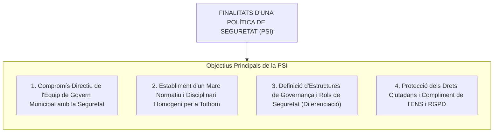
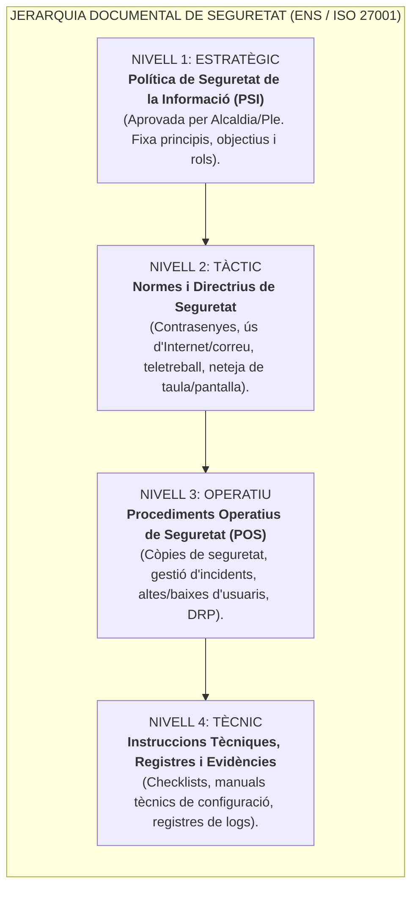
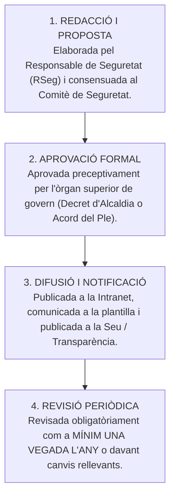

# Tema 37. Definició d'una política de seguretat

> **Fonts i marcs de referència:** Esquema Nacional de Seguretat ([`CORPUS/ENS_2022.pdf`](file:///home/oriol/Projectes/OPOS/CORPUS/ENS_2022.pdf) - Art. 12 i Mesura `[org.1]`), Guia CCN-STIC 801 (*Política de Seguretat de la Informació*), Guia CCN-STIC 805 i família d'estàndards internacionals **ISO/IEC 27001:2022** i **ISO/IEC 27002**.

---

## 1. Concepte i Fonament de la Política de Seguretat de la Informació (PSI)

La **Política de Seguretat de la Informació (PSI)** és el document estratègic de màxim rang d'un ajuntament o ens públic mitjançant el qual els òrgans de govern municipal (**Alcaldia o Ple**) formalitzen la seva visió, compromís i directrius generals per garantir la protecció integral de la informació, els actius tecnològics i els serveis prestats a la ciutadania.

---

## 2. La Piràmide Documental de Seguretat (Arquitectura Documental de l'ENS)

La seguretat de la informació no s'esgota en un sol document, sinó que s'articula en una **jerarquia documental de 4 nivells** que va des de l'estratègia política fins al detall tècnic operatiu:

---

## 3. Contingut Mínim Obligatori de la PSI (Art. 12 RD 311/2022 i Mesura `[org.1]`)

D'acord amb l'ENS i la **Guia CCN-STIC 801**, la Política de Seguretat ha d'incloure preceptivament els següents apartats:

| Secció de la PSI | Contingut i Abast Exigit per l'ENS |
| :--- | :--- |
| **1. Objectius i Missió** | Declaració formal del compromís de l'Ajuntament amb la continuïtat dels serveis i la protecció de les dades veïnals. |
| **2. Marc Legal i Normatiu** | Identificació expressa de les lleis aplicables: RD 311/2022 (ENS), RD 4/2010 (ENI), RGPD/LOPDGDD, Llei 39/2015 i Llei 40/2015. |
| **3. Àmbit d'Aplicació** | **Subjectiu:** Obligatòria per a tot el personal empleat públic, càrrecs electes i empreses externes. **Objectiu:** Tots els sistemes d'informació, xarxes i dades municipals. |
| **4. Estructura de Governança i Rols** | Designació expressa dels rols de seguretat: **Responsable de la Informació (RI)**, **del Servei (RS)**, **de Seguretat (RSeg/CISO)**, **del Sistema (RSis)**, **DPD** i **Comitè de Seguretat**. |
| **5. Jerarquia Documental** | Definició del quadre de desenvolupament normatiu (Normes, Procediments i Guies). |
| **6. Gestió Basada en els Riscos** | Principi que qualsevol canvi, adquisició o procés tecnològic ha d'estar precedit d'una **avaluació formal de riscos (MAGERIT)**. |
| **7. Formació i Conscienciació** | Pla obligatori de formació continuada en ciberseguretat i prevenció d'atacs (*phishing*) per a tots els treballadors. |
| **8. Deure de Compliment i Sancions** | Clàusula de compliment estricte i advertiment de responsabilitats disciplinàries (segons el TREBEP) i administratives en cas d'incompliment. |
| **9. Cicle de Vida i Aprovació** | Establiment del mecanisme de revisió anual i procediment formal d'actualització. |

---

## 4. Normes de Seguretat Clau (Nivell 2)

Sota la PSI es despleguen normes específiques d'obligat compliment per a la plantilla municipal:
- **Norma d'Ús Acceptable de Recursos:** Prohibició de descàrrega de programari pirata o no corporatiu i regulació de l'ús privat limitat del correu.
- **Norma de Gestió de Contrasenyes:** Longitud mínima (12 caràcters), complexitat, caducitat periòdica (90 dies) i autenticació de doble factor (**MFA**) obligatòria.
- **Norma de Taula Neta i Pantalla Neta (*Clear Desk / Clear Screen*):** Bloqueig automàtic de sessió i obligació de no deixar documents de paper amb dades personals sobre les taules desateses.
- **Norma de Teletreball i Mobilitat:** Ús exclusiu d'equips corporatius amb xifratge BitLocker i túnel VPN segur.

---

## 5. Procediment d'Aprovació, Difusió i Revisió

---

## 6. Quadre Resum i Preguntes Típiques d'Examen Tipus Test

| Pregunta / Concepte Clau | Resposta Correcta / Trampa Freqüent |
| :--- | :--- |
| **Quin òrgan municipal té la competència per aprovar formalment la PSI?** | L'**Alcaldia** (mitjançant Decret) o el **Ple municipal** (Acord de Ple). |
| **Quin lloc ocupa la PSI a la jerarquia documental de seguretat?** | El **Nivell 1 (Estratègic / Màxim rang)** de la piràmide documental. |
| **A qui vincula la Política de Seguretat de la Informació municipal?** | A **tot el personal municipal (càrrecs electes, funcionaris, laborals) i a les empreses externes proveïdores**. |
| **Amb quina periodicitat s'ha de revisar la Política de Seguretat?** | Com a mínim **una vegada l'any**, o de forma extraordinària davant canvis tecnològics substancials o incidents greus. |
| **Quina norma internacional de la família ISO regula els Sistemes de Gestió de Seguretat de la Informació (SGSI)?** | La norma **ISO/IEC 27001** (i la seva guia de controls associada **ISO/IEC 27002**). |
| **On s'ubiquen els Procediments Operatius de Seguretat (com el procediment de còpies de seguretat)?** | Al **Nivell 3 (Operatiu)** de la piràmide documental. |
