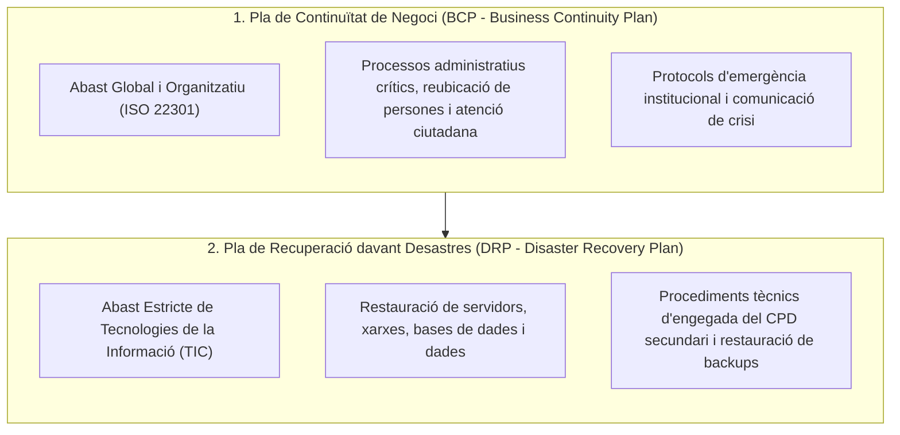
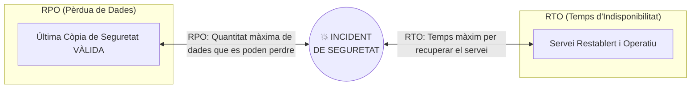
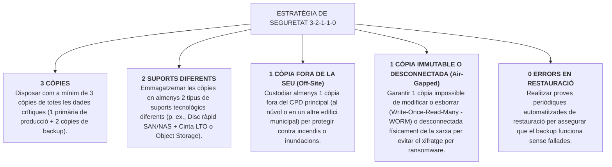

# Tema 38. Còpies de seguretat: continuïtat del negoci, "disaster recovery", sistemes de còpia de seguretat. Estratègia, disseny i operació

> **Fonts i marcs de referència:** Esquema Nacional de Seguretat ([`CORPUS/ENS_2022.pdf`](file:///home/oriol/Projectes/OPOS/CORPUS/ENS_2022.pdf) - Mesures `[op.cont]` Continuïtat del servei i `[mp.if.5]` Còpies de seguretat), estàndard **ISO 22301** (Sistemes de Gestió de Continuïtat de Negoci) i Guia CCN-STIC 809.

---

## 1. Continuïtat del Servei Municipal: BCP vs. DRP

La gestió de la continuïtat té per objectiu garantir que els serveis públics municipals essencials puguin continuar prestant-se o restablir-se ràpidament davant d'una catàstrofe greu (incendi del CPD, inundació, ciberatac per ransomware o tall energètic perllongat):

---

## 2. Mètriques Crítiques de Continuïtat: RPO, RTO, MTBF i MTTR

En l'**Anàlisi d'Impacte en el Negoci (BIA - Business Impact Analysis)** es defineixen els llindars màxims tolerables de pèrdua per a cada servei municipal:

| Mètrica Clau | Definició Operativa | Exemple a l'Ajuntament |
| :--- | :--- | :--- |
| **RPO (*Recovery Point Objective*)** | **Punt de Recuperació Objectiu:** Quantitat màxima de temps de dades que l'Ajuntament pot tolerar perdre entre l'última còpia i l'incident. | $\text{RPO} = 1\text{ hora}$ per a la base de dades del Registre d'Entrada/Sortida; $\text{RPO} = 24\text{ hores}$ per a fitxers ofimàtics. |
| **RTO (*Recovery Time Objective*)** | **Temps de Recuperació Objectiu:** Temps màxim admissible per restablir el servei des que es produeix la caiguda. | $\text{RTO} = 2\text{ hores}$ per a la Seu Electrònica i Portal ciutadà; $\text{RTO} = 24\text{ hores}$ per a aplicacions internes no urgents. |
| **MTBF (*Mean Time Between Failures*)** | **Temps Mitjà Entre Fallades:** Fiabilitat del maquinari (temps mitjà que un equip funciona sense avaries). | Indicador de qualitat dels servidors i cabines de discos del CPD. |
| **MTTR (*Mean Time To Repair*)** | **Temps Mitjà de Reparació:** Temps mitjà requerit pels tècnics per reparar i solucionar una avaria. | Mesura de l'eficiència del suport tècnic i contractes de manteniment. |

---

## 3. Tipologies de Centres de Contingència (*Disaster Recovery Sites*)

Segons la velocitat de recuperació necessària i el pressupost municipal:

1. **Seu Freda (*Cold Site*):** Espai físic buit amb connexió elèctrica i climatització bàsica, però sense servidors ni dades. La recuperació triga **dies o setmanes** (cal comprar o traslladar màquines).
2. **Seu Tèbia (*Warm Site*):** Espai amb servidors i xarxes preinstal·lats, però les dades no estan actualitzades en temps real (cal restaurar còpies de seguretat). Recuperació en **hores o dies**.
3. **Seu Calenta (*Hot Site* / CPD Secundari Mirall):** Rèplica exacta del CPD principal en funcionament continu amb replicació sincrònica o asincrònica de dades. Recuperació gairebé **immediata (minuts o segons)** en cas de catàstrofe al CPD principal.

---

## 4. Estratègia de Còpies de Seguretat: La Regla d'Or 3-2-1-1-0

L'estratègia de referència recomanada pel CCN-CERT i l'ENS per protegir els ajuntaments contra catàstrofes i ransomware és la regla **3-2-1-1-0**:

---

## 5. Arquitectura i Components d'un Sistema de Backup

- **Servidor de Gestió de Backup (*Backup Server / Master*):** Planifica les tasques, gestiona els calendaris de retenció i controla la deduplicació i xifratge.
- **Dipòsit d'Emmagatzematge (*Backup Repository*):** Espai de disc on es guarden les còpies (servidors d'emmagatzematge dedicats, cabines NAS amb discos enterprise, magatzems S3 al núvol).
- **Deduplicació i Compressió:**
  - **Deduplicació a l'origen (*Source Deduplication*):** L'agent analitza els blocs repetits abans d'enviar-los per la xarxa, estalviant amplada de banda.
  - **Deduplicació a la destinació (*Target Deduplication*):** El servidor de backup emmagatzema un sol cop els blocs comuns (p. ex., el sistema operatiu de 100 servidors virtuals Windows només s'emmagatzema una vegada), reduint l'espai de disc necessari fins a un **80-90%**.

---

## 6. Proves de Restauració i Simulacres de Desastre (ENS `[op.cont.4]`)

Una còpia de seguretat no provada és una còpia inexistent. L'ENS imposa:
1. **Verificació periòdica automàtica (*SureBackup*):** Arrencada automàtica de màquines virtuals en un entorn de xarxa aïllat (*Sandbox*) per verificar que el sistema operatiu i els serveis (SQL, Web, AD) arrenquen sense corrupció.
2. **Simulacre Anual de Recuperació de Desastres (DRP Test):** Exercici pràctic anual on l'equip TIC simula la pèrdua total del CPD i executa el restabliment dels serveis des del CPD secundari o des dels backups.

---

## 7. Quadre Resum i Preguntes Típiques d'Examen Tipus Test

| Pregunta / Concepte Clau | Resposta Correcta / Trampa Freqüent |
| :--- | :--- |
| **Què és el RPO (Recovery Point Objective)?** | El **temps màxim de pèrdua de dades admissible** per a un servei des de l'últim backup vàlid. |
| **Què és el RTO (Recovery Time Objective)?** | El **temps màxim tolerable per restablir operativament un servei** caigut. |
| **Què estableix la regla 3-2-1 de còpies de seguretat?** | **3** còpies de dades, en **2** suports diferents, amb **1** còpia fora de la seu (*off-site*). |
| **Què caracteritza una seu de contingència de tipus 'Hot Site'?** | És una **rèplica exacta i activa del CPD amb sincronització en temps real** que permet una recuperació gairebé instantània. |
| **Què és una còpia 'Air-Gapped' o desconnectada?** | Una còpia **aïllada físicament o lògicament de qualsevol xarxa**, impossible de xifrar o esborrar per un atac remot de ransomware. |
| **Quina norma internacional regula els Sistemes de Gestió de Continuïtat de Negoci?** | La norma **ISO 22301**. |
