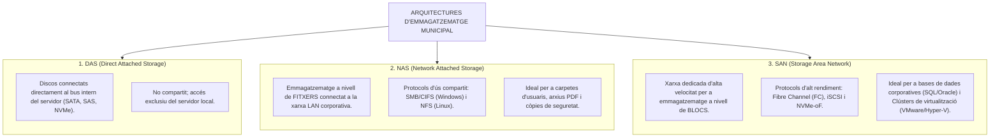
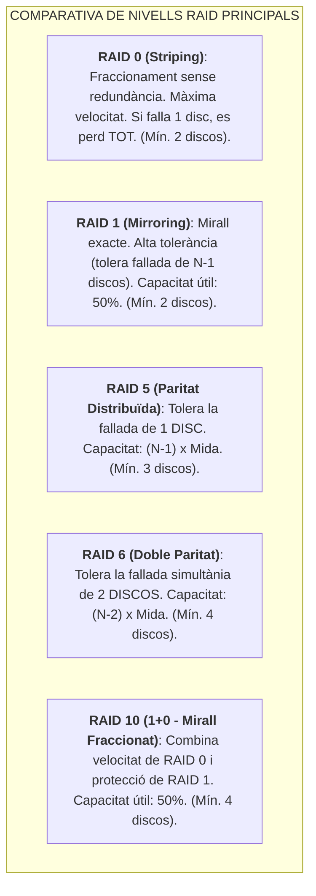
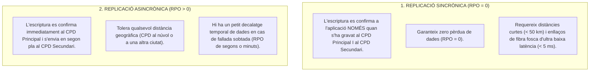

# Tema 39. Emmagatzematge i protecció de dades. Tipus de discos i configuracions RAID. Redundància de dades entre CPDs

> **Fonts i marcs de referència:** Esquema Nacional de Seguretat ([`CORPUS/ENS_2022.pdf`](file:///home/oriol/Projectes/OPOS/CORPUS/ENS_2022.pdf) - Mesures `[mp.if]` Protecció de la informació i `[op.cont]` Continuïtat del servei), estàndards de la *Storage Networking Industry Association* (SNIA) i tecnologies RAID (SNIA / IETF).

---

## 1. Arquitectures d'Emmagatzematge Empresarial: DAS, NAS i SAN

L'emmagatzematge a l'administració local s'organitza en tres grans arquitectures segons com es connecta als servidors:

---

## 2. Tipologia de Discos Físics: HDD, SSD i NVMe

| Tecnologia | Descripció Física i Rendiment | Ús Recomanat al CPD Municipal |
| :--- | :--- | :--- |
| **HDD (Hard Disk Drive - Mecànic)** | Discos magnètics giratoris (SATA 7.200 RPM / SAS 10.000-15.000 RPM). Rendiment limitat (~100-200 IOPS per disc), però molt baix cost per Terabyte. | Emmagatzematge massiu d'arxiu històric documental i dipòsits de còpies de seguretat. |
| **SSD (Solid State Drive - Flash NAND)** | Memòria d'estat sòlid sense parts mòbils sobre interfície SATA o SAS. Rendiment elevat (~50.000-100.000 IOPS) i baixa latència. | Servidors d'aplicacions generals i màquines virtuals estàndard. |
| **NVMe (Non-Volatile Memory Express)** | Memòria flash connectada directament al bus **PCIe**. Taxa de transferència ultra ràpida (GB/s), latència mínima i milions d'IOPS. | Bases de dades transaccionals crítiques (Padró, Gestor d'expedients d'alt rendiment). |

---

## 3. Nivells de RAID (Redundant Array of Independent Disks)

El sistema **RAID** combina múltiples discos físics en una única unitat lògica per oferir **tolerància a fallades (redundància)**, **major rendiment (velocitat)** o ambdues:

### 3.1. Taula Comparativa Tècnica de Configuracions RAID

| Nivell RAID | Discos Mínims | Capacitat Útil | Tolerància a Fallades | Rendiment de Lectura / Escriptura | Ús Típic a l'Ajuntament |
| :--- | :---: | :---: | :---: | :--- | :--- |
| **RAID 0** | 2 | $N \times S$ (100%) | **0 discos** (Cap tolerància) | Lectura: Molt alta Escriptura: Molt alta | Processament temporal no crític (prohibit per a producció). |
| **RAID 1** | 2 | $1 \times S$ (50%) | **1 disc** (o $N-1$) | Lectura: Alta Escriptura: Normal | Discos de sistema operatiu en servidors individuals. |
| **RAID 5** | 3 | $(N - 1) \times S$ | **1 disc** | Lectura: Molt alta Escriptura: Penalització de paritat | Servidors de fitxers i emmagatzematge general. |
| **RAID 6** | 4 | $(N - 2) \times S$ | **2 discos simultanis** | Lectura: Molt alta Escriptura: Doble penalització de paritat | Cabines d'emmagatzematge amb discos de gran capacitat (SATA/SAS). |
| **RAID 10 (1+0)** | 4 | $(N / 2) \times S$ (50%) | **Fins a 1 disc per cada subgrup mirall** | Lectura: Molt alta Escriptura: Molt alta (sense càlcul de paritat) | **Bases de dades d'alta concurrència (SQL) i hipervisors crítics**. |

- **Disc Hot-Spare (Reserva en Calent):** Disc físic mantingut en espera que la controladora RAID activa automàticament per iniciar la reconstrucció de dades immediatament quan detecta la fallada d'un disc del conjunt.

---

## 4. Redundància i Replicació de Dades entre CPDs

Per garantir la continuïtat del servei davant la destrucció total d'un edifici municipal, les dades es repliquen entre un **CPD Principal** i un **CPD Secundari de Resolució**:

### 4.1. Clúster d'Emmagatzematge Metropolità (*MetroCluster / Active-Active*)
Tecnologia que estén una cabina d'emmagatzematge SAN entre dos edificis físics independents, permetent que ambdós CPDs llegeixin i escriguin sobre el mateix volum de dades en paral·lel. Si un CPD cau completament, els servidors de l'altre CPD continuen treballant **de forma transparent i sense cap tall per als ciutadans ni usuaris**.

---

## 5. Quadre Resum i Preguntes Típiques d'Examen Tipus Test

| Pregunta / Concepte Clau | Resposta Correcta / Trampa Freqüent |
| :--- | :--- |
| **Quina diferència bàsica hi ha entre NAS i SAN?** | **NAS** proporciona emmagatzematge a nivell de **fitxers** (SMB/NFS sobre LAN); **SAN** proporciona emmagatzematge a nivell de **blocs** (Fibre Channel/iSCSI sobre xarxa dedicada). |
| **Quants discos poden fallar com a màxim en un conjunt RAID 5 sense perdre dades?** | Com a màxim **1 sol disc** (utilitza un sol bloc de paritat distribuïda). |
| **Quants discos com a mínim exigeix una configuració RAID 6 i quants poden fallar?** | Exigeix com a mínim **4 discos** i suporta la fallada simultània de **2 discos**. |
| **Quin nivell RAID és el més recomanat per a bases de dades crítiques d'alt rendiment?** | El **RAID 10 (1+0)**, ja que combina alta velocitat sense la penalització de càlcul de paritat. |
| **Què és un disc 'Hot-Spare'?** | Un disc de **reserva en calent** que s'activa automàticament per reconstruir el volum RAID quan s'avaria un disc. |
| **Quin tipus de replicació entre CPDs garanteix un RPO = 0 (zero pèrdua de dades)?** | La **Replicació Sincrònica** (requereix connexió de baixa latència). |
