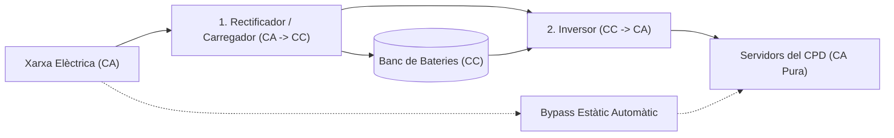

# Tema 40. Sistemes d'alimentació ininterrompuda. Equipaments de continuïtat i condicionament de l'alimentació elèctrica: definició, tipus i característiques

> **Fonts i marcs de referència:** Esquema Nacional de Seguretat ([`CORPUS/ENS_2022.pdf`](file:///home/oriol/Projectes/OPOS/CORPUS/ENS_2022.pdf) - Mesures `[mp.if.3]` Subministrament elèctric i `[op.cont]` Continuïtat del servei), estàndard internacional **IEC 62040-3** (Sistemes d'alimentació ininterrompuda) i Guies de CPDs.

---

## 1. Concepte i Funcions d'un SAI / UPS (*Uninterruptible Power Supply*)

Un **Sistema d'Alimentació Ininterrompuda (SAI)**, conegut internacionalment com a **UPS**, és un dispositiu que s'interposa entre la xarxa elèctrica pública i els equips informàtics crítics per complir dues funcions indispensables:
1. **Garantir la continuïtat energètica:** Subministrar energia elèctrica immediata des del seu banc intern de bateries quan es produeix un tall total de subministrament elèctric (*blackout*), evitant l'aturada dels servidors.
2. **Condicionar i filtrar el subministrament elèctric:** Netejar l'ona elèctrica de pertorbacions habituals que danyen el maquinari electrònic:
   - **Pics de tensió (*Spikes / Surges*):** Pujades sobtades i breus de voltatge (causades per llamps o arrencada de grans motors).
   - **Sobretensions i Subtensions (*Sags / Undervoltage*):** Caigudes o elevacions perllongades de la tensió de xarxa.
   - **Soroll elèctric i harmònics:** Interferències electromagnètiques (EMI/RFI) a la línia.
   - **Variacions de freqüència:** Oscil·lacions de la freqüència de 50 Hz.

---

## 2. Topologies i Tipologies de SAI (Norma IEC 62040-3)

La norma internacional **IEC 62040-3** classifica els SAI en tres grans tecnologies segons el seu nivell de protecció i temps de transferència:

```mermaid
flowchart TD
    SAI_MAP["TOPOLOGIES DE SAI (NORMA IEC 62040-3)"]
    
    subgraph T1["1. SAI Off-Line / Standby (VFD)"]
        direction TB
        O1["La càrrega s'alimenta DIRECTAMENT de la xarxa elèctrica sense filtrar."]
        O2["Només commuta a bateria quan es produeix un tall de llum."]
        O3["Temps de commutació: 4 - 10 mil·lisegons."]
        O4["Ús: PCs d'oficina i perifèrics (PROHIBIT per a servidors i CPD)."]
    end

    subgraph T2["2. SAI Line-Interactive (VI)"]
        direction TB
        L1["Incorpora un regulador automàtic de voltatge (AVR - Autotransformador)."]
        L2["Estabilitza subtensions i sobretensions sense gastar bateria."]
        L3["Temps de commutació: 2 - 4 mil·lisegons."]
        L4["Ús: Armaris de xarxa de planta (Switches), petits servidors d'oficina."]
    end

    subgraph T3["3. SAI On-Line de Doble Conversió (VFI)"]
        direction TB
        N1["<b>DOBLE CONVERSIÓ CONTINUA: CA -> CC -> CA</b>."]
        N2["Genera una ona sinusoïdal pura 100% aïllada de la xarxa pública."]
        N3["<b>Temps de commutació: ZERO MIL·LISEGONS (0 ms - Sense tall)</b>."]
        N4["<b>Ús: ESTÀNDARD OBLIGATORI PER A CPDS, SERVIDORS I BASES DE DADES</b>."]
    end

    SAI_MAP --> T1
    SAI_MAP --> T2
    SAI_MAP --> T3
```

---

## 3. Arquitectura Interna del SAI On-Line de Doble Conversió (VFI)

En un SAI On-Line, la càrrega crítica mai està connectada directament a la xarxa elèctrica comercial:

- **Rectificador:** Converteix el corrent altern (CA) de la xarxa en corrent continu (CC) per alimentar l'inversor i mantenir carregat el banc de bateries.
- **Inversor:** Converteix el corrent continu (CC) en un corrent altern (CA) d'ona sinusoïdal perfecta, estable a 230 V i 50 Hz.
- **Bypass Estàtic Automàtic (*Static Bypass*):** Interruptor electrònic d'alta velocitat basat en tiristors (SCR) que, en cas de sobrecàrrega interna o avaria del SAI, deriva la càrrega directament a la xarxa elèctrica en 0 ms sense interrupció.
- **Bypass Manual de Manteniment:** Commutador manual que permet aïllar completament el SAI per reparar-lo o substituir-ne components sense tallar el subministrament als servidors.

---

## 4. Paràmetres Elèctrics i Dimensionament del SAI

| Paràmetre Tècnic | Concepte i Relació de Càlcul |
| :--- | :--- |
| **Potència Aparent ($S$)** | Mesurada en **Voltampers (VA / kVA)**. És la potència total subministrada per la xarxa. |
| **Potència Activa ($P$)** | Mesurada en **Watts (W / kW)**. És la potència realment consumida i transformada en treball útil pels equips informàtics. |
| **Factor de Potència ($\text{FP}$)** | Quocient entre potència activa i aparent: $\text{FP} = \frac{P}{S}$. En servidors moderns amb fonts PFC és de **0,9 a 1,0**. |
| **Autonomia de Bateries** | Temps (minuts) que el banc de bateries pot mantenir la càrrega màxima. En CPDs municipals sol dimensionar-se per a **15 - 30 minuts** (temps suficient perquè arrenqui el grup electrogen o per tancar ordenadament els servidors). |
| **Tecnologia de Bateries** | Tradicional: **Plom-Àcid segellat (VRLA / AGM)** (vida útil 3-5 anys). Moderna: **Ió de Liti (Li-Ion)** (menor pes, càrrega ràpida, vida útil 10 anys). |

---

## 5. Arquitectures de Redundància de SAI en CPDs

Segons la criticitat del sistema municipal (d'acord amb les categories de l'ENS):

1. **Capacitat Simple ($N$):** Un sol SAI que cobreix exactament la càrrega del CPD. Si s'avaria o cal fer manteniment, el CPD queda desprotegit.
2. **Redundància Paral·lela ($N+1$):** El sistema està format per múltiples mòduls SAI connectats en paral·lel que comparteixen la càrrega, amb un mòdul extra de reserva. Si falla un mòdul qualsevol, els altres assumeixen la càrrega sense cap impacte.
3. **Doble Línia Aïllada ($2N$ o $2(N+1)$ - Sistemes Tier III/IV):** Dos sistemes SAI completament independents alimenten dues branques elèctriques separades (Línia A i Línia B) que arriben a cada rack, alimentant les dues fonts redundants de cada servidor.

---

## 6. Quadre Resum i Preguntes Típiques d'Examen Tipus Test

| Pregunta / Concepte Clau | Resposta Correcta / Trampa Freqüent |
| :--- | :--- |
| **Quin tipus de SAI té un temps de commutació de ZERO mil·lisegons (0 ms)?** | El **SAI On-Line de Doble Conversió (VFI)**. |
| **Quin tipus de SAI és l'únic recomanat per a servidors i centres de dades (CPD)?** | El **SAI On-Line de Doble Conversió**. |
| **Quina és la funció del Bypass Estàtic en un SAI?** | Commutar automàticament la càrrega a la xarxa elèctrica **sense tall** en cas de sobrecàrrega o avaria interna del SAI. |
| **Quina diferència hi ha entre un SAI Off-Line i un Line-Interactive?** | El **Line-Interactive** incorpora un regulador automàtic de voltatge (AVR) que corregeix variacions de tensió sense consumir bateria. |
| **Què és el Factor de Potència d'un SAI?** | La relació entre la **Potència Activa (Watts)** i la **Potència Aparent (Voltampers)** ($\text{FP} = \text{W} / \text{VA}$). |
| **Què permet fer el Bypass Manual de Manteniment?** | Realitzar tasques de manteniment o substituir el SAI **sense haver d'apagar els servidors del CPD**. |
