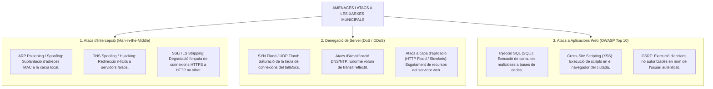
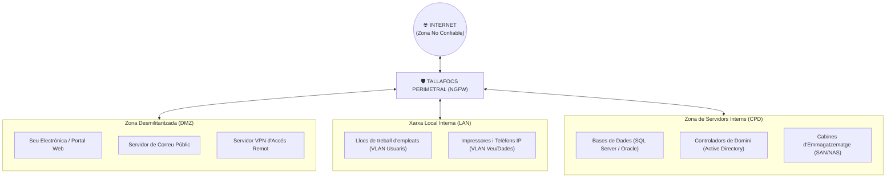

# Tema 41. Seguretat en les comunicacions. Tipus d'atacs i eines per a la prevenció. Seguretat perimetral i del lloc de treball

> **Fonts i marcs de referència:** Esquema Nacional de Seguretat ([`CORPUS/ENS_2022.pdf`](file:///home/oriol/Projectes/OPOS/CORPUS/ENS_2022.pdf) - Mesures `[mp.com]` Protecció de les comunicacions i `[mp.eq]` Protecció d'equips), Guies CCN-STIC i catàleg **OWASP Top 10**.

---

## 1. Amenaces i Tipologies d'Atacs a les Comunicacions

La seguretat de les xarxes municipals s'enfronta a múltiples vectors d'atac:

---

## 2. Seguretat Perimetral: Arquitectura de Zones i Segmentació (DMZ)

La mesura `[mp.com.1] Perímetre segur` de l'ENS obliga a **segmentar la xarxa municipal en diferents zones de confiança** separades per tallafocs:

- **Zona Desmilitaritzada (DMZ):** Conté exclusivament els servidors que han de ser accessibles des d'Internet. Si un servidor de la DMZ és compromès, el tallafocs **impedeix el pas cap a la xarxa interna (LAN)**.
- **Zona Interna de Servidors (CPD):** Allotja les bases de dades i fitxers sensibles. **Mai té accés directe des d'Internet**; només rep peticions filtrades des de la DMZ o des de la LAN autoritzada.

---

## 3. Dispositius i Eines de Protecció de Xarxa

| Dispositiu / Eina | Funció i Tecnologia Clau | Ubicació al Perímetre |
| :--- | :--- | :--- |
| **Next-Generation Firewall (NGFW)** | Inspecció profunda de paquets (*Deep Packet Inspection - DPI*), control d'aplicacions (*App-ID*), filtratge URL i descodificació de trànsit xifrat SSL/TLS. | Límit perimetral entre Internet i la xarxa municipal. |
| **WAF (Web Application Firewall)** | Tallafocs especialitzat a la **Capa 7 (Aplicació)** que analitza les peticions HTTP/HTTPS i bloqueja atacs de l'**OWASP Top 10** (SQLi, XSS) contra la Seu Electrònica. | Davant dels servidors web de la DMZ. |
| **IDS / IPS (Intrusion Detection/Prevention)** | **IDS:** Detecta i alerta de patrons d'atac (*Snort, Suricata*). **IPS:** Actua en línia i **bloqueja activament el trànsit maliciós** en temps real. | Integrat al NGFW o a la xarxa interna. |
| **VPN (Virtual Private Network)** | **IPsec (Site-to-Site):** Enllaç permanent xifrat entre edificis municipals (Biblioteca, Policia Local, Ajuntament). **SSL/TLS VPN (Client-to-Site):** Accés remot segur per a teletreball amb doble factor (MFA). | Servidor VPN perimetral. |
| **NAC (Network Access Control - 802.1X)** | Autentica qualsevol equip abans de concedir-li accés a la xarxa física o Wi-Fi corporativa, verificant el compliment de seguretat. | Switches i punts d'accés Wi-Fi. |

---

## 4. Seguretat del Lloc de Treball (*Endpoint Security*)

La protecció del lloc de treball combina múltiples capes de defensa (*Defensa en Profunditat*):

1. **EDR (Endpoint Detection and Response) / XDR:** Substitueix l'antivirus tradicional basat en signatures per **anàlisi de comportament en temps real mitjançant IA**, detectant ransomware i atacs sense fitxers (*fileless malware*), amb capacitat d'aïllar automàticament l'equip de la xarxa.
2. **Protecció del Correu Electrònic:**
   - **SPF (Sender Policy Framework):** Registre DNS que especifica quins servidors tenen permís per enviar correus en nom del domini de l'Ajuntament (`@ajuntament.cat`).
   - **DKIM (DomainKeys Identified Mail):** Signatura digital de capçaleres de correu per garantir la integritat del missatge.
   - **DMARC (Domain-based Message Authentication):** Política que indica al receptor què fer si fallen SPF o DKIM (rebutjar o posar en quarantena), evitant el *phishing* i la suplantació del consistori.
3. **Solucions del CCN-CERT (Esquema Nacional de Seguretat):**
   - **MicroCLAUDIA:** Eina corporativa de vacunació contra ransomware i gestió de vulnerabilitats.
   - **SAT-ICS / CLAUDIA:** Sonda d'alerta primerenca connectada al Centre d'Operacions de Seguretat (SOC).

---

## 5. El Model de Seguretat 'Zero Trust' (*Confiança Zero*)

El model tradicional de seguretat perimetral ("castell i fossat", on tot el que hi ha dins de la xarxa és de confiança) ha estat superat pel principi **Zero Trust**:

$$\text{"Mai confiar, verificar sempre de forma contínua"}$$

- **Microsegmentació:** Aïllament extrem de servidors i màquines fins i tot dins de la mateixa xarxa local.
- **Principi de Mínim Privilegi:** Accés només als recursos estrictament necessaris i pel temps indispensable.
- **Autenticació Contínua i Contextual:** Avaluació de la identitat, salut del dispositiu, geolocalització i doble factor (MFA) en cada petició.

---

## 6. Quadre Resum i Preguntes Típiques d'Examen Tipus Test

| Pregunta / Concepte Clau | Resposta Correcta / Trampa Freqüent |
| :--- | :--- |
| **Quina és la funció d'una Zona Desmilitaritzada (DMZ)?** | Allotjar servidors amb serveis públics accessibles des d'Internet **aïllant-los completament de la xarxa interna municipal (LAN)**. |
| **Quina diferència hi ha entre un IDS i un IPS?** | L'**IDS** només **detecta i alerta** de l'atac; l'**IPS** s'ubica en línia i **bloqueja activament el trànsit maliciós** en temps real. |
| **Quin dispositiu protegeix específicament la Seu Electrònica davant atacs SQL Injection i XSS?** | Un **WAF (Web Application Firewall)** a la capa d'aplicació. |
| **Què és un EDR en la seguretat del lloc de treball?** | Una eina avançada d'**Endpoint Detection and Response** basada en anàlisi de comportament i resposta automatitzada davant amenaces. |
| **Quins 3 registres i protocols protegeixen el correu municipal davant suplantacions i phishing?** | **SPF, DKIM i DMARC**. |
| **En què consisteix el principi de seguretat 'Zero Trust'?** | **"Mai confiar, verificar sempre"**: cap usuari o dispositiu té confiança implícita pel fet d'estar dins de la xarxa corporativa. |
