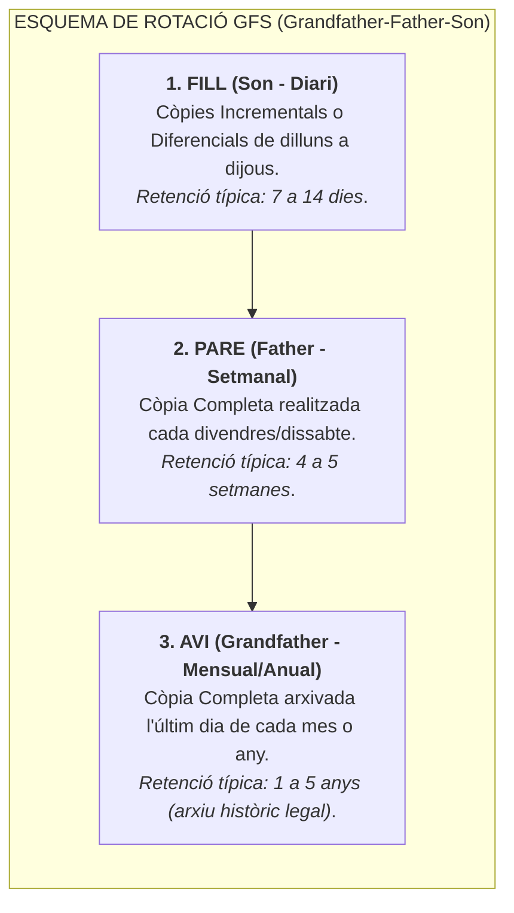
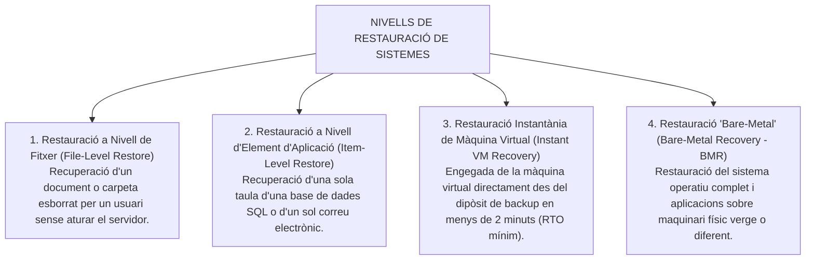

# Tema 42. Tipus de còpies de seguretat. Recuperació i restauració. Continuïtat del servei recuperació de desastres, (RPO i RTO). Eines de gestió

> **Fonts i marcs de referència:** Esquema Nacional de Seguretat ([`CORPUS/ENS_2022.pdf`](file:///home/oriol/Projectes/OPOS/CORPUS/ENS_2022.pdf) - Mesures `[mp.if.5]` Còpies de seguretat i `[op.cont]` Continuïtat del servei) i Guies CCN-STIC de protecció davant atacs de ransomware.

---

## 1. Tipologies de Còpies de Seguretat

L'elecció del tipus de còpia de seguretat és un equilibri fonamental entre el **temps de realització de la còpia**, l'**espai d'emmagatzematge consumit** i la **velocitat de restauració** en cas d'incident:

---

## 2. Taula Comparativa Tècnica dels Mètodes de Còpia

Suposem una Còpia Completa el diumenge i modificacions diàries de dilluns a dijous:

| Tipus de Còpia | Què copia el dimecres? | Atribut d'Arxiu | Espai / Temps de Còpia | Com es restaura el dijous? (Passos) |
| :--- | :--- | :---: | :---: | :--- |
| **Completa (*Full*)** | Totes les dades del sistema. | Es desmarca | Molt alt / Lent | **1 sol pas:** Només la còpia de dimecres. |
| **Incremental** | Només els canvis fets entre dimarts i dimecres. | Es desmarca | **Molt baix / Ràpid** | **4 passos:** Diumenge (Full) + Dilluns (Inc) + Dimarts (Inc) + Dimecres (Inc). *(Si falla una incremental entremig, es perd la cadena posterior)*. |
| **Diferencial** | Tots els canvis acumulats des de diumenge fins dimecres. | **No es toca** | Mitjà / Creixent | **2 passos:** Diumenge (Full) + Dimecres (Dif). |

---

## 3. Esquemes de Rotació i Retenció: El Model GFS (*Grandfather-Father-Son*)

L'esquema de rotació **GFS (Avi-Pare-Fill)** és el patró clàssic per equilibrar la retenció històrica amb l'estalvi d'espai:

---

## 4. Estratègies de Recuperació i Reducció de RTO i RPO

En cas de caiguda d'un servei, s'apliquen diferents nivells de restauració segons l'abast de l'avaria:

- **Instant VM Recovery:** Tecnologia clau de plataformes modernes que munta els fitxers de disc virtual (VMDK/VHDX) directament des del magatzem de còpies de seguretat i engega la màquina virtual a l'hipervisor en qüestió de segons, reduint el **RTO a pràcticament zero** mentre es completa la migració definitiva en segon pla (*Storage vMotion*).
- **VSS (Volume Shadow Copy Service):** Servei de Windows que permet realitzar còpies consistents d'aplicacions en calent (bases de dades SQL, Exchange, Active Directory) sense aturar el servei ni corrompre dades.

---

## 5. Eines de Gestió de Còpies de Seguretat en el Sector Públic

| Eina de Gestió | Tipologia de Llicència | Característiques i Ús a l'Administració Local |
| :--- | :--- | :--- |
| **Veeam Backup & Replication** | Comercial (Estàndard de facto) | Líder absolut per a entorns virtualitzats (**VMware vSphere i Microsoft Hyper-V**). Ofereix suport natiu per a repositoris immutables Linux (XFS), deduplicació avançada i verificació automàtica *SureBackup*. |
| **Bacula / Bareos** | Codi Obert (*Open Source*) | Plataforma modular d'alta fiabilitat per a entorns heterogenis (Linux, Windows, Unix) i gestió de grans llibreries de cintes LTO. |
| **Proxmox Backup Server (PBS)** | Codi Obert (*Open Source*) | Optimitzat per a hipervisors Proxmox VE amb deduplicació a nivell de blocs, xifratge xifrat d'extrem a extrem i còpies incrementals ultra ràpides. |
| **Commvault / Dell PowerProtect** | Comercial Enterprise | Solucions per a grans ajuntaments o diputacions amb múltiples CPDs i milers de servidors físics i al núvol. |

---

## 6. Quadre Resum i Preguntes Típiques d'Examen Tipus Test

| Pregunta / Concepte Clau | Resposta Correcta / Trampa Freqüent |
| :--- | :--- |
| **Quin tipus de còpia de seguretat requereix menys passos per restaurar?** | La **Còpia Completa (Full Backup)** (es restaura en 1 sol pas). |
| **Quina diferència hi ha entre la còpia Incremental i la Diferencial respecte a l'atribut d'arxiu?** | La **Incremental desmarca** l'atribut d'arxiu (Archive Bit = 0); la **Diferencial NO el desmarca** (es manté per a la propera còpia). |
| **Com es restaura una Còpia Diferencial?** | Es restaura l'**última Còpia Completa + l'ÚLTIMA Còpia Diferencial** (només 2 passos). |
| **Què és l'esquema de rotació GFS?** | L'esquema **Grandfather-Father-Son (Avi-Pare-Fill)**, que combina còpies diàries, setmanals i mensuals/anuals. |
| **Com s'anomena la tecnologia que permet arrencar una VM directament des del backup en minuts?** | **Instant VM Recovery**. |
| **Quin servei de Windows permet fer còpies de seguretat consistents de bases de dades en calent?** | El servei **VSS (Volume Shadow Copy Service)**. |
