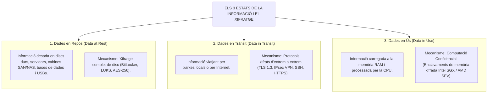
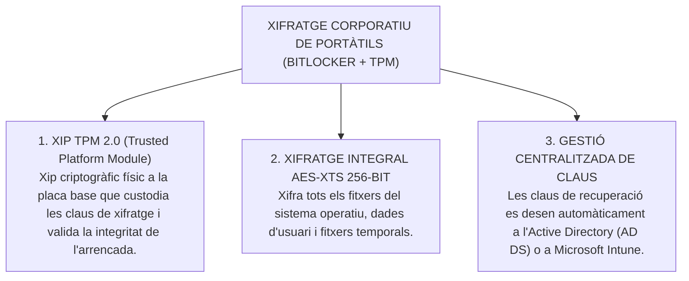
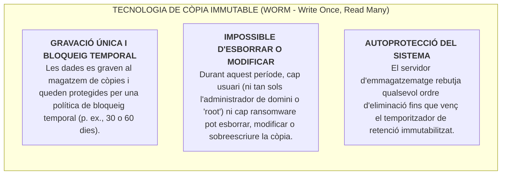

# Tema 43. Encriptació de dispositius i recursos. Còpies immutables i encriptació de dispositius mòbils (portàtils, USB, ...)

> **Fonts i marcs de referència:** Esquema Nacional de Seguretat ([`CORPUS/ENS_2022.pdf`](file:///home/oriol/Projectes/OPOS/CORPUS/ENS_2022.pdf) - Mesures `[mp.if.3]` Xifratge, `[mp.eq.2]` Protecció de dispositius portàtils i `[mp.if.5]` Còpies de seguretat), Guia CCN-STIC 807 (*Criptografia d'emprat a l'ENS*) i Guia CCN-STIC 824.

---

## 1. Fonaments del Xifratge de Dades segons l'ENS (RD 311/2022)

El xifratge (o encriptació) és el mecanisme criptogràfic essencial per garantir la **Confidencialitat** i la **Integritat** de la informació en els seus tres estats possibles:

### 1.1. Algoritmes i Longituds de Clau Aprovats pel CCN-CERT (Guia CCN-STIC 807)
- **Criptografia Simètrica (Xifratge massiu de dades i discs):** **AES (Advanced Encryption Standard)** amb claus de **128 o 256 bits** (recomanat **AES-256** en mode XTS per a discs durs i GCM per a xarxa).
- **Criptografia Asimètrica (Intercanvi de claus i signatures):** **RSA** amb claus mínimes de **2048 o 3072 bits**, o Corbes El·líptiques (**ECDSA / Ed25519** amb claus mínimes de 256 bits).
- **Funcions Resum (Hash):** Família **SHA-2 (SHA-256, SHA-384, SHA-512)** o **SHA-3** (queda expressament prohibit l'ús de MD5 o SHA-1 per obsolescència i col·lisions).

---

## 2. Xifratge de Dispositius Mòbils i Portàtils (*Full Disk Encryption - FDE*)

La mesura `[mp.eq.2] Dispositius portàtils` de l'ENS estableix que **tot ordinador portàtil, tauleta o telèfon corporatiu ha de tenir el seu emmagatzematge completament xifrat**:

| Tecnologia de Xifratge | Sistema Operatiu | Integració i Característiques Clau |
| :--- | :--- | :--- |
| **Microsoft BitLocker** | Windows 10/11 Enterprise | Requereix xip **TPM 2.0**. Permet arrencada transparent o amb sol·licitud de **PIN d'arrencada previ** (*Pre-boot Authentication*). |
| **LUKS (Linux Unified Key Setup) / dm-crypt** | Linux (Ubuntu, Debian, RedHat) | Estàndard de xifratge de blocs per a equips i servidors Linux mitjançant claus de pas o fitxers de clau. |
| **FileVault 2** | macOS (Apple) | Xifratge de volum complet mitjançant el coprocessador de seguretat Apple Silicon / xip T2. |

---

## 3. Xifratge de Suports Extraïbles (Memòries USB i Discs Externs)

L'extracció de dades municipals en memòries USB no xifrades és una de les majors causes de bretxes de seguretat:

- **BitLocker To Go:** Funció de Windows que xifra unitats USB externes. Mitjançant polítiques de grup (**GPO**), l'Ajuntament pot forçar la regla: *"Es prohibeix escriure dades en qualsevol memòria USB a menys que estigui prèviament xifrada amb BitLocker To Go"*.
- **Memòries USB amb Xifratge per Maquinari:** Dispositius USB d'alta seguretat que incorporen un teclat alfanumèric físic a la carcassa per introduir el PIN abans de ser reconeguts per l'ordinador (certificats FIPS 140-2 / Catàleg CPSTIC del CCN-CERT).

---

## 4. Còpies de Seguretat Immutables (*Immutable Backups / WORM*)

El programari maliciós modern (*Ransomware de doble extorsió*) està programat per localitzar, infiltrar-se i **esborrar o xifrar en primer lloc tots els servidors de còpies de seguretat** abans d'atacar els servidors de producció, impedint qualsevol recuperació:

### 4.1. Implementacions Tècniques de Còpies Immutables
1. **Dipòsit Linux Immutable (Veeam Hardened Repository):** Servidor Linux físic amb sistema de fitxers **XFS** que utilitza els atributs d'immutabilitat del nucli Linux (`chattr +i` / crides de sistema aïllades), operant amb un usuari de servei sense permisos de superusuari i sense servei SSH actiu.
2. **Emmagatzematge d'Objectes al Núvol amb 'Object Lock' (S3 / Azure Blob):** Utilització de dipòsits al núvol compatibles amb S3 configurats en **Mode Compliment (*Compliance Mode*)**, on ni tan sols el compte principal de l'Ajuntament pot cancel·lar el bloqueig abans del termini fixat.
3. **Cintes LTO WORM (*Linear Tape-Open*):** Cintes magnètiques físiques dissenyades de fàbrica per permetre una sola escriptura i lectura infinita (*True Hardware WORM*).

---

## 5. Destrucció Segura de Suports i Dades (Mesura `[mp.si.4]`)

Quan un disc dur, servidor o memòria USB arriba al final de la seva vida útil, l'ENS prohibeix el seu llançament a les escombraries ordinàries sense un procés certificat de desmilitarització (*Data Sanitization*):

| Mètode de Destrucció Segura | Descripció Tècnica | Ús segons la Categoria de l'ENS |
| :--- | :--- | :--- |
| **Sobreescriptura Lògica Certificada (*Wiping*)** | Sobreescriptura de tots els sectors del disc amb patrons de bits aleatoris múltiples (segons estàndards **NIST SP 800-88** o **DoD 5220.22-M**) mitjançant programari auditable (*Blancco*). | Permet la reutilització segura del disc a l'Ajuntament. |
| **Desmagnetització (*Degaussing*)** | Aplicació d'un camp magnètic d'alta intensitat que destrueix instantàniament l'estructura magnètica dels plats del disc dur HDD o cintes. | El disc queda completament inutilitzable. |
| **Destrucció Física Mecànica (*Shredding*)** | Trituració física del disc dur o xips SSD en partícules de pocs mil·límetres mitjançant una trituradora industrial amb certificat d'empresa gestora autoritzada. | **Obligatori per a suports que han contingut dades d'alta sensibilitat o categoria ALTA de l'ENS**. |

---

## 6. Quadre Resum i Preguntes Típiques d'Examen Tipus Test

| Pregunta / Concepte Clau | Resposta Correcta / Trampa Freqüent |
| :--- | :--- |
| **Quin algoritme simètric és l'estàndard oficial recomanat per l'ENS per xifrar discos?** | **AES (Advanced Encryption Standard)** amb claus de **256 bits** (AES-256). |
| **Què és el xip TPM (Trusted Platform Module) utilitzat per BitLocker?** | Un **xip criptogràfic físic integrat a la placa base** que custodia de forma segura les claus de xifratge del disc. |
| **Què significa la tecnologia d'emmagatzematge WORM?** | **Write Once, Read Many** (Escriure un sol cop, llegir molts cops), base de les còpies immutables. |
| **Per què són fonamentals les còpies immutables enfront del ransomware?** | Perquè **impedeixen que el programari maliciós pugui xifrar o esborrar els backups**, garantint sempre la recuperació. |
| **Què és BitLocker To Go?** | La tecnologia de Microsoft per **xifrar unitats d'emmagatzematge extraïbles (memòries USB i discs externs)**. |
| **Quin estàndard regula la destrucció i esborrat segur de dades en suports electrònics?** | L'estàndard internacional **NIST SP 800-88** (o DoD 5220.22-M). |
