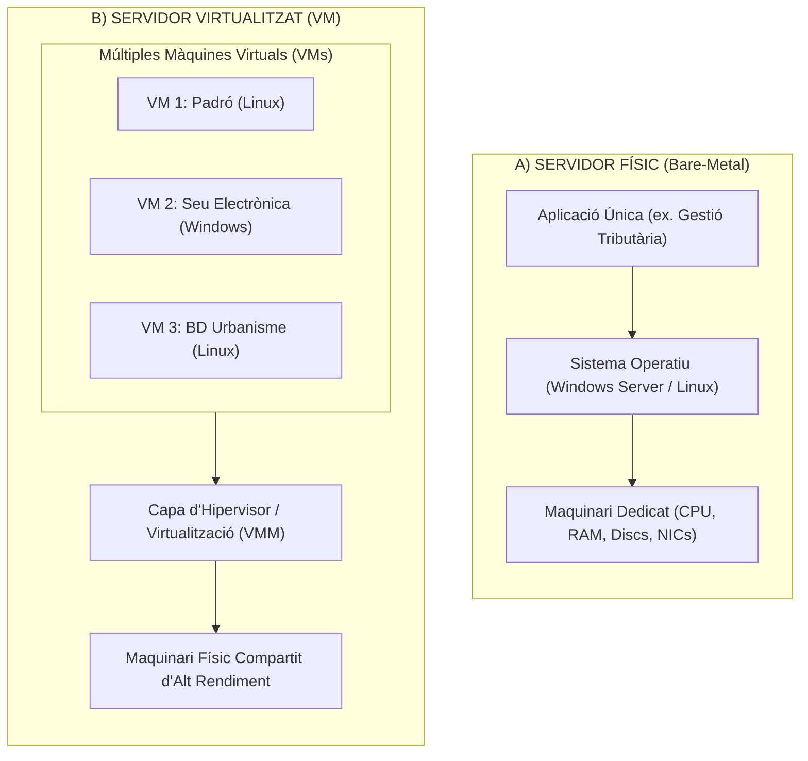
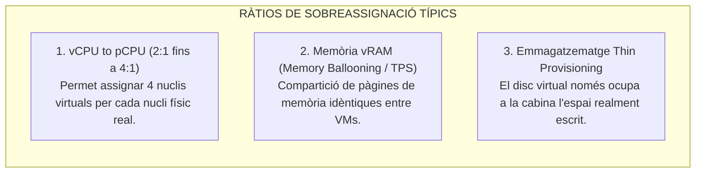

# Tema 44. Servidors físics i virtuals: diferències

> **Fonts i marcs de referència:** Esquema Nacional de Seguretat ([`CORPUS/ENS_2022.pdf`](file:///home/oriol/Projectes/OPOS/CORPUS/ENS_2022.pdf) - Mesures `[mp.if]` Protecció d'instal·lacions i `[op.cont]` Continuïtat del servei), Guia CCN-STIC 823 (*Seguretat en entorns virtualitzats*) i estàndards d'arquitectura de computació.

---

## 1. Concepte de Servidor Físic (*Bare-Metal*) vs. Servidor Virtual (VM)

En l'evolució dels sistemes d'informació de l'Administració Local, la computació ha passat del model tradicional d'un servidor físic dedicat per a cada aplicació municipal a un model consolidat basat en la virtualització:



---

## 2. Comparativa Estructurada: Servidor Físic vs. Servidor Virtual

| Paràmetre de Comparació | Servidor Físic (*Bare-Metal*) | Servidor Virtual (*Virtual Machine*) |
| :--- | :--- | :--- |
| **Aprofitament del Maquinari** | **Molt baix (10% - 20%):** La majoria de recursos queden infrautilitzats per absorbir pics puntuals de càrrega. | **Molt alt (70% - 85%):** Múltiples servidors virtuals comparteixen de forma dinàmica CPU, memòria i emmagatzematge. |
| **Aïllament i Seguretat** | **Total i físic:** Cada servidor és un equip independent amb el seu propi maquinari aïllat. | **Lògic:** Les VMs estan aïllades per l'hipervisor; una fallada o bloqueig en una VM no afecta les altres. |
| **Temps d'Aprovisionament** | **Lent (setmanes / mesos):** Requereix compra de maquinari, enviament físic, muntatge en rack, cablejat i instal·lació. | **Immediat (pocs minuts):** Clonació d'una plantilla (*template*) o desplegament automatitzat. |
| **Alta Disponibilitat (HA)** | **Complexa i costosa:** Requereix muntar clústers físics duplicats idèntics (maquinari redundant 1:1). | **Nativa i automàtica:** Si cau el servidor físic amfitrió, les VMs es reinicien automàticament en un altre amfitrió del clúster (HA). |
| **Còpies de Seguretat i Recuperació** | Còpies a nivell d'agent dins el SO; restauració sobre maquinari diferent (*bare-metal restore*) complexa per controladors. | **Còpies a nivell d'hipervisor (Snapshot / Imatge completa):** Restauració instantània de la VM en qualsevol maquinari amfitrió. |
| **Escalabilitat (*Upgrades*)** | **Rígida:** Cal obrir físicament el servidor per afegir mòduls de RAM o canviar discs (parada programada). | **Àgil (*Hot-Add*):** Es poden afegir vCPUs, memòria RAM o espai de disc en calent sense aturar el servei. |
| **Rendiment (*Overhead*)** | **Màxim (100% natiu):** Accés directe al maquinari sense cap capa intermèdia d'abstracció. | **Lleugera penalització (1% - 3%):** Sobrecost mínim generat per l'hipervisor (*overhead* de virtualització). |
| **Consum Energètic i Espai al CPD** | **Elevat:** Molts equips físics en marxa generen gran consum elèctric, ocupació d'unitats de rack (U) i necessitat de climatització. | **Òptim i sostenible:** Reducció dràstica de l'empremta física, consum elèctric i necessitats de refrigeració al CPD municipal. |

---

## 3. Gestió i Sobreassignació de Recursos (*Overcommitment*)

Un dels grans avantatges dels servidors virtuals és la capacitat d'assignar més recursos virtuals que els físicament disponibles, aprofitant que no totes les aplicacions municipals consumeixen el 100% de la seva capacitat al mateix temps:



---

## 4. Casos d'Ús Recomanats a l'Administració Local

```mermaid
flowchart TD
    Decisio{"Avaluació del Servei Municipal"}
    
    Decisio -->|Bases de Dades d'Altíssim Rendiment I/O o Requisits de Llicència per Socket Físic| BareMetal["Mantenir en SERVIDOR FÍSIC<br/>(ex. Oracle RAC corporatiu o Grans Cabines SAN dedicades)"]
    Decisio -->|La immensa majoria de serveis municipals (Padró, Seu, Gestor d'Expedients, Correu, Web)| Virtual["Desplegar en SERVIDORS VIRTUALS (VMs)<br/>(Flexibilitat, Alta Disponibilitat, Snapshots i Estalvi)"]
```

---

## 5. Quadre Resum i Preguntes Típiques d'Examen Tipus Test

| Pregunta / Concepte Clau | Resposta Correcta / Trampa Freqüent |
| :--- | :--- |
| **Quin és el principal benefici de la virtualització de servidors?** | La **consolidació de maquinari, estalvi de costos energètics i alta disponibilitat**. |
| **Què és l'overcommitment de memòria o CPU?** | Assignar més recursos virtuals (vCPU/vRAM) dels que físicament té el servidor amfitrió. |
| **Què és el Thin Provisioning en discs virtuals?** | Assignar una mida màxima a un disc virtual, però **consumir només l'espai que conté dades reals**. |
| **Té penalització de rendiment un servidor virtual?** | Sí, un sobrecost mínim (*overhead*) de l'**1% al 3%** gestionat per l'hipervisor. |
| **Com es garanteix l'alta disponibilitat en servidors virtuals?** | Mitjançant el clúster d'hipervisors que **reinicia automàticament les VMs en un altre node físic** si un falla. |
