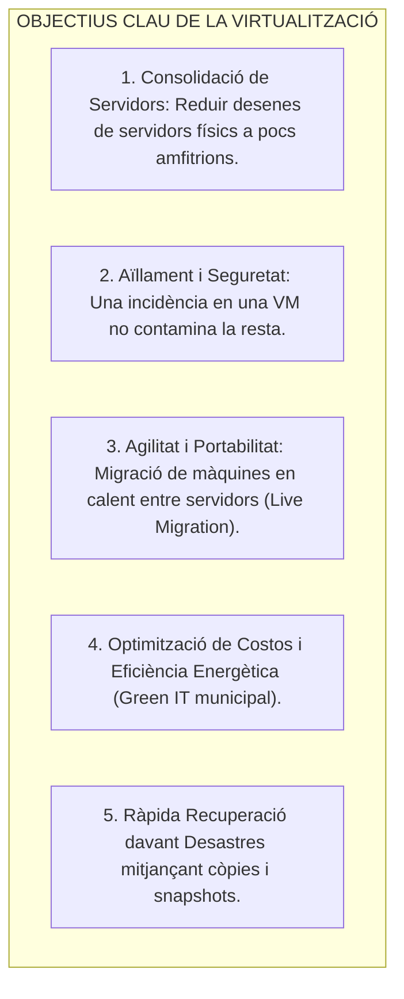
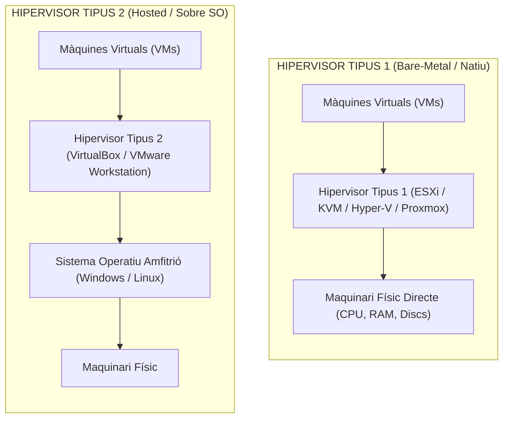
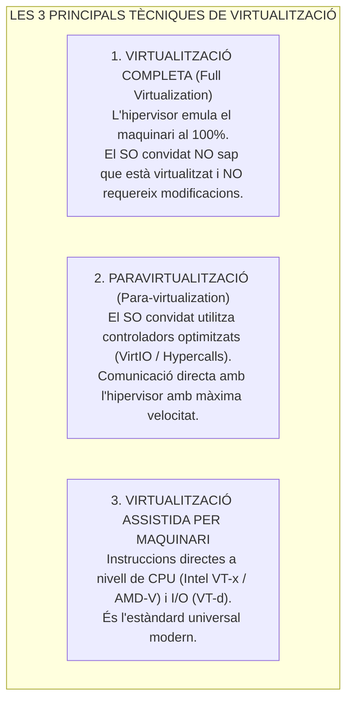
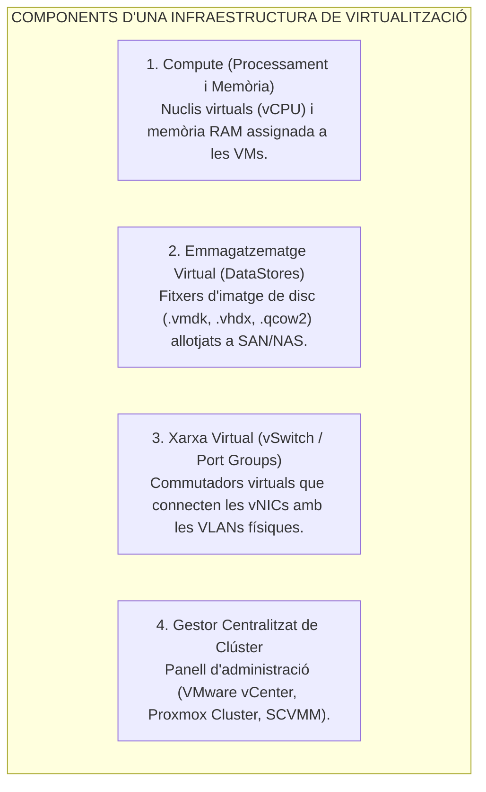

# Tema 45. Tècniques de virtualització: objectius, diferències, components i implementació

> **Fonts i marcs de referència:** Esquema Nacional de Seguretat ([`CORPUS/ENS_2022.pdf`](file:///home/oriol/Projectes/OPOS/CORPUS/ENS_2022.pdf) - Mesura `[mp.sw.1]` Aïllament i `[mp.if]`), Guia CCN-STIC 823 (*Seguretat en Virtualització*) i principis de virtualització de Popek-Goldberg (Intel VT-x / AMD-V).

---

## 1. Concepte i Objectius Fonamentals de la Virtualització

La **virtualització** és la tecnologia que permet crear una capa d'abstracció entre el maquinari físic (*hardware*) i els sistemes operatius i aplicacions, permetent que múltiples sistemes operatius s'executin de manera simultània, aïllada i independent sobre una mateixa infraestructura física.

---

## 2. Tipologia d'Hipervisors: Tipus 1 vs. Tipus 2

L'element central de la virtualització és l'**Hipervisor** o **Monitor de Màquines Virtuals (VMM - *Virtual Machine Monitor*)**:

| Criteri de Comparació | Hipervisor Tipus 1 (*Bare-Metal*) | Hipervisor Tipus 2 (*Hosted*) |
| :--- | :--- | :--- |
| **Ubicació en l'Arquitectura** | S'executa **directament sobre el maquinari físic** (sense SO amfitrió). | S'executa com una **aplicació dins d'un SO amfitrió**. |
| **Rendiment i Latència** | **Excel·lent i d'alta eficiència (overhead < 2%)**. | Menor rendiment (*overhead* doble pel SO amfitrió). |
| **Seguretat i Superfície d'Atac** | **Molt alta:** Nucli reduït (*microkernel*) sense serveis innecessaris. | Menor: La seguretat depèn de la integritat del SO amfitrió. |
| **Casos d'Ús Habituals** | **Centres de dades (CPD), servidors de producció municipal**. | **Desenvolupament, proves de laboratori, formació**. |
| **Solucions Tecnològiques Líders** | **VMware ESXi, KVM (Linux), Microsoft Hyper-V, Proxmox VE**. | **Oracle VirtualBox, VMware Workstation / Fusion**. |

---

## 3. Tècniques de Virtualització

---

## 4. Components Principals d'una Plataforma de Virtualització

---

## 5. Quadre Resum i Preguntes Típiques d'Examen Tipus Test

| Pregunta / Concepte Clau | Resposta Correcta / Trampa Freqüent |
| :--- | :--- |
| **Quina és la diferència principal entre un hipervisor Tipus 1 i Tipus 2?** | El **Tipus 1 s'executa directament sobre el maquinari bare-metal**, mentre que el **Tipus 2 s'executa sobre un sistema operatiu amfitrió**. |
| **Quin tipus d'hipervisor és KVM o VMware ESXi?** | Són hipervisors de **Tipus 1 (Bare-Metal)**. |
| **Què és la paravirtualització?** | Una tècnica on el sistema convidat utilitza **controladors optimitzats (com VirtIO)** per comunicar-se directament amb l'hipervisor. |
| **Quines tecnologies de CPU permeten la virtualització per maquinari?** | **Intel VT-x** i **AMD-V** (i Intel VT-d / AMD-Vi per a I/O). |
| **Quins són els formats de disc virtual més comuns?** | **VMDK** (VMware), **VHDX** (Microsoft) i **QCOW2** (KVM/Proxmox). |
