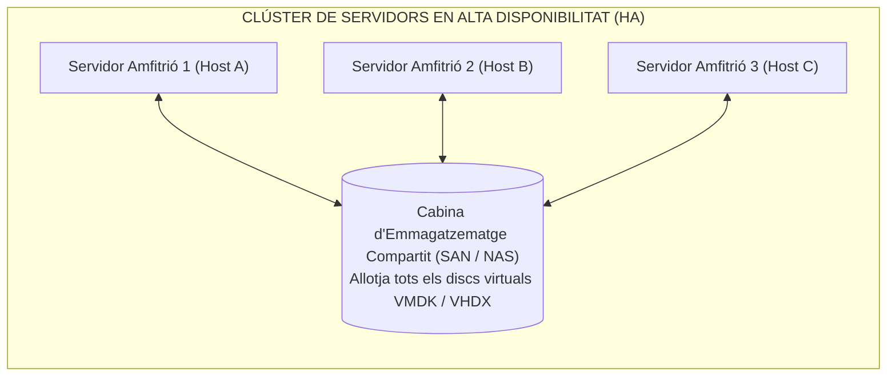
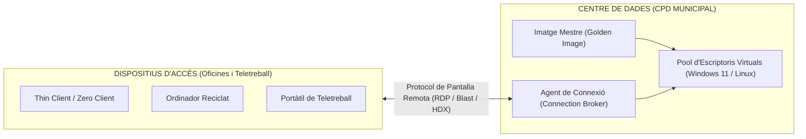

# Tema 46. Virtualització de servidors i llocs de treball (VDI)

> **Àmbit temàtic:** Infraestructura de virtualització de servidors, clústers d'alta disponibilitat i infraestructura d'escriptoris virtuals (VDI) per al lloc de treball municipal.

---

## 1. Virtualització Avançada de Servidors: Clústers i Disponibilitat

En un entorn corporatiu municipal, els servidors virtuals s'agrupen en **clústers de virtualització** interconnectats a un emmagatzematge compartit (SAN/NAS) per oferir resiliència i continuïtat del servei:

### 1.1. Mecanismes Clau del Clúster de Virtualització
1. **Alta Disponibilitat (HA - *High Availability*):** Si un servidor físic s'avaria sobtadament, l'hipervisor detecta la pèrdua de comunicació (*heartbeat*) i **reinicia automàticament les VMs afectades en els altres servidors físics** del clúster.
2. **Migració en Calent (*Live Migration / vMotion*):** Permet moure una màquina virtual en funcionament d'un servidor físic a un altre **sense cap tall de servei ni desconnexió d'usuaris**. És indispensable per fer manteniments de maquinari sense aturar l'Ajuntament.
3. **Distribució Dinàmica de Càrrega (DRS - *Dynamic Resource Scheduling*):** L'hipervisor monitoritza l'ús de CPU i memòria de cada node físic i mou automàticament les VMs mitjançant migració en calent per equilibrar el rendiment.
4. **Instantànies (*Snapshots*):** Permeten congelar l'estat de la VM abans d'una actualització de programari per poder retornar enrere (*rollback*) immediatament si es produeix un error.

---

## 2. Virtualització de Llocs de Treball (VDI - *Virtual Desktop Infrastructure*)

La **Virtualització d'Escriptoris (VDI)** és la tecnologia que allotja els sistemes operatius d'escriptori dels treballadors públics en servidors virtuals del CPD municipal, transmetent només la imatge de pantalla, el teclat i el ratolí a l'equip de l'usuari:

---

## 3. Tipologia d'Escriptoris VDI: Persistents vs. No Persistents

| Característica | VDI Persistent (*Dedicated Desktop*) | VDI No Persistent (*Pooled / Floating*) |
| :--- | :--- | :--- |
| **Assignació** | Cada empleat públic té assignat un **escriptori virtual únic i fix**. | Els escriptoris es generen de forma dinàmica des d'una **Imatge Mestre (*Golden Image*)**. |
| **Personalització** | L'usuari pot instal·lar programari i modificar configuracions de forma permanent. | Les dades d'usuari es guarden al perfil centralitzat; **en tancar sessió l'escriptori es reinicia o destrueix**. |
| **Consum d'Espai (Emmagatzematge)** | **Elevat:** Cada usuari té el seu propi disc virtual complet. | **Molt baix:** Tothom comparteix el mateix disc base amb escriptura diferencial. |
| **Manteniment i Pegats** | Complex: Cal actualitzar cada màquina virtual una a una. | **Immediat i centralitzat:** S'actualitza la Imatge Mestre i tots els usuaris tenen l'actualització. |
| **Nivell de Seguretat** | Mitjà. | **Màxim:** Els virus o fitxers brossa desapareixen en reiniciar la sessió. |

---

## 4. Protocols de Visualització Remota i Dispositius Clients

### 4.1. Protocols de Pantalla Remota
- **RDP (Remote Desktop Protocol):** Protocol estàndard de Microsoft per a entorns Windows.
- **VMware Blast Extreme:** Protocol modern optimitzat per a navegadors web (HTML5) i xarxes mòbils amb còdec H.264/H.265.
- **Citrix HDX / ICA:** Protocol d'alt rendiment amb baix consum d'amplada de banda, excel·lent per a connexions lentes.
- **PCoIP (PC-over-IP):** Protocol basat en UDP d'alta definició i baixa latència.

### 4.2. Dispositius Clients
- **Thin Clients (Clients Lleugers):** Petits terminals de baix cost i baix consum (10-15 W) amb un sistema operatiu reduït (Linux integrat o Windows IoT).
- **Zero Clients:** Equips sense sistema operatiu ni emmagatzematge local; disposen d'un processador dedicat per descodificar el protocol de pantalla (màxima seguretat).

---

## 5. Avantatges de la VDI a l'Administració Pública
1. **Seguretat de les Dades:** La informació mai surt del CPD municipal; el robatori d'un terminal no comporta fuga de dades (*Data Breach*).
2. **Facilitat per al Teletreball:** Els funcionaris poden accedir al seu lloc de treball complet de forma segura des de qualsevol lloc mitjançant VPN o passarel·la web segura.
3. **Eficiència Energètica i Estalvi:** Els *thin clients* tenen una vida útil de més de 8-10 anys i redueixen dràsticament la factura elèctrica de l'Ajuntament.

---

## 6. Quadre Resum i Preguntes Típiques d'Examen Tipus Test

| Pregunta / Concepte Clau | Resposta Correcta / Trampa Freqüent |
| :--- | :--- |
| **Què és la migració en calent (*Live Migration / vMotion*)?** | Moure una màquina virtual d'un amfitrió a un altre **sense tall de servei ni interrupció**. |
| **Com funciona un entorn VDI no persistent (*Pooled*)?** | Els escriptoris es generen des d'una **Imatge Mestre (*Golden Image*)** i es restableixen en tancar sessió. |
| **Quin protocol de visualització és natiu de Microsoft?** | El protocol **RDP (Remote Desktop Protocol)**. |
| **Què és un Zero Client?** | Un dispositiu d'accés **sense sistema operatiu ni emmagatzematge local** dedicat exclusivament a VDI. |
| **Com millora la seguretat la VDI en el teletreball municipal?** | **Les dades mai viatgen a l'ordinador domèstic**; només es transmeten els píxels de la pantalla. |
