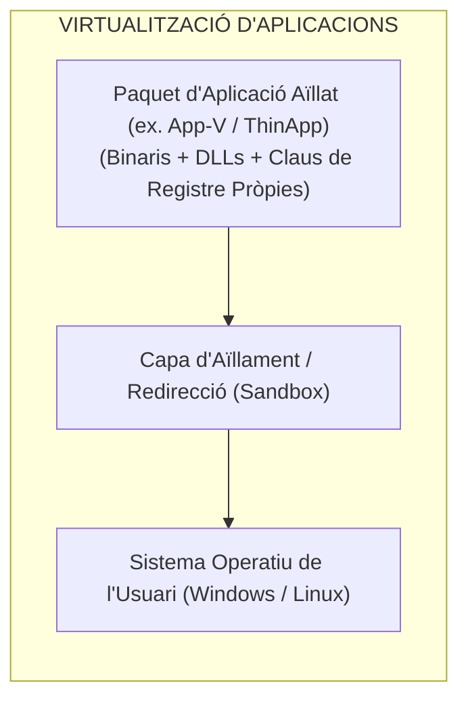
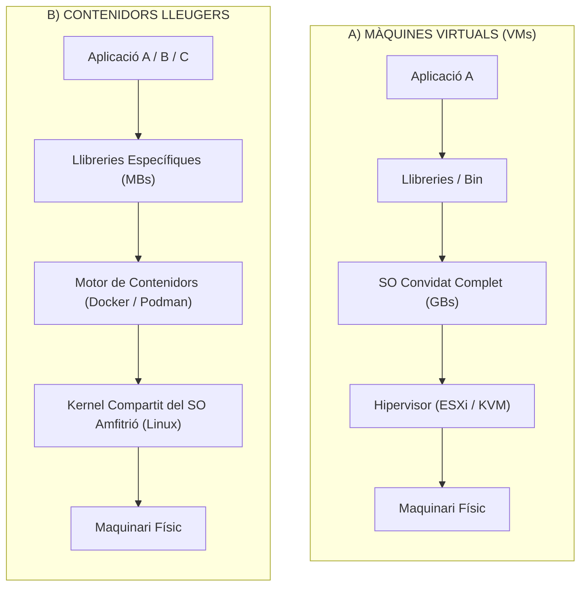
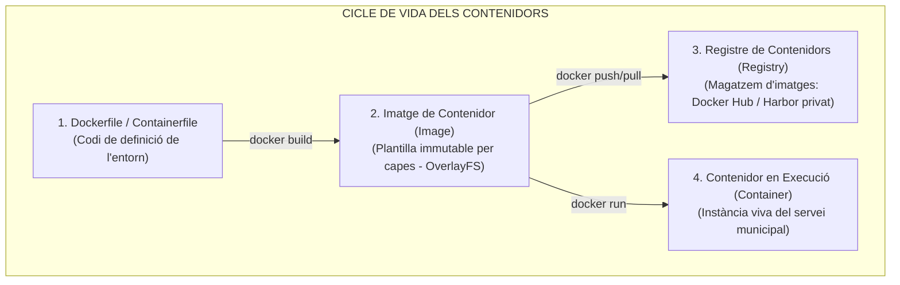
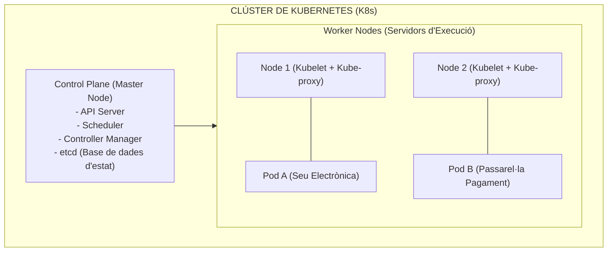

# Tema 47. Virtualització de programari d'aplicacions. Desplegament de programari d'aplicacions en contenidors lleugers

> **Fonts i marcs de referència:** Esquema Nacional d'Interoperabilitat ([`CORPUS/ENI.pdf`](file:///home/oriol/Projectes/OPOS/CORPUS/ENI.pdf) - Reutilització i transferència tecnològica), Guia CCN-STIC 886 (*Seguretat en Contenidors i Kubernetes*) i especificacions de la Open Container Initiative (OCI).

---

## 1. Virtualització de Programari d'Aplicacions

La **virtualització d'aplicacions** consisteix a encapsular una aplicació juntament amb les seves llibreries (DLLs, dependències) i configuracions de registre en un paquet independent que s'executa en una capa aïllada (*sandbox*) sobre el sistema operatiu de l'usuari:

- **Principals Avantatges:**
  - **Eliminació del conflicte de llibreries (*DLL Hell*):** Permet executar diferents versions d'un mateix programari incompatibles entre si (per exemple, dues versions de Java runtime) en un mateix ordinador.
  - **Desplegament i actualització neta:** L'aplicació no modifica el registre ni copia fitxers a carpetes del sistema; eliminar l'aplicació és tan senzill com esborrar el paquet.

---

## 2. Contenidors Lleugers (*Containerization*): Màquines Virtuals vs. Contenidors

Mentre que les Màquines Virtuals (VMs) virtualitzen el maquinari complet (incloent un sistema operatiu convidat sencer), els **contenidors** virtualitzen a **nivell de sistema operatiu**, compartint el mateix nucli (*kernel*) del sistema amfitrió:

| Criteri de Comparació | Màquines Virtuals (VMs) | Contenidors Lleugers (Docker / Podman) |
| :--- | :--- | :--- |
| **Abstracció** | Nivell de **Maquinari físic** (Hardware). | Nivell de **Sistema Operatiu** (Kernel compartit). |
| **Pes i Mida** | Pesades (**diversos GigaBytes** per VM). | Molt lleugers (**desenes o centenars de MegaBytes**). |
| **Temps d'Arrencada** | Minuts (requereix boot del SO convidat). | **Mil·lisegons o pocs segons** (arrencada immediata). |
| **Mecanismes d'Aïllament** | Aïllament per hipervisor (molt robust). | Aïllament per **Namespaces** i **Cgroups** de Linux. |
| **Densitat per Servidor** | Desenes de VMs per node. | **Centenars de contenidors** per node físic. |

---

## 3. L'Ecosistema de Contenidors: Docker, Podman i Registres

- **Mecanismes de Nucli de Linux utilitzats:**
  - **Namespaces:** Proporcionen aïllament lògic (processos `pid`, xarxa `net`, muntatges `mnt`, usuaris `user`).
  - **Control Groups (*cgroups*):** Limiten i mesuren el consum de recursos (CPU, memòria RAM, I/O de disc).

---

## 4. Orquestració de Contenidors a Gran Escala: Kubernetes (K8s)

Quan l'Ajuntament desplega desenes de microserveis (portals de tràmits, passarel·les de pagament, gestors de signatures), cal un **orquestrador automàtic**:

- **Conceptes Fonamentals de Kubernetes:**
  - **Pod:** La unitat de desplegament mínima a K8s; conté un o més contenidors que comparteixen xarxa i emmagatzematge.
  - **Autorecuperació (*Self-Healing*):** Si un contenidor cau o un servidor s'avaria, Kubernetes recrea automàticament el Pod en un altre node en segons.
  - **Escalabilitat Automàtica (*Horizontal Pod Autoscaler - HPA*):** Si s'obre el període de matriculació a les escoles bressol i augmenta el trànsit, K8s multiplica el nombre de Pods automàticament.
  - **Actualitzacions sense caiguda (*Rolling Updates*):** Permet actualitzar la versió de l'aplicació web municipal de forma progressiva sense cap minut d'indisponibilitat ciutadana.

---

## 5. Quadre Resum i Preguntes Típiques d'Examen Tipus Test

| Pregunta / Concepte Clau | Resposta Correcta / Trampa Freqüent |
| :--- | :--- |
| **Quina és la diferència fonamental entre una VM i un contenidor?** | Els contenidors **comparteixen el kernel del sistema operatiu amfitrió**; les VMs tenen un SO complet independent. |
| **Quins dos mecanismes de Linux fan possible l'aïllament dels contenidors?** | Els **Namespaces** (aïllament de processos/xarxa) i els **Control Groups (*cgroups*)** (límit de recursos). |
| **Què és un Pod a Kubernetes?** | La **unitat mínima d'execució i desplegament**, que conté un o més contenidors estretament vinculats. |
| **Què permet l'arquitectura d'imatges per capes a Docker?** | Reutilitzar capes comunes només de lectura (*OverlayFS*), **estalviant espai de disc i temps de descàrrega**. |
| **Quin és el propòsit d'un orquestrador com Kubernetes?** | Automatitzar el **desplegament, l'escalat automàtic, la recuperació de fallades (*self-healing*) i el balanç de càrrega**. |
