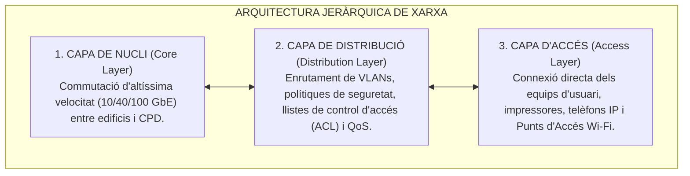
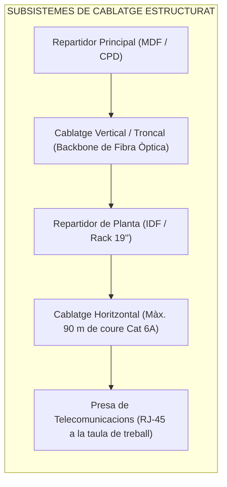
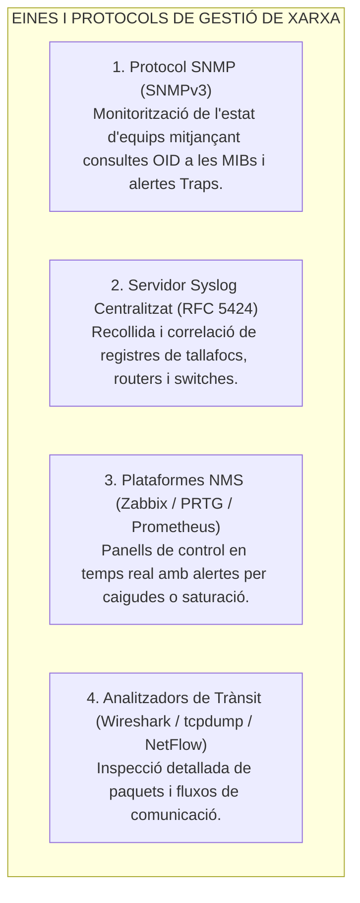

# Tema 48. Infraestructura de xarxa. Solucions de cablatge i interconnexió. Equipament. Eines de configuració i monitorització

> **Àmbit temàtic:** Xarxes de comunicacions municipals, normes de cablatge estructurat (TIA/EIA-568), equipament actiu i passiu, i sistemes de monitorització (SNMP, Zabbix).

---

## 1. Arquitectura Jeràrquica de la Xarxa Municipal

La infraestructura de xarxa corporativa d'un ajuntament s'estructura segons el model clàssic de **tres capes jeràrquiques de xarxa**:

---

## 2. El Sistema de Cablatge Estructurat (TIA/EIA-568 i ISO/IEC 11801)

El cablatge estructurat és el conjunt d'elements passius (cables, connectors, canalitzacions i armaris) que garanteixen una connectivitat normalitzada i flexible:

### 2.1. Regla de Distàncies del Cablatge Horitzontal (Norma TIA/EIA)
- **Distància màxima del canal complet:** **100 metres**.
  - **90 metres:** Cablejat horitzontal fix sòlid (des del panell de pegat a la presa de paret).
  - **10 metres:** Suma dels cordons de pegat flexibles (*patch cords* a l'armari i a la taula).

---

### 2.2. Categories de Cable de Parell Trenat (Coure)

| Categoria | Freqüència Màxima | Velocitat Màxima | Distància / Ús Típic Municipal |
| :--- | :--- | :--- | :--- |
| **Cat 5e** | 100 MHz | 1 Gbps (1000BASE-T) | 100 m (Obsolet per a noves instal·lacions). |
| **Cat 6** | 250 MHz | 1 Gbps / 10 Gbps | 100 m a 1 Gbps; només fins a 55 m a 10 Gbps. |
| **Cat 6A** *(Estàndard actual)* | **500 MHz** | **10 Gbps (10GBASE-T)** | **100 m complets a 10 Gbps (Norma obligatòria per a noves seus municipals)**. |
| **Cat 7 / 7A** | 600 / 1000 MHz | 10 Gbps | 100 m (Apantallament individual S/FTP). |
| **Cat 8** | 2000 MHz | 25 / 40 Gbps | **Fins a 30 m** (dissenyat exclusivament per a servidors dins del CPD). |

- **Tipus de blindatge:**
  - **U/UTP (*Unshielded*):** Sense apantallament.
  - **F/UTP (*Foiled*):** Làmina d'alumini global que embolcalla els 4 parells.
  - **S/FTP (*Shielded Foiled*):** Malla metàl·lica global exterior i làmina d'alumini individual al voltant de cada parell (màxima protecció contra interferències EMI).

---

## 3. Equipament Passiu i Actiu de Xarxa

### 3.1. Equipament Passiu
- **Armaris Rack de 19 polzades:** Allotgen els equips. L'alçada es mesura en **Unitats de Rack (U)**, on $1\text{ U} = 1,75\text{ polzades} = 44,45\text{ mm}$.
- **Panells de Pegat (*Patch Panels*):** Regletes metàl·liques amb preses RJ-45 femella on s'acaba el cablejat fix de planta per connectar-lo fàcilment als commutadors.
- **Power over Ethernet (PoE):** Alimentació elèctrica dels dispositius a través del mateix cable de dades RJ-45:
  - **PoE (IEEE 802.3af):** Fins a **15,4 W** (telèfons IP bàsics).
  - **PoE+ (IEEE 802.3at):** Fins a **30 W** (Punts d'accés Wi-Fi 6, càmeres IP amb zoom).
  - **PoE++ / 4PPoE (IEEE 802.3bt):** Fins a **60 W - 90 W** (càmeres PTZ d'exterior, sistemes de videoconferència).

### 3.2. Equipament Actiu
- **Commutadors (*Switches*) de Capa 2 i Capa 3:** Interconnecten equips en xarxa local, gestionen VLANs (IEEE 802.1Q) i encaminen paquets a velocitat de cable (*wire-speed*).
- **Encaminadors (*Routers*) / Gateways:** Connecten la seu municipal amb Internet i amb altres seus a través de xarxes WAN privades o línies dedicades de fibra.

---

## 4. Eines de Diagnòstic, Configuració i Monitorització

### 4.1. Comandes bàsiques de diagnòstic per a tècnics municipals:
- `ping`: Comprova connectivitat i latència mitjançant missatges ICMP Echo Request/Reply.
- `traceroute` / `tracert`: Mostra el camí i salts d'encaminadors (*hops*) fins a la destinació mesurant el TTL (*Time-To-Live*).
- `netstat` / `ss`: Llista les connexions de xarxa actives, ports en escolta (*listening*) i sockets oberts.
- `nslookup` / `dig`: Realitza consultes directes als servidors de resolució de noms DNS.

---

## 5. Quadre Resum i Preguntes Típiques d'Examen Tipus Test

| Pregunta / Concepte Clau | Resposta Correcta / Trampa Freqüent |
| :--- | :--- |
| **Quina és la distància màxima del canal de cablatge horitzontal?** | **100 metres en total** (90 m de cable fix + 10 m de cordons de pegat). |
| **Quina categoria de coure garanteix 10 Gbps a 100 metres?** | La **Categoria 6A (Cat 6A)** a 500 MHz. |
| **Quina és la mida d'una Unitat de Rack (1 U)?** | **1,75 polzades (44,45 mm)**. |
| **Quina versió de SNMP és l'única recomanada per seguretat a l'ENS?** | **SNMPv3**, ja que incorpora **autenticació i xifratge de dades**. |
| **Què és el protocol PoE (Power over Ethernet)?** | Tecnologia que **subministra energia elèctrica a través del cable de xarxa RJ-45** a telèfons IP i APs. |
| **Quina comanda permet conèixer els salts intermedis d'encaminament?** | `traceroute` (a Linux) o `tracert` (a Windows). |
