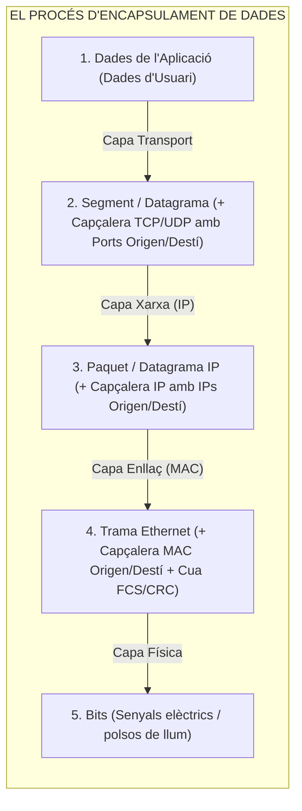
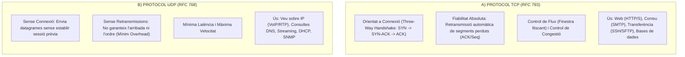

# Tema 49. Els models de referència per a la comunicació de sistemes oberts: TCP/IP. Capes, funcionalitats, protocols, estandardització

> **Fonts i marcs de referència:** Esquema Nacional d'Interoperabilitat ([`CORPUS/ENI.pdf`](file:///home/oriol/Projectes/OPOS/CORPUS/ENI.pdf) - NTI de Catàleg d'estàndards), model **ISO 7498 (Model OSI)** i estàndards IETF per a la pila TCP/IP (**RFC 791 IPv4**, **RFC 793 TCP**, **RFC 768 UDP** i **RFC 8200 IPv6**).

---

## 1. Els Models de Comunicació per Capes i l'Encapsulament de Dades

El principi fonamental de les xarxes de telecomunicacions és l'**arquitectura en capes**, on cada capa ofereix serveis a la capa superior i utilitza els serveis de la capa inferior mitjançant una interfície normalitzada:

---

## 2. Comparativa: Model OSI (7 Capes) vs. Model TCP/IP (4 Capes)

El model **OSI** (Open Systems Interconnection de la ISO) és el model teòric de referència, mentre que el model **TCP/IP** (creat per la IETF) és l'estàndard d'implementació real d'Internet:

| Capa Model OSI (ISO 7498) | Capa Model TCP/IP | Unitat de Dades (PDU) | Protocols Principals |
| :--- | :--- | :---: | :--- |
| **7. Aplicació** **6. Presentació** **5. Sessió** | **Capa d'APLICACIÓ** | **Dades** | **HTTP, HTTPS, DNS, DHCP, SSH, SMTP, IMAP, NTP, SNMP, FTP** |
| **4. Transport** | **Capa de TRANSPORT** | **Segment (TCP) Datagrama (UDP)** | **TCP** (Fiable / Orientat a connexió) **UDP** (Ràpid / No fiable / Sense connexió) |
| **3. Xarxa** | **Capa d'INTERNET (Xarxa)** | **Paquet** | **IPv4, IPv6, ICMP, IGMP, ARP**, OSPF, BGP |
| **2. Enllaç de Dades** **1. Física** | **Capa d'ACCÉS A LA XARXA** | **Trama (Frame) Bits** | **Ethernet (IEEE 802.3), Wi-Fi (IEEE 802.11)**, Fibra Òptica, Coure |

---

## 3. Anàlisi Detallada de les Capes de la Pila TCP/IP

### 3.1. Capa de Transport: TCP vs. UDP

#### Establiment de Connexió TCP (*Three-Way Handshake*):
1. **Client $\rightarrow$ Servidor:** Envia paquet amb flag **`SYN`** (*Synchronize*) i número de seqüència inicial $X$.
2. **Servidor $\rightarrow$ Client:** Respon amb flags **`SYN + ACK`** (*Acknowledge* $X+1$) i número de seqüència $Y$.
3. **Client $\rightarrow$ Servidor:** Envia flag **`ACK`** (*Acknowledge* $Y+1$). Connexió establerta!

---

### 3.2. Capa d'Internet (Xarxa): Protocol IP i ICMP
- **Protocol IP (Internet Protocol - IPv4 / IPv6):**
  - Protocol no orientat a connexió i de millor esforç (*best-effort*): No garanteix que els paquets arribin ni que ho facin en ordre (aquesta tasca la delega a TCP).
  - **Camp TTL (*Time-To-Live*):** Comptador de salts que es decrementa en 1 a cada router. Quan arriba a 0, el paquet es descarta per **evitar bucles infinits a la xarxa**, retornant un missatge ICMP *Time Exceeded*.
- **Protocol ICMP (Internet Control Message Protocol):** Utilitzat per a diagnòstic i notificació d'errors a la xarxa (base de les comandes `ping` i `traceroute`).
- **Protocol ARP (Address Resolution Protocol):** Resol l'adreça física **MAC (Capa 2)** associada a una adreça lògica **IP (Capa 3)** dins la mateixa xarxa local.

---

### 3.3. Capa d'Aplicació: Ports i Protocols Essencials

Els ports de comunicació (de 0 a 65535) permeten dirigir el trànsit a l'aplicació correcta dins el servidor:

| Port i Protocol de Transport | Protocol d'Aplicació | Funció en l'Administració Local |
| :---: | :--- | :--- |
| **Port 53 (UDP/TCP)** | **DNS** (*Domain Name System*) | Resolució de noms de domini (ex. `ajuntament.cat` $\rightarrow$ IP). |
| **Ports 67 / 68 (UDP)** | **DHCP** (*Dynamic Host Config*) | Assignació automàtica d'adreces IP mitjançant el procés **DORA** (*Discover, Offer, Request, Acknowledge*). |
| **Port 80 (TCP)** | **HTTP** | Accés web sense xifrar (redirigeix a HTTPS). |
| **Port 443 (TCP)** | **HTTPS** (*HTTP sobre TLS*) | Accés web segur xifrat a la Seu Electrònica i portals municipals. |
| **Port 22 (TCP)** | **SSH** (*Secure Shell*) | Administració remota segura per línia de comandes de servidors Linux. |
| **Port 123 (UDP)** | **NTP** (*Network Time Protocol*) | Sincronització de l'hora oficial de tots els servidors de l'Ajuntament. |

---

## 4. Organismes d'Estandardització Internacional

- **IETF (*Internet Engineering Task Force*):** Desenvolupa els protocols d'Internet mitjançant documents **RFC (*Request for Comments*)**.
- **IEEE (*Institute of Electrical and Electronics Engineers*):** Estandarditza la Capa Física i d'Enllaç (sèrie IEEE 802: 802.3 Ethernet, 802.11 Wi-Fi, 802.1Q VLANs).
- **ISO (*International Organization for Standardization*):** Creadora del model teòric OSI.

---

## 5. Quadre Resum i Preguntes Típiques d'Examen Tipus Test

| Pregunta / Concepte Clau | Resposta Correcta / Trampa Freqüent |
| :--- | :--- |
| **Com s'anomena la PDU a cada capa del model OSI?** | Capa 4: **Segment**; Capa 3: **Paquet**; Capa 2: **Trama (*Frame*)**; Capa 1: **Bits**. |
| **Quins són els 3 passos del Three-Way Handshake de TCP?** | **SYN $\rightarrow$ SYN-ACK $\rightarrow$ ACK**. |
| **Quina és la funció del camp TTL d'un paquet IP?** | **Evitar bucles infinits de paquets** a la xarxa descartant-los quan el valor arriba a 0. |
| **Quin protocol tradueix una adreça IP a una adreça MAC?** | El protocol **ARP (Address Resolution Protocol)**. |
| **En quins ports i protocol s'executa el servei DHCP?** | Ports **UDP 67 (servidor) i UDP 68 (client)** mitjançant el procés DORA. |
| **Quina diferència bàsica hi ha entre TCP i UDP?** | **TCP és orientat a connexió i fiable**; **UDP és sense connexió, més ràpid i no garanteix el lliurament**. |
