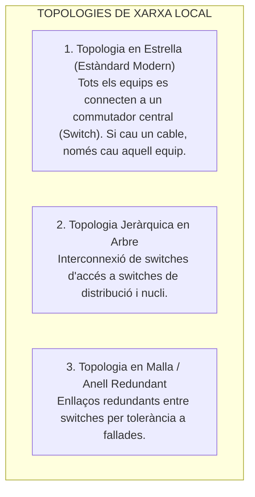
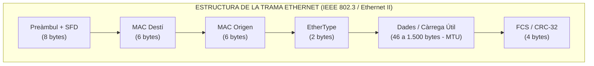
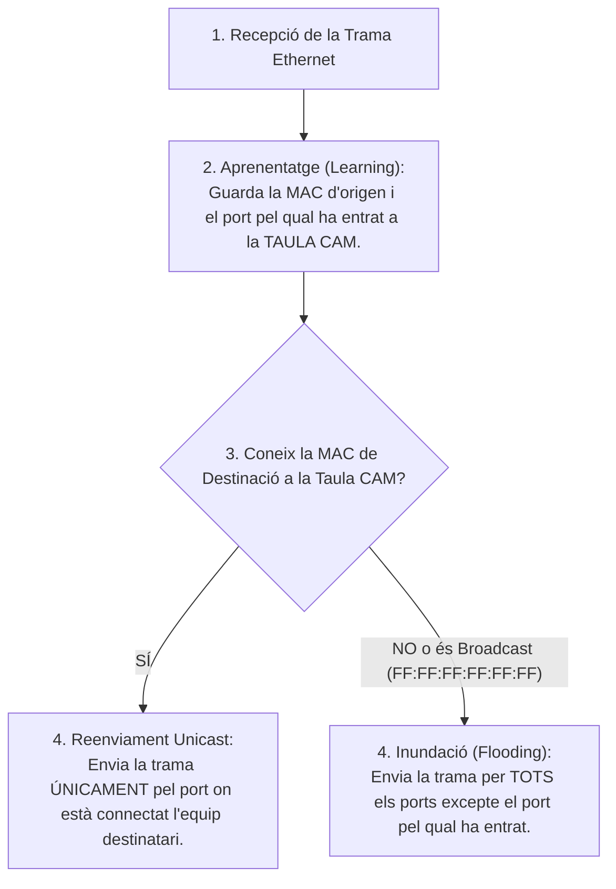
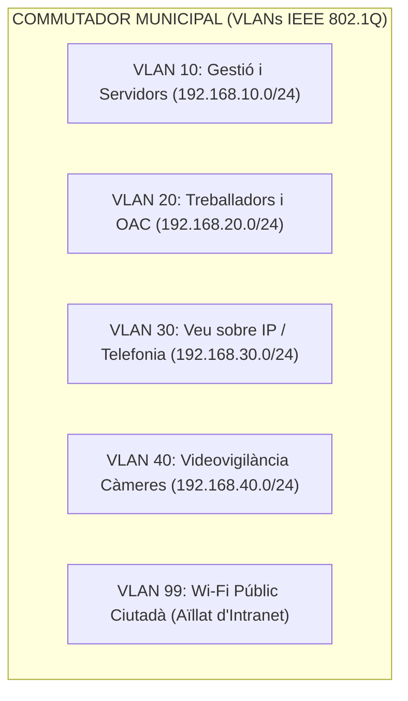

# Tema 50. Xarxes d'àrea local (LAN): característiques, tipologies, protocols, commutació i VLANs

> **Fonts i marcs de referència:** Esquema Nacional de Seguretat ([`CORPUS/ENS_2022.pdf`](file:///home/oriol/Projectes/OPOS/CORPUS/ENS_2022.pdf) - Mesura `[mp.com.1]` Segregació de xarxes), estàndards **IEEE 802.3 (Ethernet)**, **IEEE 802.1Q (VLANs)**, **IEEE 802.1w (RSTP)** i **IEEE 802.3ad (LACP)**.

---

## 1. Concepte i Característiques de les Xarxes d'Àrea Local (LAN)

Una **Xarxa d'Àrea Local (LAN - *Local Area Network*)** és un sistema de comunicacions que interconnecta ordinadors, servidors, impressores i dispositius dins d'un àmbit geogràfic limitat (un edifici municipal, una oficina d'atenció ciutadana o un campus d'equipaments públics), caracteritzada per **altes velocitats de transferència (1 Gbps a 100 Gbps), latències molt baixes i propietat privada de la infraestructura**:

---

## 2. L'Estàndard IEEE 802.3 (Ethernet) i Estructura de la Trama

L'estàndard universal per a xarxes LAN és **Ethernet (IEEE 802.3)**. En les xarxes modernes commutades es treballa en mode **Full-Duplex**, la qual cosa permet transmetre i rebre informació de forma simultània sense col·lisions.

- **Adreça MAC (*Media Access Control*):** Adreça física de 48 bits (6 bytes) expressada en hexadecimal (ex. `00:1A:2B:3C:4D:5E`). Els primers 24 bits identifiquen el fabricant (**OUI - *Organizationally Unique Identifier***) i els últims 24 bits identifiquen l'equip.
- **MTU (*Maximum Transmission Unit*):** La mida màxima de dades permesa en una trama estàndard és de **1.500 bytes**. En entorns de servidors i cabines de disc SAN s'utilitzen *Jumbo Frames* de fins a **9.000 bytes** per reduir la càrrega de CPU.

---

## 3. Commutació (*Switching*): Funcionament del Switch

El commutador (*Switch*) opera a la **Capa 2 (Enllaç de Dades)** del model OSI. Quan rep una trama:

### Mètodes de Commutació Interna del Switch:
- **Store-and-Forward:** El switch emmagatzema la trama sencera a la memòria intermèdia (*buffer*) i comprova el codi de redundància cíclica (**FCS/CRC-32**). Si està corrupta, la descarta. És el mètode per defecte per màxima fiabilitat.
- **Cut-Through:** El switch llegeix només els primers 6 bytes (adreça MAC de destinació) i comença a reenviar la trama immediatament, oferint la **mínima latència**.

---

## 4. Xarxes Locals Virtuals (VLAN - IEEE 802.1Q)

Una **VLAN** és una segmentació lògica d'un commutador físic en múltiples xarxes independents. Cada VLAN constitueix un **domini de difusió (*broadcast domain*) separat**:

### 4.1. Tipus de Ports a la Xarxa Municipal
- **Port d'Accés (*Access Port*):** Pertany a una única VLAN. S'hi connecten equips finals (PCs, impressores). Les trames que entren i surten van **sense etiquetar (*untagged*)**.
- **Port Troncal (*Trunk Port*):** Interconnecta dos switches o un switch amb el router/firewall. Transporta el trànsit de múltiples VLANs afegint una **etiqueta de 4 bytes** segons la norma **IEEE 802.1Q** que inclou el **VLAN ID** (de l'1 al 4094) i la prioritat **QoS (802.1p)**.

---

## 5. Protocols de Prevenció de Bucles i Agregació d'Enllaços

### 5.1. Spanning Tree Protocol (STP / RSTP - IEEE 802.1w)
Quan s'estableixen connexions redundants entre switches per evitar caigudes, les trames de broadcast podrien entrar en un bucle infinit provocant una **tempesta de difusió (*broadcast storm*)** que col·lapsaria la xarxa municipal en segons.
- **Solució:** El protocol **Rapid Spanning Tree (RSTP - IEEE 802.1w)** construeix un arbre lògic lliure de bucles, **bloquejant els enllaços redundants** i desbloquejant-los automàticament en menys de **2 segons** si l'enllaç principal s'avaria.

### 5.2. Agregació d'Enllaços (LACP - IEEE 802.3ad / 802.1AX)
Permet agrupar múltiples cables de xarxa físics (per exemple, $4 \times 1\text{ Gbps}$) entre dos switches per formar un únic enllaç lògic (*Port-Channel*) de **4 Gbps**, sumant amplada de banda i proporcionant redundància immediata si un dels cables es trenca.

---

## 6. Quadre Resum i Preguntes Típiques d'Examen Tipus Test

| Pregunta / Concepte Clau | Resposta Correcta / Trampa Freqüent |
| :--- | :--- |
| **A quina capa del model OSI opera un switch de xarxa estàndard?** | A la **Capa 2 (Enllaç de Dades)**, utilitzant adreces MAC. |
| **Quina norma estandarditza les VLANs i el seu etiquetatge troncal?** | La norma **IEEE 802.1Q** (inserció d'etiqueta de 4 bytes amb VLAN ID). |
| **Quina és la funció del protocol Spanning Tree (RSTP - IEEE 802.1w)?** | **Evitar bucles de xarxa i tempestes de broadcast** en xarxes amb enllaços redundants. |
| **Què és un domini de col·lisió vs un domini de broadcast?** | Cada port d'un switch és un **domini de col·lisió independent**; cada VLAN és un **domini de broadcast separat**. |
| **Quin protocol permet agrupar múltiples enllaços físics en un de lògic?** | El protocol **LACP (IEEE 802.3ad / 802.1AX - Link Aggregation)**. |
| **Quants bytes mesura una adreça física MAC?** | **6 bytes (48 bits)**, expressats en hexadecimal. |
