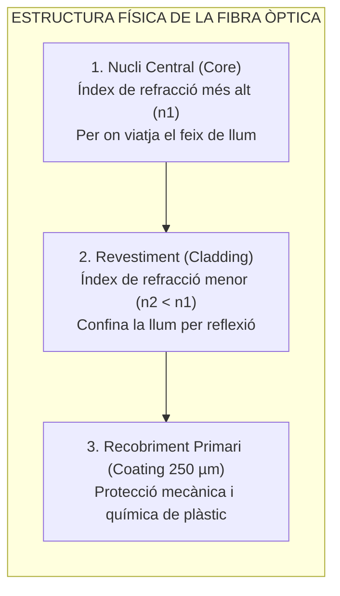
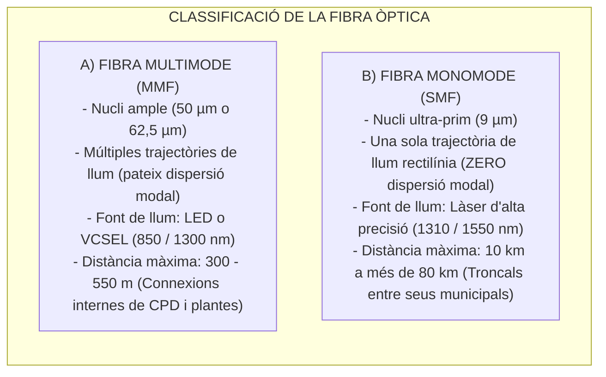
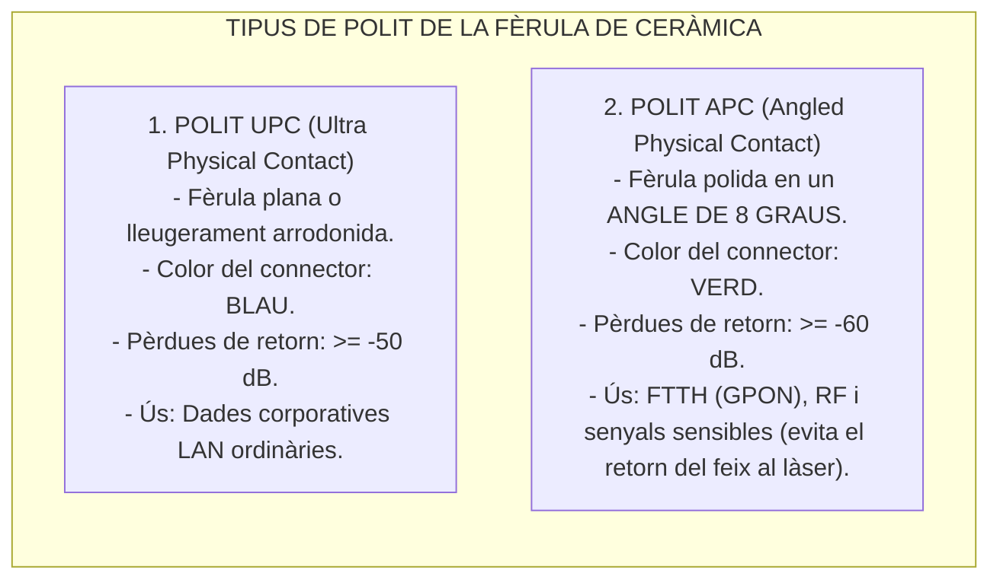

# Tema 51. Xarxes de fibra òptica: característiques, tipologies (Monomode vs. Multimode), protocols, connectors i equipament

> **Fonts i marcs de referència:** Esquema Nacional de Seguretat ([`CORPUS/ENS_2022.pdf`](file:///home/oriol/Projectes/OPOS/CORPUS/ENS_2022.pdf) - Mesura `[mp.if]` Protecció de línies de transmissió) i estàndards internacionals de transmissió òptica **ISO/IEC 11801 (OM1-OM5, OS1-OS2)** i **ITU-T sèrie G.652 / G.657**.

---

## 1. Fonaments Físics i Avantatges de la Fibra Òptica

La **fibra òptica** és una guia d'ona dielèctrica cilíndrica de sílice (vidre d'alta puresa) o plàstic que transmet informació en forma de **polsos de llum** mitjançant el principi de la **Reflexió Interna Total**:

- **Avantatges Crítics per a l'Administració Local:**
  1. **Immunitat absoluta a interferències electromagnètiques (EMI/RFI):** Pot instal·lar-se per les mateixes canalitzacions que els cables elèctrics sense cap degradació.
  2. **Aïllament elèctric complet:** Evita problemes de bucles de massa o diferències de potencial elèctric causades per llamps en interconnectar dos edificis municipals diferents.
  3. **Abast kilomètric:** Permet enllaçar equipaments municipals allunyats a desenes de quilòmetres sense necessitat de repetidors intermedis.
  4. **Seguretat:** És pràcticament impossible d'interceptar (*punxar*) sense tallar el feix de llum i activar immediatament les alertes del sistema.

---

## 2. Tipologies de Fibra: Monomode (SMF) vs. Multimode (MMF)

### 2.1. Categories Estandarditzades (Norma ISO/IEC 11801)

| Categoria | Tipus | Diàmetre Nucli/Revestiment | Amplada de Banda / Distància 10 GbE | Aplicació Típica Municipal |
| :--- | :---: | :---: | :---: | :--- |
| **OM1** | Multimode | 62,5 / 125 µm | 10 Gbps fins a 33 m (Obsoleta) | Instal·lacions antigues. |
| **OM3** | Multimode | **50 / 125 µm** | **10 Gbps fins a 300 m** (Làser optimitzat) | Cablatge troncal intern dins d'un mateix edifici. |
| **OM4** | Multimode | **50 / 125 µm** | **10 Gbps fins a 400 m** / 100 Gbps a 150 m | Interconnexió de racks a centres de dades (CPD). |
| **OS1** | Monomode | **9 / 125 µm** | 10/40/100 Gbps fins a 10 km (Atenuació 1 dB/km) | Enllaços interiors entre pavellons municipals. |
| **OS2** | Monomode | **9 / 125 µm** | **10/40/100 Gbps fins a 40-80 km (Atenuació 0,4 dB/km)** | **Xarxa MAN municipal, interconnectant Ajuntament, Policia Local, Biblioteques i Brigada**. |

---

## 3. Connectors de Fibra i Tipus de Polit de Fèrula

### 3.1. Tipus de Connectors Principals
- **LC (*Lucent Connector*):** Connector petit de format compacte (*Small Form Factor*) amb pestanya de subjecció tipus RJ-45. És l'**estàndard absolut modern** per a mòduls transceptors SFP/SFP+.
- **SC (*Subscriber Connector*):** Connector quadrat d'inserció directa per pressió (*push-pull*). Molt comú en telecomunicacions públiques i caixes FTTH.
- **ST (*Straight Tip*):** Connector rodó amb tancament per baioneta (comú en instal·lacions antigues).
- **MPO / MTP:** Connector multifibra d'alta densitat (12 o 24 fibres en un sol connector) utilitzat per a enllaços de 40 GbE i 100 GbE al CPD.

---

### 3.2. Tipus de Polit de la Fèrula: UPC (Blau) vs. APC (Verd)

> ⚠️ **Regla d'or de connexió:** **Mai s'ha de connectar un connector UPC (Blau) amb un APC (Verd)**, ja que la diferència d'angle danyarà físicament les superfícies de vidre de les dues fibres.

---

## 4. Equipament Actiu i Mesurament

- **Transceptors Òptics Connectables (*Pluggables*):**
  - **SFP (*Small Form-factor Pluggable*):** 1 Gbps (1000BASE-SX per a MMF a 850 nm; 1000BASE-LX per a SMF a 1310 nm).
  - **SFP+:** 10 Gbps (10GBASE-SR per a MMF; 10GBASE-LR per a SMF fins a 10 km; 10GBASE-ER fins a 40 km).
  - **QSFP+ / QSFP28:** 40 Gbps i 100 Gbps per a backbones de CPD.
- **Fusió de Fibra Òptica:** Unió de dos extrems de fibra mitjançant una **empalmadora per fusió d'arc elèctric voltaic** (pèrdues típiques $< 0,02\text{ dB}$).
- **Instruments de Certificació:**
  - **OTDR (*Optical Time-Domain Reflectometer*):** Emet polsos de llum i analitza la reflexió per mesurar l'atenuació al llarg de tot el traçat i localitzar talls o empalmes defectuosos amb precisió mil·limètrica.

---

## 5. Quadre Resum i Preguntes Típiques d'Examen Tipus Test

| Pregunta / Concepte Clau | Resposta Correcta / Trampa Freqüent |
| :--- | :--- |
| **Quin diàmetre de nucli té una fibra monomode estàndard (SMF)?** | **9 micròmetres (especificació 9/125 µm)**. |
| **Quina fibra s'utilitza per interconnectar seus a més de 10 km?** | La **fibra monomode (SMF - Categoria OS2)**. |
| **De quin color és un connector amb polit angular APC de 8 graus?** | De color **VERD** (mentre que l'UPC pla és **BLAU**). |
| **Quin connector és el més utilitzat en mòduls SFP/SFP+ de switches?** | El connector **LC (Lucent Connector)**. |
| **Quin instrument permet mesurar pèrdues i localitzar talls en fibra?** | L'**OTDR (Optical Time-Domain Reflectometer)**. |
| **Per què la fibra és ideal per enllaçar edificis municipals separats?** | Perquè ofereix **aïllament galvànic total (evita descàrregues de llamps)** i **immunitat EMI**. |
