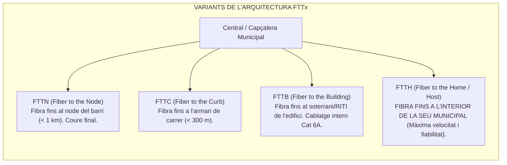
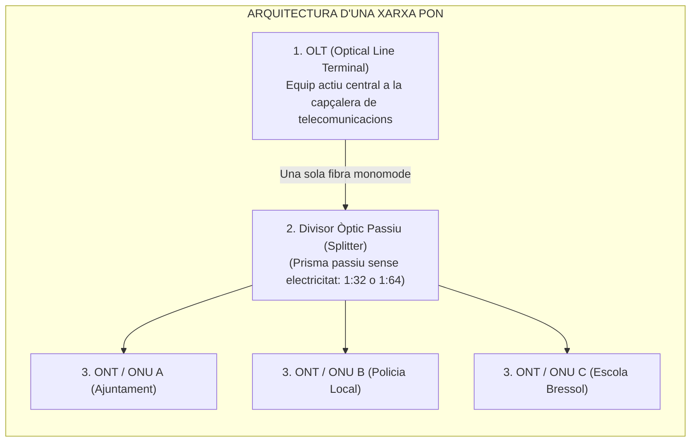
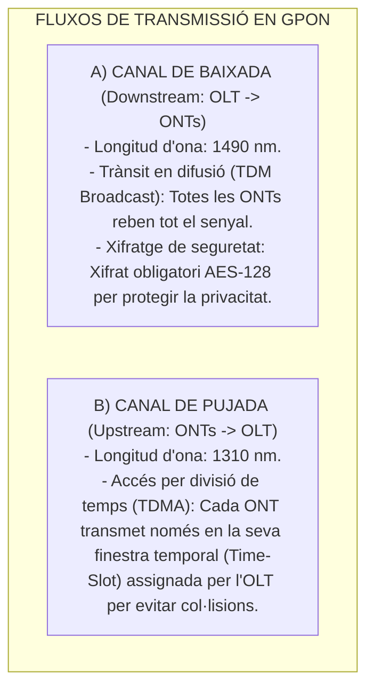

# Tema 52. Xarxes de fibra òptica. Tecnologies passives PON (GPON, XGS-PON). Tecnologies d'accés FTTx

> **Fonts i marcs de referència:** Llei 9/2017 de Contractes del Sector Públic ([`CORPUS/Contractes_2017.pdf`](file:///home/oriol/Projectes/OPOS/CORPUS/Contractes_2017.pdf) - Plecs d'accés a telecomunicacions) i recomanacions de la Unió Internacional de Telecomunicacions (**ITU-T G.984 GPON**, **ITU-T G.9807.1 XGS-PON** i **IEEE 802.3ah EPON**).

---

## 1. El Model d'Accés FTTx (*Fiber to the x*)

Les tecnologies **FTTx** defineixen l'arquitectura de xarxa d'accés segons la proximitat a la qual arriba la fibra òptica respecte a l'usuari final o equipament municipal:

- **FTTA (*Fiber to the Antenna*):** Alimentació de fibra òptica d'altíssima capacitat fins a les antenes de telefonia mòbil (estacions base 4G/5G).

---

## 2. Arquitectura de les Xarxes Òptiques Passives (PON)

Una xarxa **PON (*Passive Optical Network*)** és una xarxa d'accés punt a multipunt (P2MP) que no utilitza cap component electrònic actiu amb alimentació elèctrica entre la central i l'usuari, basant-se en **divisors òptics passius (*optical splitters*)**:

### Components Principals de la Xarxa PON:
1. **OLT (*Optical Line Terminal*):** Equip actiu central situat a la seu principal o central de telecomunicacions que controla i sincronitza totes les transmissions de la xarxa.
2. **ODN (*Optical Distribution Network*):** La xarxa física passiva de fibra monomode i **splitters** (divisors 1:16, 1:32 o 1:64) que reparteixen el feix de llum entre múltiples seus.
3. **ONT (*Optical Network Terminal*) / ONU:** Dispositiu terminal instal·lat a cada equipament municipal que rep la fibra i lliura ports de xarxa Ethernet (RJ-45) i telefonia (ports FXS).

---

## 3. Mecanisme de Transmissió Bidireccional en PON

La xarxa PON utilitza una **única fibra òptica per transmetre en ambdós sentits**, separant el trànsit mitjançant diferents longituds d'ona (**WDM - *Wavelength Division Multiplexing*):**

---

## 4. Evolució dels Estàndards PON (ITU-T)

| Estàndard PON | Norma ITU-T | Velocitat Baixada | Velocitat Pujada | Longituds d'Ona ($\lambda$) | Ràtio de Divisió Típic |
| :--- | :---: | :---: | :---: | :---: | :---: |
| **GPON** *(Estàndard actual massiu)* | **ITU-T G.984** | **2,488 Gbps** | **1,244 Gbps** | Baixada: 1490 nm Pujada: 1310 nm | **1:64** (abast fins a 20 km) |
| **XG-PON** | ITU-T G.987 | 10 Gbps | 2,5 Gbps | Baixada: 1577 nm Pujada: 1270 nm | 1:64 o 1:128 |
| **XGS-PON** *(Nova generació)* | **ITU-T G.9807.1** | **10 Gbps** | **10 Gbps (Simètrics)** | **Baixada: 1577 nm Pujada: 1270 nm** | **1:64 o 1:128 (Coexisteix amb GPON a la mateixa fibra)** |
| **NG-PON2** | ITU-T G.989 | 40 Gbps (4x10G) | 40 Gbps (4x10G) | Multiplexació per 4 o 8 longituds d'ona (TWDM) | 1:128 o 1:256 |

- **Coexistència Tecnològica:** Gràcies a l'ús de diferents longituds d'ona, un ajuntament pot mantenir serveis GPON convencionals i afegir serveis simètrics d'alta capacitat **XGS-PON sobre el mateix cablejat de fibra òptica existent** sense canviar els splitters passius.

---

## 5. Quadre Resum i Preguntes Típiques d'Examen Tipus Test

| Pregunta / Concepte Clau | Resposta Correcta / Trampa Freqüent |
| :--- | :--- |
| **Quina és la velocitat nominal de baixada i pujada de GPON?** | **2,488 Gbps de baixada i 1,244 Gbps de pujada** (asimètric). |
| **Quina és la velocitat de la tecnologia XGS-PON?** | **10 Gbps simètrics** (10 Gbps tant de baixada com de pujada). |
| **Com s'anomena l'equip actiu situat a la central en una xarxa PON?** | **OLT (Optical Line Terminal)**. |
| **Què és un Splitter en una xarxa PON?** | Un **divisor òptic passiu que no necessita alimentació elèctrica** per dividir el senyal. |
| **Quin protocol s'utilitza en el canal de pujada per evitar col·lisions?** | **TDMA (Time Division Multiple Access)** mitjançant finestres de temps (*time-slots*). |
| **Com es protegeix la confidencialitat en el canal de baixada de GPON?** | Mitjançant xifratge de dades per maquinari **AES-128**. |
