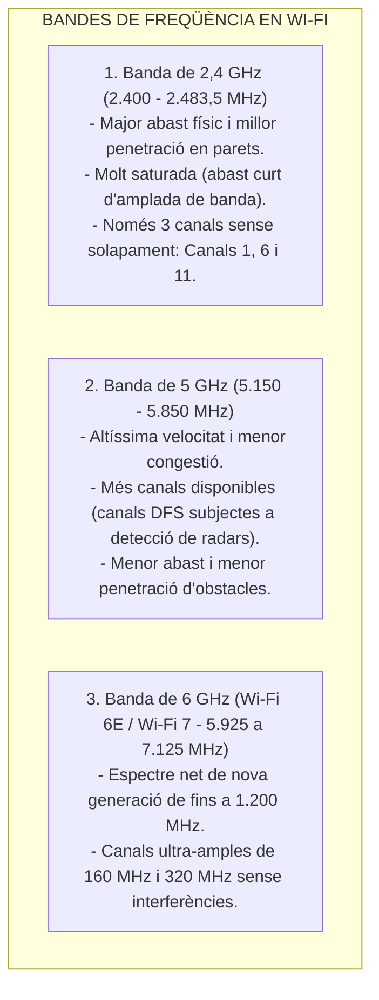
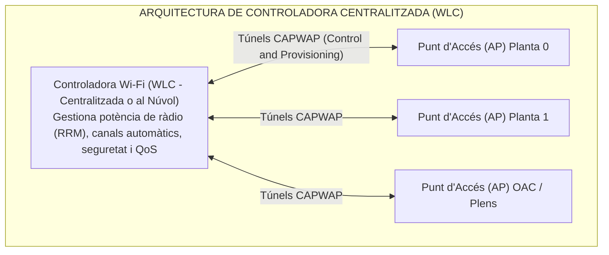
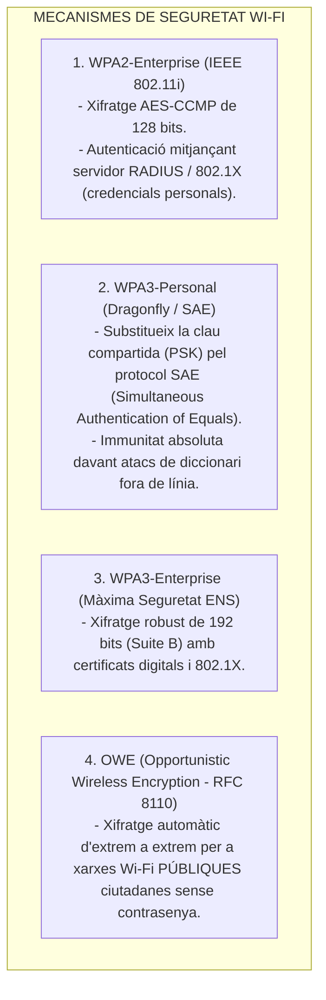

# Tema 53. Xarxes sense fils: característiques, estàndards Wi-Fi (802.11n/ac/ax/be), seguretat (WPA2/WPA3), Qualitat de Servei (QoS) i WiMAX

> **Àmbit temàtic:** Xarxes sense fils corporatives (WLAN), estàndard IEEE 802.11, mobilitat municipal, seguretat WPA3-Enterprise i xarxes WiMAX.

---

## 1. Fonaments de les Xarxes Sense Fils (WLAN)

Les **Xarxes Locals Sense Fils (WLAN - *Wireless Local Area Network*)** utilitzen ones electromagnètiques de radiofreqüència per transmetre dades a través de l'espai lliure.

- **Mètode d'Accés al Medi: CSMA/CA (*Collision Avoidance*):**  
  A diferència del cable Ethernet que detecta col·lisions (CSMA/CD), a l'aire les estacions no poden escoltar mentre transmeten. Per tant, utilitzen **CSMA/CA amb trames d'avís ACK**, escoltant el canal abans d'emetre i utilitzant un temps d'espera aleatori (*Backoff*) per evitar col·lisions.

---

## 2. Evolució dels Estàndards IEEE 802.11 (Generacions Wi-Fi)

| Generació Comercial | Estàndard IEEE | Bandes de Freqüència | Modulació i Tecnologies Clau | Velocitat Teòrica Màxima |
| :--- | :---: | :---: | :--- | :---: |
| **Wi-Fi 4** | **802.11n** (2009) | 2,4 i 5 GHz | **MIMO** (Multiple-Input Multiple-Output), canals 40 MHz, 64-QAM | 600 Mbps |
| **Wi-Fi 5** | **802.11ac** (2013) | 5 GHz | **MU-MIMO Downlink**, canals de 80/160 MHz, 256-QAM | 6,9 Gbps |
| **Wi-Fi 6** *(Estàndard actual)* | **802.11ax** (2019) | **2,4 i 5 GHz** | **OFDMA** (gestió de múltiples usuaris per canal), **MU-MIMO bidireccional**, 1024-QAM, **TWT** (estalvi bateria IoT) | **9,6 Gbps** |
| **Wi-Fi 6E** | **802.11ax (6 GHz)** | **2,4, 5 i 6 GHz** | Afegeix la nova banda neta de **6 GHz** (Wi-Fi Extended) | 9,6 Gbps |
| **Wi-Fi 7** | **802.11be** (2024) | 2,4, 5 i 6 GHz | Canals de **320 MHz**, **4096-QAM**, **MLO** (*Multi-Link Operation*) | **Fins a 46 Gbps** |

> 🌟 **La revolució de l'OFDMA a Wi-Fi 6:**  
> A diferència de les generacions anteriors on un sol usuari ocupava tot el canal de transmissió, **l'OFDMA divideix el canal en múltiples subportadores (Resource Units - RUs)**, permetent transmetre a desenes de dispositius simultàniament, ideal per a l'OAC, plens municipals i sales de conferències concorregudes.

---

## 3. Arquitectura Wi-Fi Corporativa i Itinerància (*Roaming*)

En edificis públics no s'utilitzen routers domèstics autònoms, sinó una **arquitectura gestionada per controlador (WLC)**:

- **Itinerància Ràpida (*Fast Roaming* - IEEE 802.11r/k/v):** Permet a un treballador desplaçar-se per l'edifici amb el seu ordinador portàtil o telèfon IP canviant d'un Punt d'Accés a un altre **en menys de 50 mil·lisegons sense que es talli la trucada ni la sessió**.

---

## 4. Seguretat en Xarxes Sense Fils: WPA2 vs. WPA3

Segons les directrius de l'Esquema Nacional de Seguretat (ENS):

---

## 5. Qualitat de Servei (QoS - IEEE 802.11e / WMM)

El protocol **Wi-Fi Multimedia (WMM - IEEE 802.11e)** prioritza el trànsit crític de l'Ajuntament en 4 categories d'accés:
1. **Veu (AC_VO - *Voice*):** Màxima prioritat i mínim temps d'espera per a telefonia IP.
2. **Vídeo (AC_VI - *Video*):** Segona prioritat per a videoconferències i càmeres de seguretat.
3. **Millor Esforç (AC_BE - *Best Effort*):** Trànsit ordinari d'usuaris (navegació web, seu electrònica).
4. **Fons (AC_BK - *Background*):** Trànsit no urgent (descàrregues massives, impressions).

---

## 6. Tecnologia WiMAX (IEEE 802.16)

**WiMAX (*Worldwide Interoperability for Microwave Access*)** és una tecnologia d'accés sense fils metropolità (WMAN) d'alta potència:
- **Abast:** Enllaços de **10 a 50 km** amb velocitats superiors a 70-100 Mbps.
- **Utilitat municipal:** Enllaços ràdio punt a punt i punt a multipunt per connectar instal·lacions aïllades on no arriba la fibra (dipòsits d'aigua municipals, deixalleries, estacions meteorològiques o càmeres de trànsit perifèriques).

---

## 7. Quadre Resum i Preguntes Típiques d'Examen Tipus Test

| Pregunta / Concepte Clau | Resposta Correcta / Trampa Freqüent |
| :--- | :--- |
| **Quin mètode d'accés al medi utilitza el Wi-Fi (IEEE 802.11)?** | **CSMA/CA (Carrier Sense Multiple Access with Collision Avoidance)**. |
| **Quins 3 canals no se solapen a la banda de 2,4 GHz?** | Els canals **1, 6 i 11** (a Europa també 1, 7 i 13). |
| **Quina tecnologia clau introdueix Wi-Fi 6 per a alta densitat?** | **OFDMA (Orthogonal Frequency-Division Multiple Access)**. |
| **Quina millora de seguretat clau aporta WPA3-Personal davant WPA2?** | L'ús del protocol **SAE (Simultaneous Authentication of Equals)** que **evita atacs de diccionari**. |
| **Quin protocol s'utilitza per comunicar els APs amb la controladora?** | El protocol **CAPWAP (Control and Provisioning of Wireless Access Points)**. |
| **Què és WiMAX (IEEE 802.16)?** | Una tecnologia sense fils d'**àmbit metropolità (WMAN) d'alta distància (fins a 50 km)**. |
