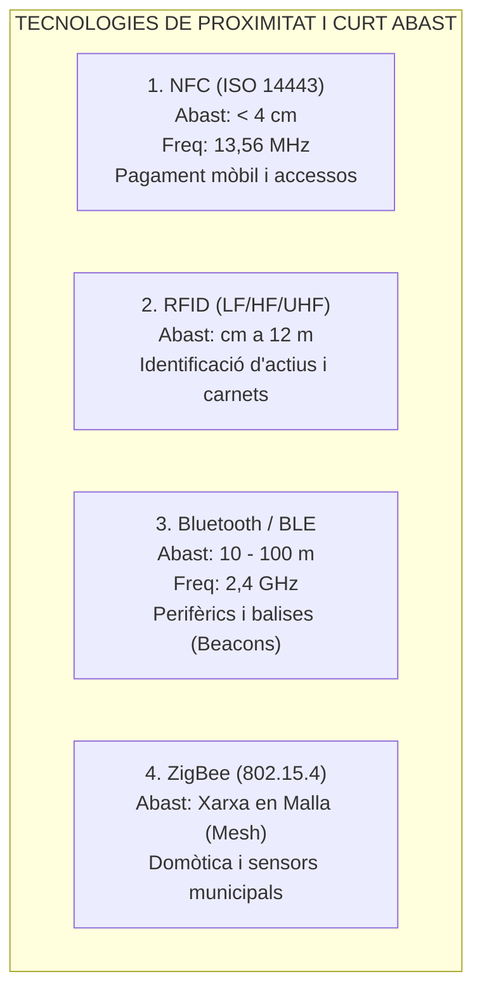
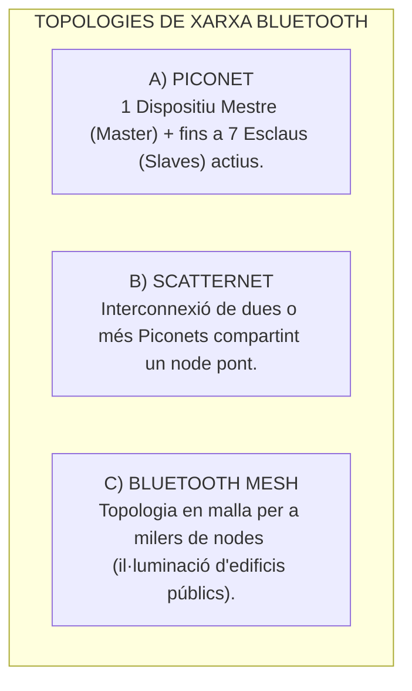
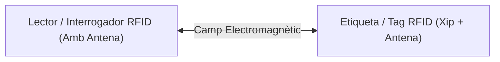
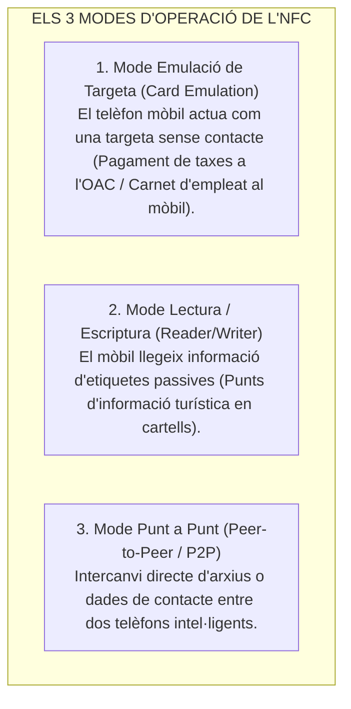
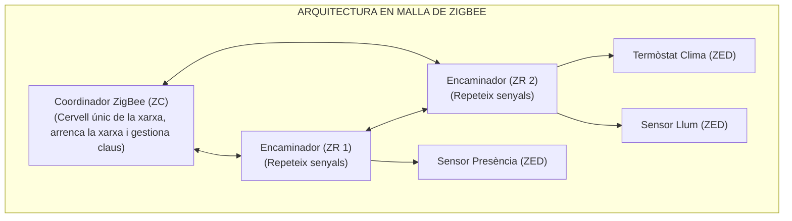

# Tema 54. Xarxes de proximitat: característiques, tipologies, protocols i seguretat. Bluetooth/BLE, RFID, NFC i ZigBee

> **Àmbit temàtic:** Xarxes d'Àrea Personal Sense Fils (WPAN), tecnologies de curt abast, identificació per radiofreqüència, control d'accessos i domòtica en edificis municipals.

---

## 1. Concepte de Xarxes d'Àrea Personal Sense Fils (WPAN)

Les **Xarxes de Proximitat o WPAN (*Wireless Personal Area Network*)** són tecnologies de comunicació sense fils dissenyades per interconnectar dispositius en un radi curt (des de pocs centímetres fins a desenes de metres), amb un consum d'energia extremadament baix (*Ultra-Low Power*) i costos molt reduïts:

---

## 2. Bluetooth i Bluetooth Low Energy (BLE - IEEE 802.15.1)

Opera a la banda lliure **ISM de 2,4 GHz** utilitzant la tècnica de salts de freqüència (**FHSS** - 1.600 salts/segon) per evitar interferències amb el Wi-Fi:

- **Bluetooth Low Energy (BLE):**  
  Dissenyat per a dispositius IoT alimentats amb petites piles de botó (durada de 2 a 5 anys). Utilitza els perfils **GAP** (descobriment) i **GATT** (transferència de dades mitjançant serveis i característiques).
- **Balises de Proximitat (*Beacons* - iBeacon / Eddystone):** Emissors BLE que transmeten un identificador constant a l'aire per a **serveis de guiatge ciutadà d'interiors a museus municipals, biblioteques o oficines d'atenció ciutadana**.

---

## 3. Identificació per Radiofreqüència (RFID - *Radio Frequency Identification*)

El sistema RFID permet transmetre la identitat d'un objecte mitjançant ones de ràdio sense necessitat de visió directa (*Line of Sight*):

### 3.1. Tipus d'Etiquetes (Tags):
1. **Passives (Sense bateria):** S'alimenten exclusivament de l'energia induïda pel camp electromagnètic del lector. Tenen un cost de pocs cèntims, mida mil·limètrica i vida útil il·limitada.
2. **Actives (Amb bateria interna):** Disposen d'alimentació pròpia i emeten senyals de forma autònoma fins a més de 100 metres (ús en vehicles d'emergència i maquinària de la brigada municipal).

### 3.2. Bandes de Freqüència RFID:
- **Baixa Freqüència (LF - 125 / 134 kHz):** Abast $< 10\text{ cm}$. Utilitzat en el microxip d'animals de companyia del cens municipal.
- **Alta Freqüència (HF - 13,56 MHz):** Abast fins a 1 m. Utilitzat en **targetes de control d'accessos d'empleats públics, carnets de biblioteca municipal i transport públic**.
- **Ultra Alta Freqüència (UHF - 860-960 MHz / EPC Gen2):** Abast fins a 10-12 m. Utilitzat en logística d'inventaris d'actius municipals, gestió de contenidors de residus i control de pas de vehicles.

---

## 4. Near Field Communication (NFC - ISO/IEC 18092 i ISO 14443)

L'**NFC** és una extensió d'alta seguretat de la tecnologia RFID HF que opera a **13,56 MHz** amb un abast intencionadament limitat a **menys de 4 centímetres** (requereix contacte gairebé físic):

---

## 5. Tecnologia ZigBee (IEEE 802.15.4)

**ZigBee** és un protocol de comunicacions sense fils obert basat en l'estàndard **IEEE 802.15.4** dissenyat específicament per a xarxes de sensors, telemesura i **automatització d'edificis municipals (*Smart Buildings*)**:

- **Característiques Clau:**
  - **Topologia en Malla (*Mesh*):** Capacitat d'autoorganització i autoreparació (*self-healing*); si un encaminador s'apaga, els paquets busquen automàticament una ruta alternativa a través d'un altre node.
  - **Velocitat:** 250 kbps a 2,4 GHz (ideal per a paquets petits d'estat de sensors).
  - **Consum:** Els dispositius finals (*End Devices - ZED*) poden estar anys funcionant amb una sola pila perquè entren en mode de repòs (*sleep*) quan no transmeten.

---

## 6. Quadre Resum i Preguntes Típiques d'Examen Tipus Test

| Pregunta / Concepte Clau | Resposta Correcta / Trampa Freqüent |
| :--- | :--- |
| **A quina distància màxima opera la tecnologia NFC?** | A **menys de 4 centímetres** (a 13,56 MHz). |
| **Quina és la diferència entre un tag RFID actiu i un passiu?** | L'**actiu té bateria interna** (abast fins a 100 m); el **passiu s'alimenta del camp del lector** (abast curt). |
| **Quina norma IEEE estandarditza la capa física de ZigBee?** | L'estàndard **IEEE 802.15.4**. |
| **Quants dispositius esclaus actius pot tenir una Piconet Bluetooth?** | Com a màxim **7 esclaus actius** (més el dispositiu Mestre). |
| **Quin protocol de xarxa en malla s'utilitza per a sensors i domòtica?** | **ZigBee** (gràcies a la seva xarxa mesh autoreparable i baix consum). |
| **Quin mode NFC permet pagar amb el telèfon mòbil?** | El mode d'**Emulació de Targeta (*Card Emulation*)**. |
