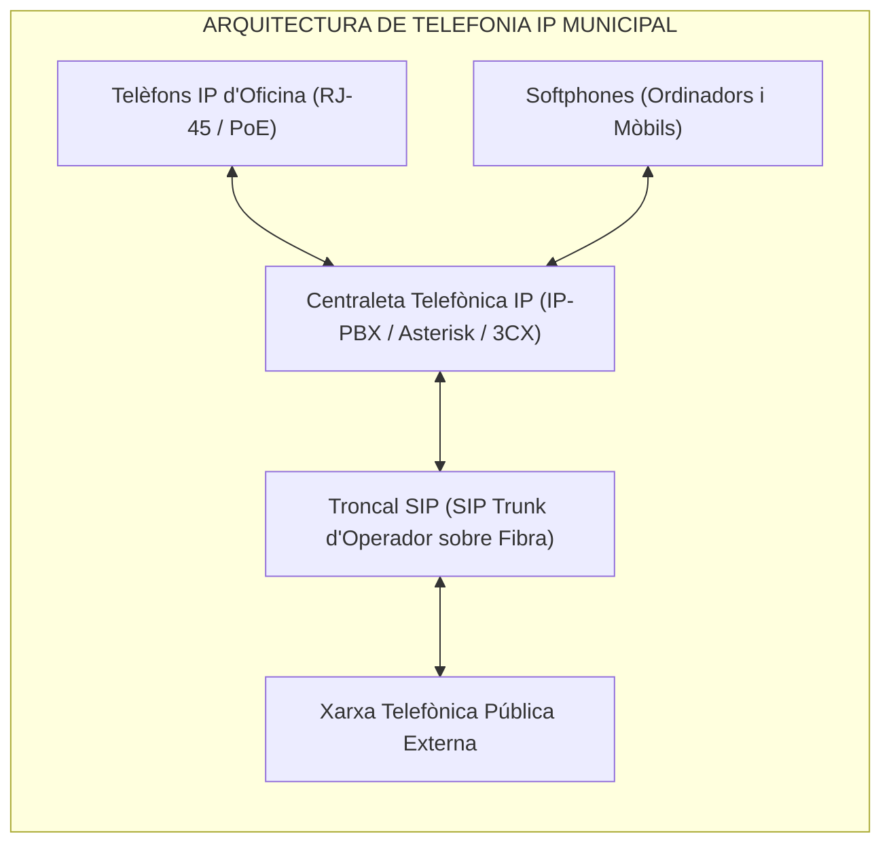
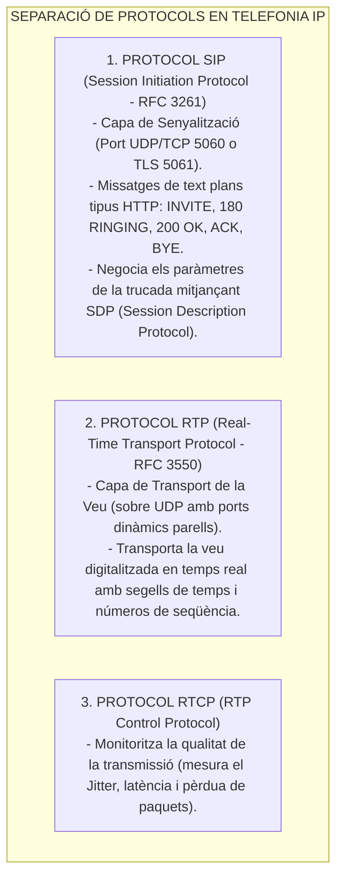
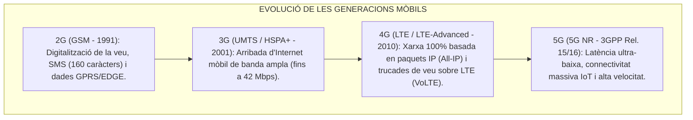
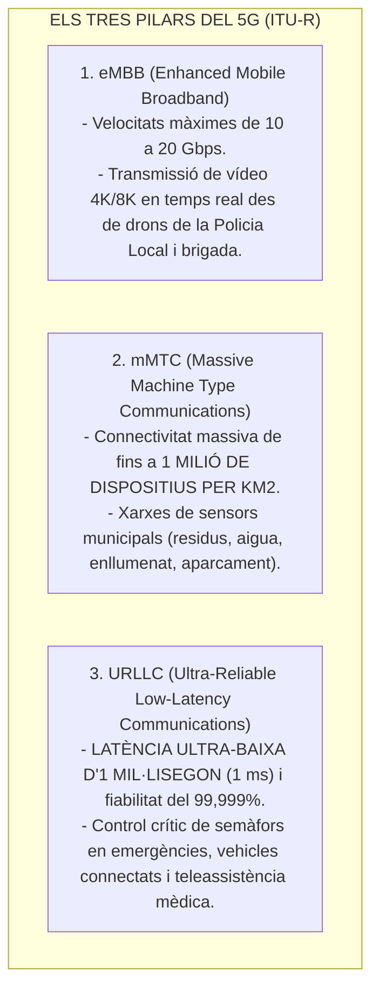
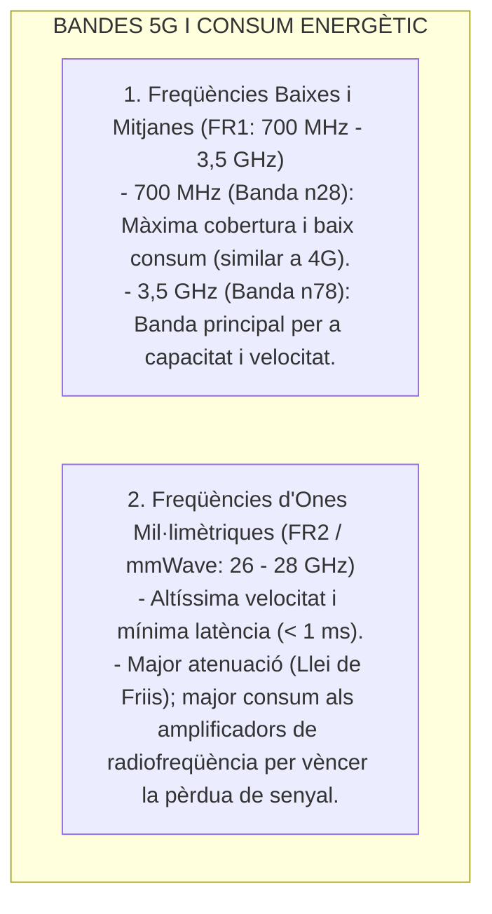
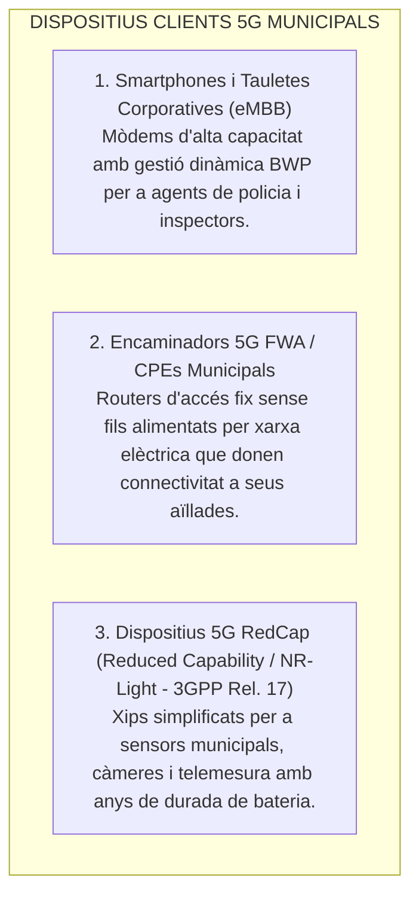

# Tema 55. Comunicacions de telefonia fixa i mòbil: xarxes, tecnologies, Telefonia IP (VoIP, SIP, RTP), evolució cel·lular (4G LTE, 5G), consum energètic i dispositius clients

> **Fonts i marcs de referència:** Esquema Nacional de Seguretat ([`CORPUS/ENS_2022.pdf`](file:///home/oriol/Projectes/OPOS/CORPUS/ENS_2022.pdf) - Mesura `[mp.com.2]` Protecció de veu sobre IP), estàndards IETF de telefonia IP (**RFC 3261 SIP**, **RFC 3550 RTP**, **RFC 4566 SDP**) i especificacions mòbils del consorci **3GPP (Release 15/16/17 per a 5G NR i 5G RedCap)**.

---

## 1. Evolució de la Telefonia Fixa: De la RTB a la Telefonia IP (ToIP)

La telefonia municipal ha evolucionat des de les antigues xarxes commutades de circuits (RTC analògica i RDSI digital) cap a la **Telefonia IP (Veu sobre IP - VoIP)**, on la veu es digitalitza, es comprimeix en paquets IP i es transmet a través de la mateixa xarxa de dades Ethernet corporativa:

---

## 2. Protocols Fonamentals de la Telefonia IP (VoIP)

La comunicació de veu sobre IP separa estrictament la **senyalització** (establir i penjar trucades) del **transport d'àudio**:

### 2.1. Còdecs de Veu Principals
- **G.711 (PCM):** Còdec estàndard sense compressió de 64 kbps (G.711 A-law a Europa). Ofereix màxima qualitat sense retard de càlcul.
- **G.729:** Còdec comprimit d'alta eficiència que redueix el consum a **8 kbps** (ideal per a seus municipals amb amplada de banda limitada).
- **Opus:** Còdec obert d'última generació d'alta definició (HD Voice) que adapta dinàmicament la seva velocitat (de 6 a 510 kbps) a l'estat de la xarxa.

---

## 3. Evolució de les Xarxes de Telefonia Mòbil Cel·lular

---

## 4. La Tecnologia 5G i el seu Impacte en l'Administració Local

La tecnologia **5G (5G New Radio - 3GPP)** és una plataforma de connectivitat per a la ciutat intel·ligent (*Smart City*) basada en **tres pilars d'ús**:

### 4.1. Conceptes Clau del 5G:
- **Modes de Desplegament:**
  - **5G NSA (*Non-Standalone*):** Utilitza antenes 5G connectades a l'antic nucli de xarxa 4G (*Evolved Packet Core*).
  - **5G SA (*Standalone*):** Desplegament pur amb nucli de xarxa nadiu 5G (*5G Core*), permetent el 100% de les prestacions de latència d'1 ms i *Network Slicing*.
- **Segmentació de Xarxa (*Network Slicing*):** Permet a l'operador dividir la xarxa física 5G en múltiples xarxes virtuals independents amb garanties de servei (QoS) estrictes (ex. un *Slice* prioritari exclusiu per a la Policia Local i Bombers que mai es col·lapsarà durant esdeveniments massius).

---

## 5. Dinàmica del Consum Energètic, Freqüències i Dispositius Clients al 5G

La relació entre freqüències, rendiment i consum al 5G presenta una dinàmica tècnica específica:

### 5.1. La Paradoxa del Consum: Eficiència per Bit vs. Potència Instantània
- **Eficiència per Bit ($\text{Joules/bit}$):** El 5G és fins a un **90% més eficient que el 4G per cada Gigabyte transmès**. Com que transmet a velocitats molt més altes, transfereix els paquets en mil·lisegons i permet que el mòdem torni ràpidament a l'estat de baix consum (*sleep*).
- **Potència Instantània de Pic ($\text{Watts}$):** Durant la transmissió activa a màxima velocitat, el consum instantani és més alt a causa de l'amplada dels canals (100 a 400 MHz vs. 20 MHz en 4G) i el processament digital de senyal (*Massive MIMO*).

---

### 5.2. Mecanismes d'Estalvi Energètic en 5G NR (New Radio)
1. **BWP (*Bandwidth Part*):** El dispositiu no necessita escoltar constantment tot el canal de 100 MHz. Si només rep text o està en repòs, el mòdem commuta dinàmicament a una subbanda estreta de 10-20 MHz reduint dràsticament el consum, obrint-se a 100 MHz només en descàrregues massives.
2. **C-DRX (*Connected-mode Discontinuous Reception*):** El mòdem entra en micro-son (*micro-sleep*) durant mil·lisegons i només es desperta periòdicament per comprovar si hi ha dades assignades.
3. **WUS (*Wake-Up Signal*):** Senyal de baixíssima potència que avisa el dispositiu abans d'encendre els circuits principals de ràdio.

---

### 5.3. Tipologia de Dispositius Clients 5G a l'Administració Local

> 🌟 **Concepte clau: 5G RedCap (*Reduced Capability* / *NR-Light*):**  
> Estandarditzat a la *Release 17* del 3GPP, **RedCap** soluciona el problema de consum i cost del 5G en sensors municipals (control d'aigua, càmeres de trànsit, enllumenat): redueix l'amplada de banda a 20 MHz, utilitza 1 o 2 antenes i retalla la complexitat del mòdem, aconseguint que un sensor IoT pugui operar durant anys amb bateria gaudint de la cobertura i baixa latència del 5G.

---

## 6. Quadre Resum i Preguntes Típiques d'Examen Tipus Test

| Pregunta / Concepte Clau | Resposta Correcta / Trampa Freqüent |
| :--- | :--- |
| **Quin protocol s'utilitza per a la senyalització en Telefonia IP?** | El protocol **SIP (Session Initiation Protocol - RFC 3261)**. |
| **Quin protocol transporta la veu digitalitzada en temps real?** | El protocol **RTP (Real-time Transport Protocol - sobre UDP)**. |
| **Quina és la funció d'un Troncal SIP (*SIP Trunk*)?** | Connectar la centraleta IP municipal amb l'operador de telefonia mitjançant una **connexió IP de dades**. |
| **Quina generació mòbil va introduir una arquitectura 100% basada en IP?** | El **4G (LTE - Long Term Evolution)**, eliminant els circuits tradicionals. |
| **Quina latència ofereix el pilar URLLC del 5G?** | Una latència de fins a **1 mil·lisegon (1 ms)** amb fiabilitat del 99,999%. |
| **Què és el Network Slicing en 5G?** | La creació de **xarxes virtuals dedicades sobre la mateixa infraestructura física** per garantir serveis crítics. |
| **Com és l'eficiència energètica del 5G respecte al 4G per Gigabyte?** | El 5G és **fins a un 90% més eficient en Joules per bit**, tot i que té pics de consum instantani més alts en canals amples. |
| **Què és el 5G RedCap (NR-Light - 3GPP Rel. 17)?** | Una versió optimitzada del 5G per a **sensors i dispositius IoT de baix cost i baix consum**. |
| **Com redueix el consum de bateria la funció BWP (*Bandwidth Part*)?** | Ajustant l'amplada de banda del mòdem a **subbandes estretes quan no es requereix màxima velocitat**. |
