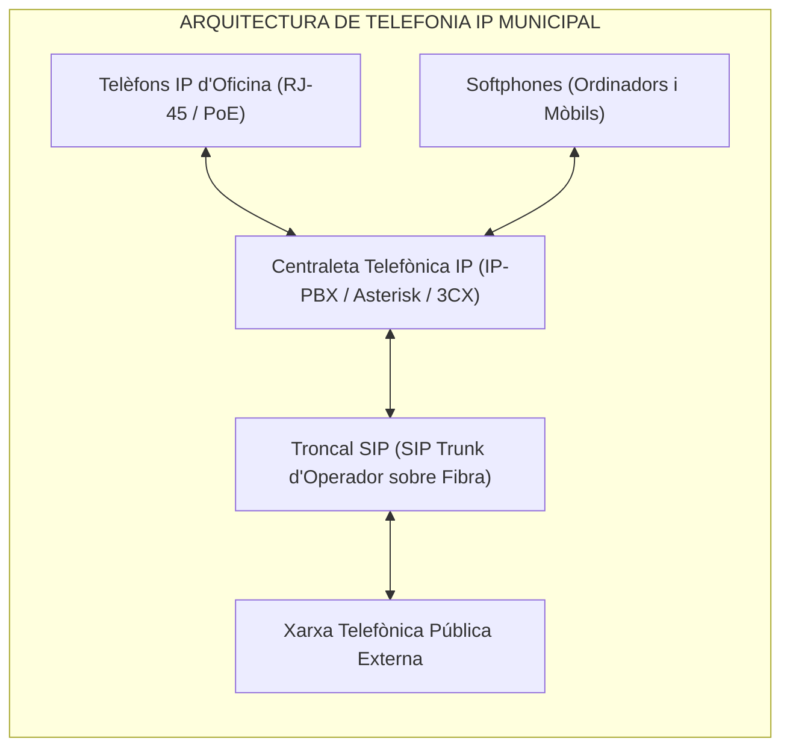
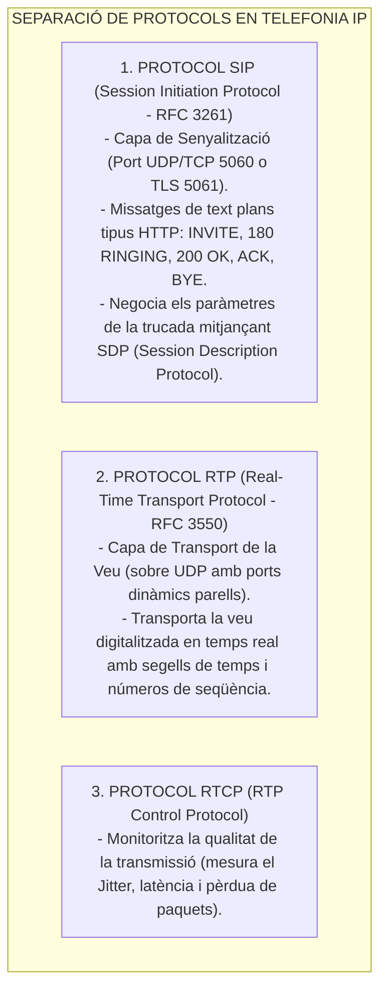
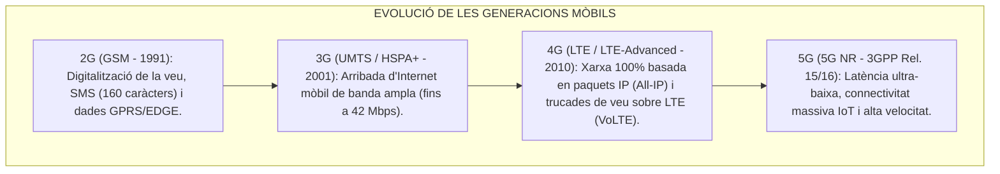
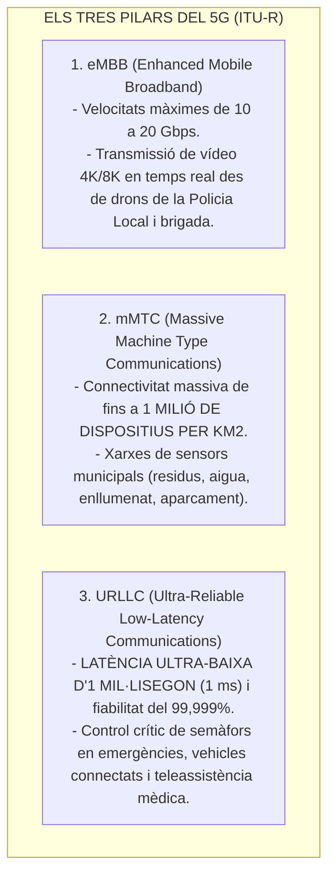

# Tema 55. Comunicacions de telefonia fixa i mòbil: xarxes, tecnologies, Telefonia IP (VoIP, SIP, RTP) i evolució cel·lular (4G LTE, 5G)

> **Àmbit temàtic:** Sistemes de telefonia corporativa municipal, xarxes de veu sobre IP, centrals IP-PBX, protocols SIP/RTP i generacions mòbils cel·lulars (4G/5G).

---

## 1. Evolució de la Telefonia Fixa: De la RTB a la Telefonia IP (ToIP)

La telefonia municipal ha evolucionat des de les antigues xarxes commutades de circuits (RTC analògica i RDSI digital) cap a la **Telefonia IP (Veu sobre IP - VoIP)**, on la veu es digitalitza, es comprimeix en paquets IP i es transmet a través de la mateixa xarxa de dades Ethernet corporativa:

---

## 2. Protocols Fonamentals de la Telefonia IP (VoIP)

La comunicació de veu sobre IP separa estrictament la **senyalització** (establir i penjar trucades) del **transport d'àudio**:

### 2.1. Còdecs de Veu Principals
- **G.711 (PCM):** Còdec estàndard sense compressió de 64 kbps (G.711 A-law a Europa). Ofereix màxima qualitat sense retard de càlcul.
- **G.729:** Còdec comprimit d'alta eficiència que redueix el consum a **8 kbps** (ideal per a seus municipals amb amplada de banda limitada).
- **Opus:** Còdec obert d'última generació d'alta definició (HD Voice) que adapta dinàmicament la seva velocitat (de 6 a 510 kbps) a l'estat de la xarxa.

---

## 3. Evolució de les Xarxes de Telefonia Mòbil Cel·lular

---

## 4. La Tecnologia 5G i el seu Impacte en l'Administració Local

La tecnologia **5G (5G New Radio - 3GPP)** no és només una millora de velocitat per a telèfons intel·ligents, sinó una plataforma de connectivitat per a la ciutat intel·ligent (*Smart City*) basada en **tres pilars d'ús**:

### 4.1. Conceptes Clau del 5G:
- **Modes de Desplegament:**
  - **5G NSA (*Non-Standalone*):** Utilitza antenes 5G connectades a l'antic nucli de xarxa 4G (*Evolved Packet Core*). És el desplegament inicial ràpid.
  - **5G SA (*Standalone*):** Desplegament pur amb nucli de xarxa nadiu 5G (*5G Core*), permetent gaudir del 100% de les prestacions de latència d'1 ms i *Network Slicing*.
- **Segmentació de Xarxa (*Network Slicing*):** Permet a l'operador dividir la xarxa física 5G en múltiples xarxes virtuals independents amb garanties de servei (QoS) estrictes. L'Ajuntament pot disposar d'un **Slice de Xarxa prioritari exclusiu per a la Policia Local i Bombers** que mai es col·lapsarà encara que milers de ciutadans estiguin utilitzant la xarxa pública durant una festa major.

---

## 5. Quadre Resum i Preguntes Típiques d'Examen Tipus Test

| Pregunta / Concepte Clau | Resposta Correcta / Trampa Freqüent |
| :--- | :--- |
| **Quin protocol s'utilitza per a la senyalització en Telefonia IP?** | El protocol **SIP (Session Initiation Protocol - RFC 3261)**. |
| **Quin protocol transporta la veu digitalitzada en temps real?** | El protocol **RTP (Real-time Transport Protocol - sobre UDP)**. |
| **Quina és la funció d'un Troncal SIP (*SIP Trunk*)?** | Connectar la centraleta IP municipal amb l'operador de telefonia mitjançant una **connexió IP de dades**. |
| **Quina generació mòbil va introduir una arquitectura 100% basada en IP?** | El **4G (LTE - Long Term Evolution)**, eliminant els circuits tradicionals. |
| **Quina latència ofereix el pilar URLLC del 5G?** | Una latència de fins a **1 mil·lisegon (1 ms)** amb fiabilitat del 99,999%. |
| **Què és el Network Slicing en 5G?** | La creació de **xarxes virtuals dedicades sobre la mateixa infraestructura física** per garantir serveis crítics. |
