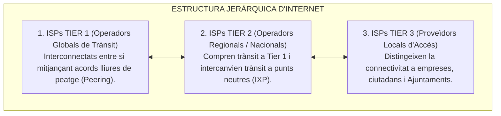
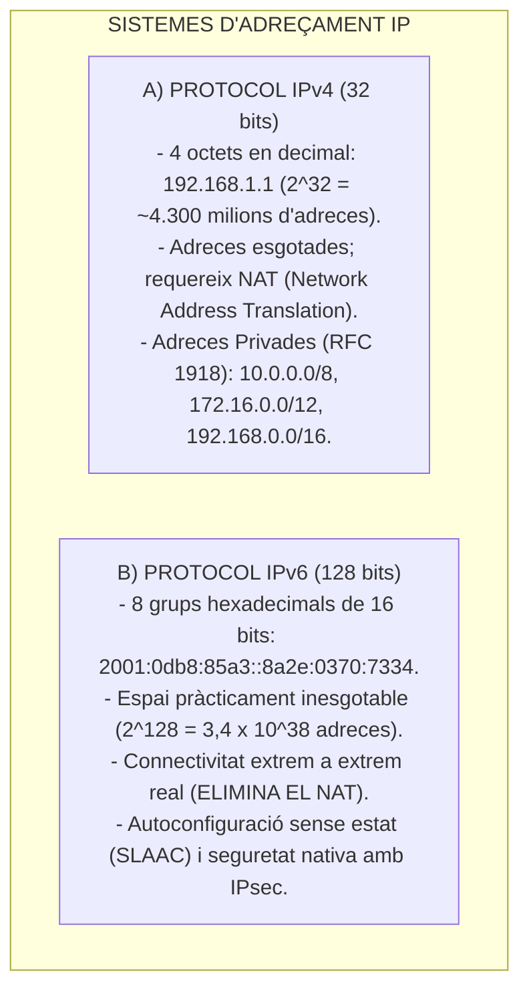
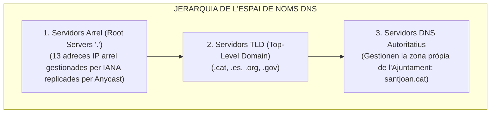

# Tema 56. Internet i els seus components: arquitectura, protocols, dominis, DNS, sistemes d'adreces (IPv4/IPv6) i certificats TLS

> **Àmbit temàtic:** Arquitectura d'Internet, encaminament BGP, sistemes d'adreçament IP, el servei DNS i certificats de seguretat web (TLS/HTTPS).

---

## 1. Arquitectura Global d'Internet i Encamidament

Internet és una xarxa global descentralitzada formada per milers de xarxes independents interconnectades anomenades **Sistemes Autònoms (AS - *Autonomous Systems*)**:

- **Protocol BGP (Border Gateway Protocol - BGPv4):** És el protocol d'encaminament dinàmic exterior que interconnecta els Sistemes Autònoms d'Internet intercanviant taules de rutes.
- **Punts Neutres d'Intercanvi (*Internet Exchange Points - IXP*):** Infraestructures físiques on múltiples operadors connecten les seves xarxes per intercanviar trànsit localment sense pagar trànsit internacional. A Catalunya destaca el **CATNIX (Punt Neutre d'Internet de Catalunya)** gestionat pel CSUC a Barcelona.

---

## 2. Sistemes d'Adreçament: IPv4 vs. IPv6

---

## 3. El Sistema de Noms de Domini (DNS - *Domain Name System*)

El servei **DNS** és una base de dades distribuïda i jeràrquica que tradueix noms de domini fàcilment recordables per a les persones (com `seu.santjoan.cat`) en adreces IP numèriques que entenen les màquines:

### 3.1. Tipus de Registres DNS Fonamentals a l'Administració

| Registre DNS | Funció Tècnica | Exemple en el Domini Municipal |
| :---: | :--- | :--- |
| **A** | Mapeja un nom de domini a una adreça **IPv4** (32 bits). | `santjoan.cat` $\rightarrow$ `213.151.100.20` |
| **AAAA** | Mapeja un nom de domini a una adreça **IPv6** (128 bits). | `santjoan.cat` $\rightarrow$ `2001:db8::1` |
| **CNAME** | **Àlies (Canonical Name)** que apunta a un altre nom de domini. | `www.santjoan.cat` $\rightarrow$ `santjoan.cat` |
| **MX** | Especifica els **servidors de correu electrònic** del domini amb la seva prioritat. | `mail.santjoan.cat` (Prioritat 10) |
| **TXT** | Emmagatzema text lliure utilitzat per a mecanismes de **seguretat anti-suplantació de correu (SPF, DKIM, DMARC)**. | `v=spf1 include:_spf.aoc.cat ~all` |
| **PTR** | **Resolució inversa** (tradueix una adreça IP al seu nom de domini associat). | `20.100.151.213.in-addr.arpa` $\rightarrow$ `correu.ajuntament.cat` |
| **NS** | Identifica els **servidors de noms autoritatius** delegats per a la zona. | `ns1.aoc.cat`, `ns2.aoc.cat` |
| **SOA** | *Start of Authority*: defineix les propietats bàsiques de la zona (número de sèrie i temporitzadors). | Paràmetres de zona. |

- **DNSSEC (*DNS Security Extensions*):** Afegeix signatures digitals criptogràfiques als registres DNS per garantir la seva autenticitat i **evitar atacs d'enverinament de memòria cau (*DNS Spoofing / Cache Poisoning*)**.

---

## 4. Certificats Digitals de Servidor i Protocol HTTPS (TLS 1.3)

El protocol **HTTPS (*HTTP Secure*)** utilitza el protocol criptogràfic **TLS (*Transport Layer Security*)** sobre el port TCP 443 per garantir:
1. **Confidencialitat:** Les dades dels tràmits i formularis ciutadans viatgen completament xifrades.
2. **Autenticitat:** El certificat digital emès per una Autoritat de Certificació (com l'AOC o Let's Encrypt) garanteix al ciutadà que la Seu Electrònica és autèntica i no un web fals de *phishing*.
3. **Integritat:** Garanteix que cap atacant intermedi ha manipulat les dades enviades.

- **TLS 1.3 (RFC 8446):** Estàndard actual que elimina algoritmes criptogràfics obsolets i vulnerables, exigeix *Perfect Forward Secrecy (PFS)* i redueix el temps d'establiment de la connexió segura a un sol viatge d'anada i tornada (**1-RTT Handshake**).

---

## 5. Quadre Resum i Preguntes Típiques d'Examen Tipus Test

| Pregunta / Concepte Clau | Resposta Correcta / Trampa Freqüent |
| :--- | :--- |
| **Quants bits mesura una adreça IPv4 vs. una adreça IPv6?** | **IPv4 mesura 32 bits** (4 octets) i **IPv6 mesura 128 bits** (8 grups hexadecimals). |
| **Quin registre DNS resol una adreça IPv6?** | El registre **AAAA** (mentre que el registre **A** resol IPv4). |
| **Què és un registre DNS tipus MX?** | El registre que defineix els **servidors de correu electrònic (*Mail Exchanger*)** del domini. |
| **Quina és la funció de DNSSEC?** | **Signar digitalment els registres DNS** per evitar suplantacions i atacs d'enverinament de cau. |
| **Què és el CATNIX?** | El **Punt Neutre d'Internet de Catalunya**, que interconnecta operadors a Barcelona. |
| **Quin port i protocol utilitza per defecte HTTPS?** | El port **TCP 443** (utilitzant TLS 1.3). |
