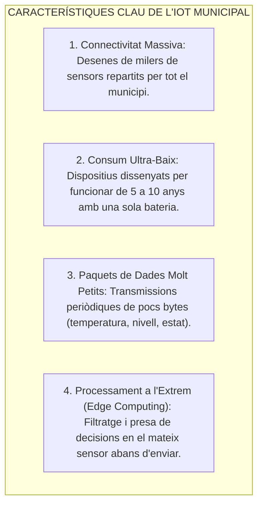
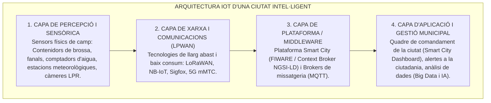
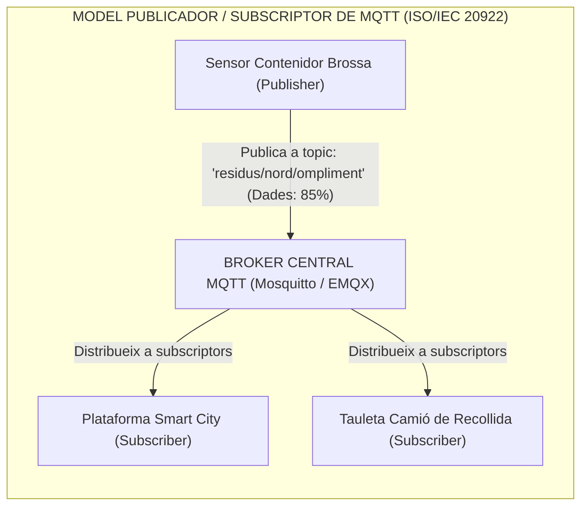
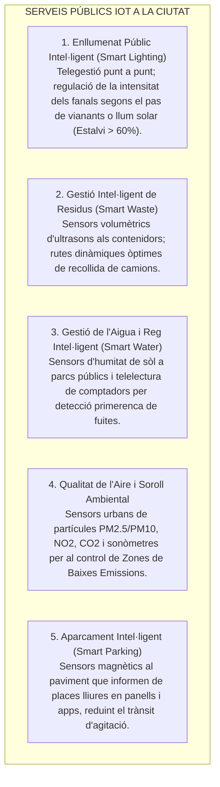

# Tema 57. Internet de les Coses (IoT): característiques, arquitectura, protocols (MQTT, LoRaWAN, NB-IoT) i serveis públics municipals (Smart Cities)

> **Fonts i marcs de referència:** Esquema Nacional d'Interoperabilitat ([`CORPUS/ENI.pdf`](file:///home/oriol/Projectes/OPOS/CORPUS/ENI.pdf)), Esquema Nacional de Seguretat ([`CORPUS/ENS_2022.pdf`](file:///home/oriol/Projectes/OPOS/CORPUS/ENS_2022.pdf) - Dispositius IoT), marc europeu de dades urbanes **FIWARE (API NGSI-LD)**, estàndards **ISO/IEC 20922 (MQTT)**, **RFC 7252 (CoAP)**, **LoRaWAN Alliance** i especificacions **3GPP NB-IoT / LTE-M**.

---

## 1. Concepte i Característiques de l'Internet de les Coses (IoT)

L'**Internet de les Coses (IoT - *Internet of Things*)** és el paradigma tecnològic que interconnecta objectes físics quotidians i equipaments urbans mitjançant sensors, actuadors, programari i connectivitat de xarxa, permetent **recopilar, transmetre i processar dades de l'entorn municipal en temps real sense necessitat d'intervenció humana**:

---

## 2. L'Arquitectura de Quatre Capes de l'IoT en una Smart City

---

## 3. Tecnologies de Xarxa LPWAN (*Low-Power Wide-Area Network*)

Per a desplegar sensors a tot el terme municipal no és viable utilitzar Wi-Fi (pel seu curt abast i alt consum) ni 4G convencional (per cost i bateria). S'utilitzen xarxes **LPWAN**:

| Tecnologia LPWAN | Banda de Freqüència | Abast Territorial | Model de Desplegament Municipal |
| :--- | :---: | :---: | :--- |
| **LoRaWAN** *(Líder municipal)* | **Banda lliure ISM (868 MHz)** | **5 a 15 km** (alta penetració) | **Xarxa pròpia de l'Ajuntament** (sense pagar quotes a operadors; instal·lació de passarel·les *Gateways* pròpies). |
| **NB-IoT** (*Narrowband IoT*) | Banda llicenciada mòbil (LTE) | 10 a 20 km | **Servei d'operador de telefonia** (requereix targeta SIM/eSIM a cada sensor; màxima seguretat i QoS garantida). |
| **Sigfox** | Banda lliure 868 MHz (UNB) | 10 a 30 km | Xarxa privada comercial d'operador; trànsit limitat a 140 missatges/dia de 12 bytes. |

---

## 4. Protocols de Missatgeria IoT: MQTT i CoAP

- **Protocol MQTT (Message Queuing Telemetry Transport):**
  - Funciona sobre **TCP (Port 1883 / TLS 8883)**.
  - Extremadament lleuger: La capçalera del paquet té una mida mínima de només **2 bytes**.
  - **Nivells de Qualitat de Servei (QoS):**
    - **QoS 0 (*At most once*):** S'envia el missatge un sol cop sense confirmació (mínim consum).
    - **QoS 1 (*At least once*):** Es garanteix que el missatge arriba com a mínim un cop (pot haver-hi duplicats).
    - **QoS 2 (*Exactly once*):** Garanteix el lliurament exacte d'un únic missatge mitjançant un acord de 4 passos (per a alarmes crítiques).
- **Plataforma Estàndard Europea FIWARE:**  
  La Unió Europea promou l'ús de l'estàndard de codi obert **FIWARE** i la seva API **NGSI-LD (Context Broker)** per unificar les dades de tots els sensors municipals en un sol model de dades obert.

---

## 5. Serveis Públics Municipals Transformats per l'IoT

---

## 6. Quadre Resum i Preguntes Típiques d'Examen Tipus Test

| Pregunta / Concepte Clau | Resposta Correcta / Trampa Freqüent |
| :--- | :--- |
| **Quin protocol de missatgeria Pub/Sub és l'estàndard de facto a l'IoT?** | El protocol **MQTT (Message Queuing Telemetry Transport)**. |
| **Quina és la mida mínima de capçalera del protocol MQTT?** | **Només 2 bytes** (fet que el fa extremadament lleuger). |
| **Quina tecnologia LPWAN permet a l'Ajuntament crear la seva pròpia xarxa sense quotes?** | La tecnologia **LoRaWAN** (opera a la banda lliure de 868 MHz). |
| **Què és NB-IoT (*Narrowband IoT*)?** | Una tecnologia LPWAN **cel·lular que utilitza la xarxa mòbil dels operadors**. |
| **Què és FIWARE a l'àmbit de les Smart Cities?** | Una **plataforma europea de codi obert amb Context Broker (NGSI-LD)** per a la gestió de dades urbanes. |
| **Com estalvia energia l'enllumenat públic intel·ligent?** | **Regulant la intensitat dels fanals LED segons la detecció de presència i la llum ambiental**. |
