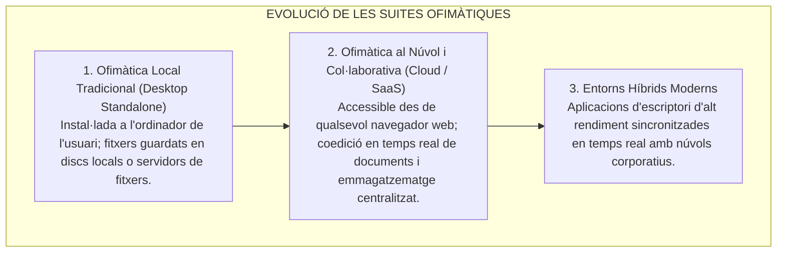
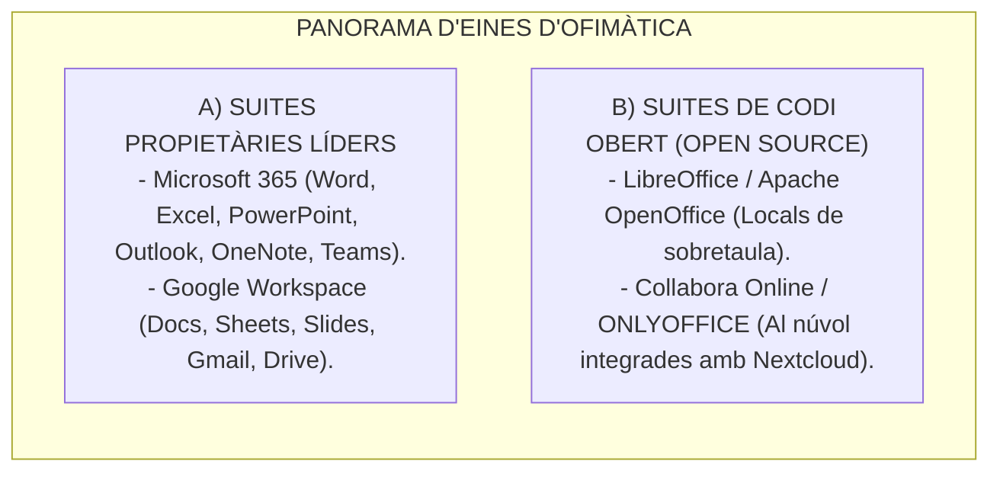

# Tema 58. Eines d'ofimàtica. Estudi de mercat. Alternatives de codi obert. Locals i al núvol

> **Fonts i marcs de referència:** Esquema Nacional d'Interoperabilitat ([`CORPUS/ENI.pdf`](file:///home/oriol/Projectes/OPOS/CORPUS/ENI.pdf) - Art. 11 i NTI de Catàleg d'estàndards per a formats de documents ofimàtics ODF/OOXML), Llei 40/2015 de Règim Jurídic ([`CORPUS/40_2015.pdf`](file:///home/oriol/Projectes/OPOS/CORPUS/40_2015.pdf) - Reutilització de sistemes i codi obert), Guies CCN-STIC i especificacions internacionals **ISO/IEC 26300 (OpenDocument)** i **ISO/IEC 29500 (Office Open XML)**.

---

## 1. Concepte i Evolució del Programari Ofimàtic Municipal

Les **eines d'ofimàtica** són el conjunt d'aplicacions i programes informàtics dissenyats per optimitzar, automatitzar i millorar els procediments i tasques diàries d'oficina a l'Administració Pública (redacció d'informes, fulls de càlcul pressupostaris, presentacions institucionals i gestió del correu):

---

## 2. Estudi de Mercat: Solucions Comercials Propietàries vs. Codi Obert

A l'Administració Local, la decisió entre solucions propietàries i solucions de codi obert (*Open Source*) respon a criteris de cost, interoperabilitat, privacitat de les dades i dependència de proveïdors (*Vendor Lock-in*):

### 2.1. Taula Comparativa de Solucions

| Característica | Microsoft 365 / Google Workspace | LibreOffice (Local) | Collabora Online / ONLYOFFICE (Núvol) |
| :--- | :--- | :--- | :--- |
| **Model de Llicenciament** | Subscripció anual per usuari (**SaaS de pagament**). | **Codi Obert (LGPL / MPL - Gratuït)**. | **Codi Obert (AGPLv3)** amb suport empresarial opcional. |
| **Desplegament** | Núvol públic del proveïdor (Microsoft / Google). | Local (*On-Premise*) a cada ordinador. | **Autoallotjat al CPD municipal (*On-Premise*) o Núvol privat**. |
| **Coedició en Temps Real** | Excel·lent i nativa entre múltiples usuaris. | No disponible nativament (requereix tancament de fitxer). | **Excel·lent (integrada amb Nextcloud / ownCloud)**. |
| **Sobirania i Privacitat (RGPD)** | Dades allotjades en servidors de grans tecnològiques. | **Total (les dades mai surten de l'Ajuntament)**. | **Total (control absolut municipal dels servidors de dades)**. |
| **Dependència de Proveïdor** | Alta (*Vendor Lock-in* de formats i llicències). | Nul·la (basat en estàndards oberts ODF). | Nul·la (formats oberts i formats Office natius). |

---

## 3. L'Estàndard de Formats Segons l'Esquema Nacional d'Interoperabilitat (ENI)

Segons l'article 11 de l'**ENI** ([`CORPUS/ENI.pdf`](file:///home/oriol/Projectes/OPOS/CORPUS/ENI.pdf)) i la corresponent Norma Tècnica d'Interoperabilitat (NTI) de Catàleg d'estàndards:
- Les administracions públiques han d'utilitzar **estàndards oberts** i, complementàriament, estàndards d'ús generalitzat per la ciutadania.
- **Formats Ofimàtics Oficials Admesos a l'Administració:**
  1. **ODF (*Open Document Format* - ISO/IEC 26300):** Format obert natiu recomanat per l'ENI (`.odt` per a text, `.ods` per a fulls de càlcul, `.odp` per a presentacions).
  2. **OOXML (*Office Open XML* - ISO/IEC 29500):** Estàndard basat en XML utilitzat per Microsoft (`.docx`, `.xlsx`, `.pptx`).
  3. **PDF / PDF/A (*Portable Document Format for Archiving* - ISO 19005):** Format estàndard **obligatori per a resolucions, decrets d'alcaldia, expedients electrònics i signatures digitals** de llarga durada.

---

## 4. Estratègia Ofimàtica Municipal: Models Híbrids

Un ajuntament modern acostuma a desplegar una **estratègia híbrida**:
- **Llocs de treball d'atenció ciutadana i gestió general:** Eines d'ofimàtica al núvol o sobretaula amb suport de plantilles corporatives vinculades al Gestor d'Expedients.
- **Departaments tècnics (Urbanisme, Intervenció, Tresoreria):** Fulls de càlcul avançats amb connexió a bases de dades SQL i macros de programari.
- **Seu Electrònica i Notificacions:** Tots els documents generats per les eines d'ofimàtica es converteixen automàticament a **PDF/A amb signatura electrònica i segell de temps** abans de ser notificats al ciutadà.

---

## 5. Quadre Resum i Preguntes Típiques d'Examen Tipus Test

| Pregunta / Concepte Clau | Resposta Correcta / Trampa Freqüent |
| :--- | :--- |
| **Quin format ofimàtic és un estàndard obert ISO/IEC 26300 recomanat per l'ENI?** | El format **OpenDocument (ODF: .odt, .ods, .odp)**. |
| **Quin format és preceptiu per a la conservació a llarg termini d'expedients?** | El format **PDF/A (ISO 19005)**. |
| **Quina alternativa de codi obert permet coedició web autoallotjada al CPD?** | **Collabora Online** o **ONLYOFFICE** (integrades amb Nextcloud). |
| **Quin estàndard ISO defineix el format Office Open XML (.docx/.xlsx)?** | La norma **ISO/IEC 29500 (OOXML)**. |
| **Què diu l'ENI sobre la reutilització i ús d'estàndards oberts?** | Que les administracions públiques han de **prioritzar l'ús d'estàndards oberts per garantir la independència del ciutadà**. |
