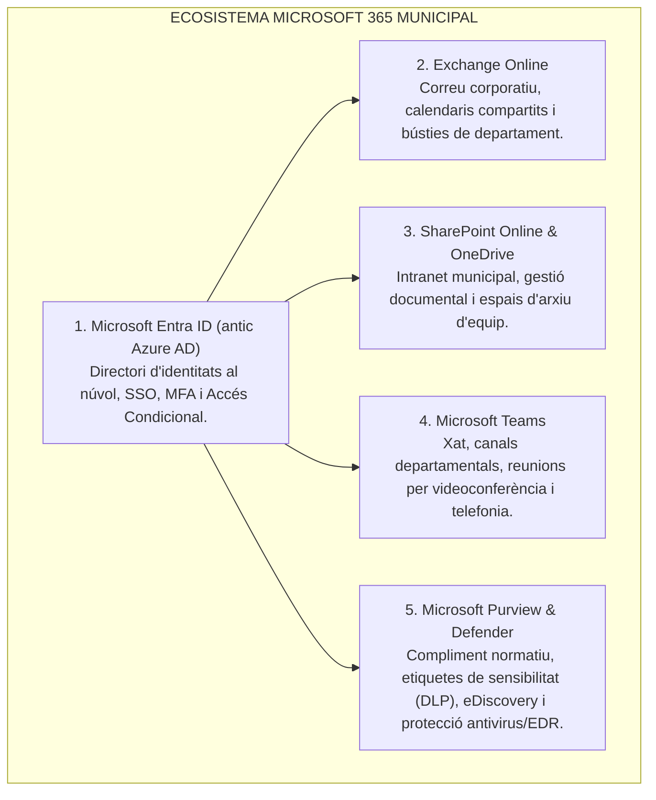
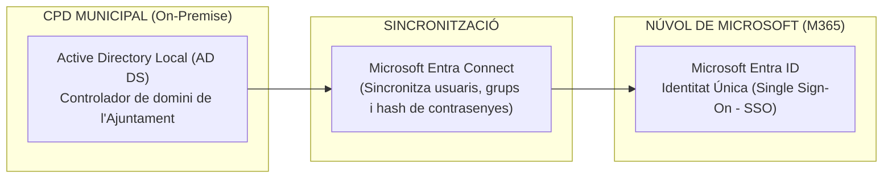

# Tema 59. Entorn Microsoft 365: arquitectura, gestió d'identitats (Entra ID), administració de llicències i seguretat

> **Fonts i marcs de referència:** Esquema Nacional de Seguretat ([`CORPUS/ENS_2022.pdf`](file:///home/oriol/Projectes/OPOS/CORPUS/ENS_2022.pdf) - Art. 2, Mesures `[op.acc]` Control d'accés i Guia CCN-STIC 823 per a serveis Cloud), Reglament General de Protecció de Dades ([`CORPUS/LOPD.pdf`](file:///home/oriol/Projectes/OPOS/CORPUS/LOPD.pdf) - Privacitat i transferències internacionals) i especificacions oficials de Microsoft Cloud Services.

---

## 1. Arquitectura i Serveis Principals de Microsoft 365 (M365)

**Microsoft 365** és una plataforma de productivitat i col·laboració al núvol en modalitat **SaaS (*Software as a Service*)** que integra aplicacions d'ofimàtica, serveis de comunicació i un conjunt de seguretat avançat:

---

## 2. Gestió d'Identitats i Usuaris: Microsoft Entra ID

La gestió centralitzada d'usuaris a l'entorn M365 es fonamenta en **Microsoft Entra ID**:

### 2.1. Models d'Identitat a M365
1. **Identitat només al Núvol (*Cloud-Only*):** Els comptes es creen i es gestionen exclusivament a Entra ID (habitual en petits ajuntaments o entitats descentralitzades).
2. **Identitat Híbrida Sincronitzada (*Hybrid Identity*):** Els treballadors es creen a l'Active Directory local del CPD i es repliquen automàticament al núvol mitjançant **Microsoft Entra Connect**. Els usuaris tenen el mateix correu i contrasenya per entrar a l'ordinador de la taula i al portal web.
3. **Identitat Federada (ADFS / SAML 2.0):** L'autenticació es delega a servidors locals de federació de l'Ajuntament.

---

### 2.2. Administració Basada en Rols (RBAC - *Role-Based Access Control*)
Per complir amb el principi de **mínim privilegi de l'ENS**, l'administració de l'entorn es divideix en rols especialitzats:
- **Global Administrator (Administrador Global):** Accés absolut a tot l'entorn (només reservat per a un màxim de 2 a 4 comptes protegits amb MFA d'alta seguretat).
- **User Administrator:** Creació d'usuaris, restabliment de contrasenyes i assignació de departaments.
- **Exchange Administrator:** Gestió de bústies de correu, regles de transport i filtres antispam.
- **Teams Administrator:** Gestió de canals, permisos de trucades i polítiques de reunions.
- **Security Administrator:** Gestió d'alertes de ciberseguretat, logs i polítiques d'accés.

---

## 3. Gestió i Tipologia de Llicències

Microsoft ofereix plans específics segons la dimensió i les necessitats funcionals del lloc de treball:

| Pla de Llicenciament | Perfil d'Usuari Municipal Recomanat | Serveis Inclosos Principals |
| :--- | :--- | :--- |
| **Microsoft 365 E3** *(Enterprise)* | **Administratius, Tècnics i Funcionaris (Perfil estàndard)** | Aplicacions d'escriptori completes (Word, Excel, etc.), Exchange Online (100 GB), SharePoint/OneDrive (1 TB), protecció bàsica. |
| **Microsoft 365 E5** *(Alta Seguretat)* | **Alcaldia, Regidors, Caps de Serveis, Tècnics TIC** | Tot el paquet E3 + **Microsoft Defender for Endpoint/Identity**, **Microsoft Entra ID P2**, Purview avançat, Power BI Pro i audioconferència. |
| **Microsoft 365 F3** *(Frontline Worker)* | **Agents de la Policia Local a peu, Brigada Municipal, Monitors** | Només aplicacions web i mòbils (sense versió instal·lable d'escriptori), Exchange Online (2 GB) i Teams. |
| **Microsoft 365 Business Premium** | **Ajuntaments petits (< 300 empleats)** | Paquet complet d'aplicacions + gestió de dispositius **Microsoft Intune** i Defender for Business. |

- **Assignació de Llicències Basada en Grups (*Group-Based Licensing*):**  
  Permet assignar llicències de forma automatitzada afegint l'usuari a un grup de seguretat d'Entra ID (per exemple, `Grup-Policia-Local` $\rightarrow$ assigna automàticament llicències F3/E3). Si l'empleat canvia de departament o es dona de baixa, la llicència s'allibera automàticament.

---

## 4. Seguretat i Compliment Normatiu (ENS i RGPD)

1. **Polítiques d'Accés Condicional (*Conditional Access*):**  
   Mecanisme clau de seguretat que avalua el context de l'inici de sessió abans de donar accés:
   - **Exigència de Doble Factor (MFA):** Obligatori per a tots els treballadors públics en accedir fora de la xarxa de l'Ajuntament.
   - **Bloqueig Geogràfic:** Denegació automàtica de connexions procedents de països estrangers de risc.
   - **Dispositiu de Confiança:** Permetre la descàrrega de fitxers només si l'ordinador és un equip corporatiu gestionat per l'Ajuntament.
2. **Residència de Dades i RGPD (*EU Data Boundary*):**  
   Les bústies de correu i fitxers de l'Ajuntament s'allotgen exclusivament dins de centres de processament de dades situats a la Unió Europea (Amsterdam, Dublín, Madrid).
3. **Certificació ENS Nivell ALT:** Els serveis de Microsoft 365 disposen de certificació de conformitat amb l'**Esquema Nacional de Seguretat en categoria ALTA**.

---

## 5. Quadre Resum i Preguntes Típiques d'Examen Tipus Test

| Pregunta / Concepte Clau | Resposta Correcta / Trampa Freqüent |
| :--- | :--- |
| **Com s'anomena el directori d'identitats al núvol de Microsoft?** | **Microsoft Entra ID** (anteriorment conegut com *Azure Active Directory*). |
| **Quina eina sincronitza l'Active Directory local amb Entra ID?** | **Microsoft Entra Connect** (permet identitat híbrida i SSO). |
| **Quin rol té accés total a tot el tenant de Microsoft 365?** | El rol de **Global Administrator** (s'ha de limitar el seu ús segons l'ENS). |
| **Quin pla de llicenciament està dissenyat per a treballadors de camp sense PC fix?** | Els plans **Frontline (F1 / F3)**. |
| **Quina eina permet aplicar MFA obligatori basat en la ubicació o el dispositiu?** | Les **Polítiques d'Accés Condicional (*Conditional Access*)** d'Entra ID. |
| **Quin nivell de compliment té Microsoft 365 respecte a l'ENS?** | Certificació oficial en categoria **ENS Nivell ALT**. |
