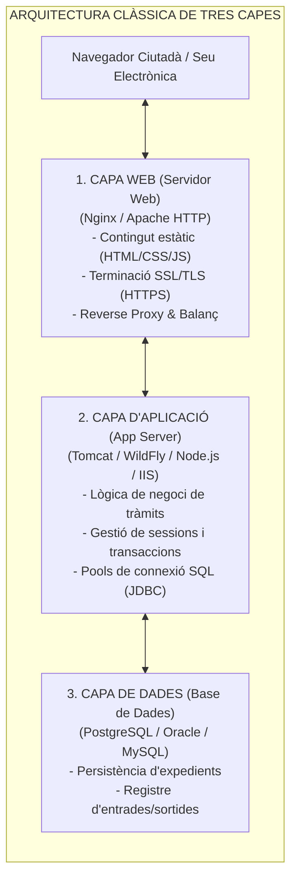
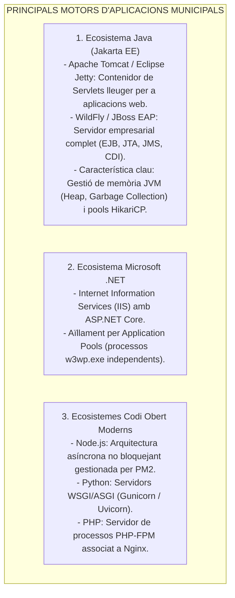
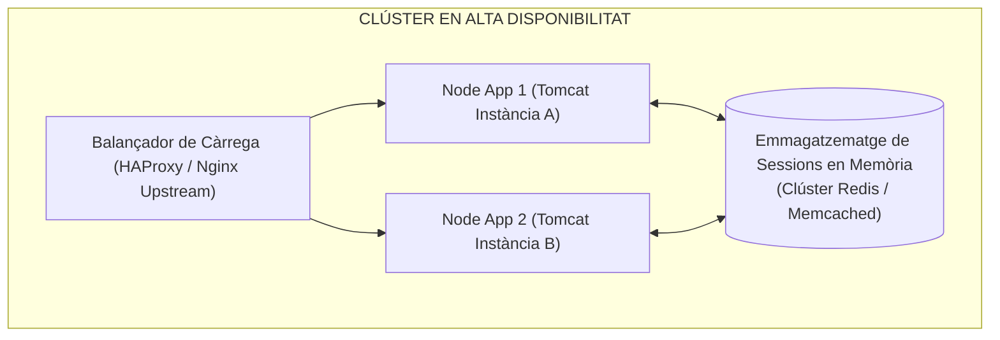
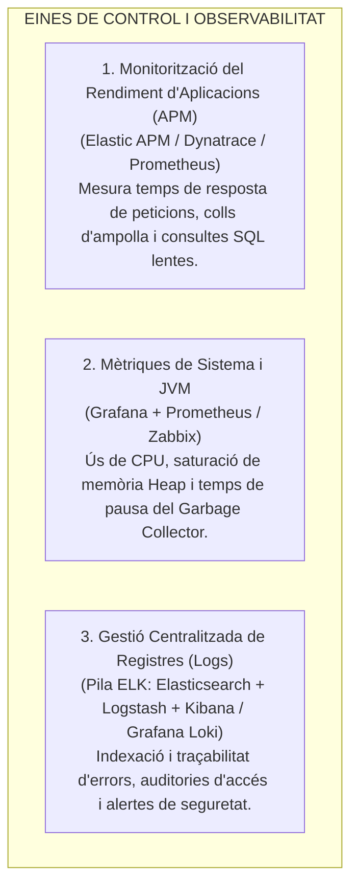

# Tema 60. Servidors d'aplicacions: arquitectura, gestió, eines d'administració i monitorització (APM, logs)

> **Fonts i marcs de referència:** Esquema Nacional de Seguretat ([`CORPUS/ENS_2022.pdf`](file:///home/oriol/Projectes/OPOS/CORPUS/ENS_2022.pdf) - Mesures `[mp.sw]` Seguretat de programari, `[op.mon]` Monitorització i `[op.exp.8]` Registre d'activitat), Esquema Nacional d'Interoperabilitat ([`CORPUS/ENI.pdf`](file:///home/oriol/Projectes/OPOS/CORPUS/ENI.pdf)) i especificacions d'estàndards **Jakarta EE (Eclipse Foundation)** i **W3C/IETF**.

---

## 1. Concepte de Servidor d'Aplicacions vs. Servidor Web

En l'arquitectura de sistemes municipals de tres capes (*Three-Tier Architecture*), el **servidor d'aplicacions** és la peça central que executa la lògica de negoci i interconnecta els portals ciutadans amb les bases de dades corporatives:

| Criteri de Comparació | Servidor Web (*Web Server*) | Servidor d'Aplicacions (*App Server*) |
| :--- | :--- | :--- |
| **Funció Principal** | Servir **contingut estàtic** (HTML, imatges, CSS) i gestionar connexions HTTP/HTTPS. | Executar **lògica de negoci dinàmica**, càlculs, processos batch i regles administratives. |
| **Tecnologies / Protocols** | Protocols HTTP, HTTPS, HTTP/2, HTTP/3, WebSockets. | Java EE/Jakarta EE, .NET Core, Python WSGI, PHP-FPM, Node.js. |
| **Accés a Dades** | No accedeix directament a bases de dades; fa de passarel·la (*Reverse Proxy*). | Gestiona **connexions directes a BD mitjançant *Connection Pools*** i transaccions ACID. |
| **Exemples Líders** | **Nginx, Apache HTTP Server, Microsoft IIS**. | **Apache Tomcat, WildFly (JBoss), Node.js (PM2), Gunicorn**. |

---

## 2. Ecosistemes i Tipologia de Servidors d'Aplicacions

---

## 3. Gestió, Clústers i Alta Disponibilitat

Per garantir la continuïtat de serveis crítics municipals (com el Padró d'Habitants o el Gestor d'Expedients), els servidors d'aplicacions es configuren en **alta disponibilitat**:

- **Mecanismes Clau de Gestió:**
  1. **Pools de Connexions a Base de Dades (*Connection Pooling*):** Mantenen connexions obertes i reutilitzables cap a la base de dades, evitant el sobrecost d'obrir i tancar connexions a cada tràmit ciutadà.
  2. **Persistència de Sessions (*Session Sharing*):** L'estat de sessió dels usuaris es guarda en un magatzem ràpid en memòria (**Redis**). Si un node cau, el ciutadà continua el seu tràmit al segon node sense desconnectar-se.
  3. **Automatització i Infraestructura com a Codi (IaC):** Desplegament i actualització de servidors d'aplicacions mitjançant receptes d'**Ansible** o plantilles de contenidors.

---

## 4. Eines de Monitorització, Rendiment (APM) i Gestió de Logs

Segons les mesures de monitorització `[op.mon]` i registre d'activitat `[op.exp.8]` de l'**Esquema Nacional de Seguretat (ENS)**:

---

## 5. Quadre Resum i Preguntes Típiques d'Examen Tipus Test

| Pregunta / Concepte Clau | Resposta Correcta / Trampa Freqüent |
| :--- | :--- |
| **Quina és la diferència funcional entre Nginx i Apache Tomcat?** | **Nginx és un servidor web/reverse proxy** per a contingut estàtic; **Tomcat és un contenidor de servlets/aplicacions** Java per a lògica dinàmica. |
| **Què és un Connection Pool (com HikariCP)?** | Un mecanisme que **manté connexions obertes a la base de dades per reutilitzar-les**, optimitzant el rendiment. |
| **Quina eina permet compartir sessions entre servidors d'un clúster?** | Un magatzem de dades en memòria distribuït com **Redis** o **Memcached**. |
| **Què és una eina d'APM (Application Performance Monitoring)?** | Un programari que **monitoritza les transaccions internes de l'aplicació, consultes a BD i colls d'ampolla**. |
| **Quins components formen la pila clàssica de gestió de logs ELK?** | **Elasticsearch** (motor de cerca/indexació), **Logstash** (recol·lector/processador) i **Kibana** (panell de visualització). |
| **Com aïlla Microsoft IIS diferents aplicacions en un mateix servidor?** | Mitjançant **Application Pools** associats a processos `w3wp.exe` independents. |
