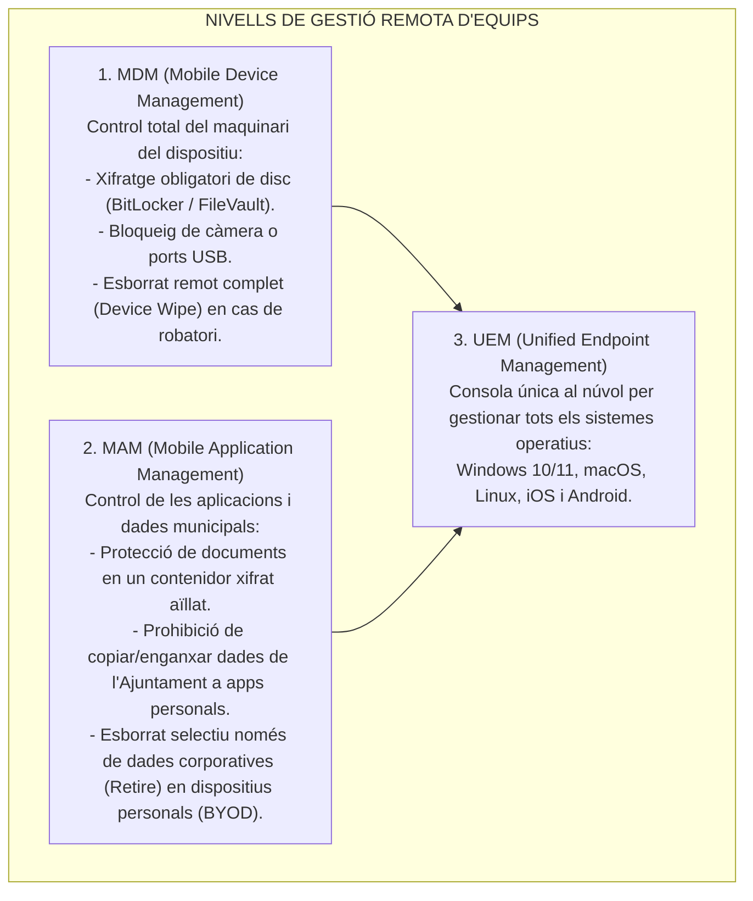
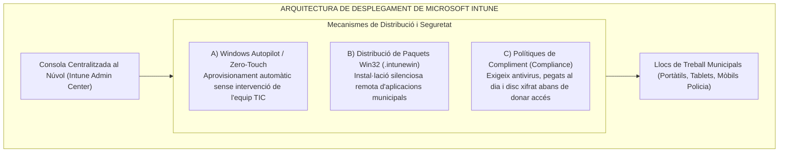

# Tema 61. Distribució remota d'aplicacions: Microsoft Intune, plataformes MDM/MAM/UEM i alternatives de mercat

> **Fonts i marcs de referència:** Esquema Nacional de Seguretat ([`CORPUS/ENS_2022.pdf`](file:///home/oriol/Projectes/OPOS/CORPUS/ENS_2022.pdf) - Mesures `[mp.eq.1]` Protecció del lloc de treball, `[mp.eq.2]` Dispositius portàtils i `[mp.sw]` Distribució de programari), Guia CCN-STIC 823 (*Gestió de Dispositius Mòbils*) i especificacions de gestió unificada d'extrems (**UEM/MDM**).

---

## 1. De la Gestió Tradicional a la Gestió Unificada d'Extrems (UEM)

La proliferació del teletreball, els ordinadors portàtils i els dispositius mòbils a l'Administració Local ha transformat la gestió d'equips: s'ha passat de les antigues polítiques de grup locals (**GPO** mitjançant Active Directory) a les plataformes de **Gestió Unificada d'Extrems (UEM - *Unified Endpoint Management*)** basades en el núvol:

---

## 2. Microsoft Intune: Arquitectura i Funcionalitats Clau

**Microsoft Intune** és la plataforma UEM al núvol líder en entorns Microsoft 365, connectada directament amb **Microsoft Entra ID**:

### 2.1. Aprovisionament sense contacte (*Windows Autopilot* / *Zero-Touch*)
- El fabricant o distribuïdor envia l'ordinador portàtil nou directament al domicili del treballador públic o a la seva taula.
- En encendre l'ordinador i introduir el correu corporatiu i la contrasenya, l'equip es vincula a l'Ajuntament, aplica totes les polítiques de seguretat, xifra el disc i **descarrega automàticament totes les aplicacions necessàries sense que cap tècnic informàtic hagi de tocar l'ordinador físicament**.

---

### 2.2. Empaquetament i Distribució de Programari Win32 (`.intunewin`)
Per desplegar aplicacions corporatives complexes d'escriptori (com gestors tributaris, padró municipal o AutoCAD):
1. Es compila l'instal·lador (`.exe` o `.msi`) mitjançant l'eina **Microsoft Win32 Content Prep Tool** generant un paquet xifrat `.intunewin`.
2. S'especifiquen les comandes d'**instal·lació silenciosa** (sense finestres emergents per a l'usuari, per exemple `msiexec /i app.msi /qn`).
3. Es defineixen les **regles de detecció** (comprovació de la presència d'un fitxer o clau de registre per saber si l'aplicació s'ha instal·lat correctament).
4. El servei Intune distribueix i instal·la el paquet automàticament en segon pla.

---

## 3. Alternatives de Mercat a Microsoft Intune

| Plataforma | Tipus de Solució | Sistemes Operatius Suportats | Característiques Destacades |
| :--- | :--- | :--- | :--- |
| **VMware Workspace ONE** *(antic AirWatch)* | Comercial (SaaS / On-Premise) | Windows, macOS, iOS, Android, Linux, ChromeOS | Plataforma UEM molt potent amb gestió avançada de polítiques d'accés condicional. |
| **ManageEngine Endpoint Central** | Comercial (Núvol o Local) | Windows, macOS, Linux, iOS, Android | Excel·lent relació qualitat-preu per a desplegament de pegats i control remot integrat. |
| **Jamf Pro** | Comercial (Especialitzada) | **macOS, iOS, iPadOS, tvOS** | L'estàndard hegemònic de facto per a organitzacions amb parc majoritari d'equips Apple. |
| **WAPT (*Tranquil IT*)** | **Codi Obert / Empresarial** | Windows, Linux, macOS | Sistema de gestió de paquets basat en Python per a desplegament ràpid d'aplicacions locals. |
| **OCS Inventory + GLPI** | **Codi Obert (GPL)** | Windows, Linux, macOS, Android | Combinació clàssica per a inventari automàtic d'actius i distribució bàsica de fitxers. |

---

## 4. Requisits de Seguretat de l'Esquema Nacional de Seguretat (ENS)

En compliment de les mesures `[mp.eq.1]` i `[mp.eq.2]` de l'ENS:
1. **Separació de dades personals i professionals:** En mòbils de treballadors públics, les dades de l'Ajuntament s'han de mantenir aïllades en un contenidor protegit.
2. **Capacitat d'Esborrat Remot Immediat (*Remote Wipe*):** Si un agent de la Policia Local perd la seva tauleta o un funcionari pateix el robatori del portàtil, l'administrador ha de poder **esborrar totes les dades municipals en qüestió de segons** des de la consola centralitzada.
3. **Control d'Inventari Permanent:** La plataforma ha de mantenir un registre en temps real de la versió de sistema operatiu, estat de pegats de seguretat i aplicacions instal·lades a cada dispositiu.

---

## 5. Quadre Resum i Preguntes Típiques d'Examen Tipus Test

| Pregunta / Concepte Clau | Resposta Correcta / Trampa Freqüent |
| :--- | :--- |
| **Quina és la diferència principal entre MDM i MAM?** | **MDM gestiona el dispositiu físic complet**; **MAM gestiona exclusivament les aplicacions i dades corporatives**. |
| **Què permet la tecnologia Windows Autopilot a Microsoft Intune?** | **Aprovisionar i configurar equips nous de forma automàtica al núvol** sense intervenció manual del tècnic (*Zero-Touch*). |
| **En quin format s'empaqueten les aplicacions Win32 per a Intune?** | En format xifrat **`.intunewin`** mitjançant la utilitat *IntuneWinAppUtil*. |
| **Què fa una política de compliment (*Compliance Policy*)?** | Verifica que el dispositiu compleix els requisits de seguretat (antivirus, xifratge) **abans de permetre-li accedir a les dades municipals**. |
| **Quina plataforma de mercat és l'estàndard especialitzat per a dispositius Apple?** | **Jamf Pro**. |
| **Quina mesura de seguretat és obligatòria segons l'ENS davant la pèrdua d'un equip mòbil?** | La capacitat d'executar un **esborrat remot de dades (*Remote Wipe*)**. |
