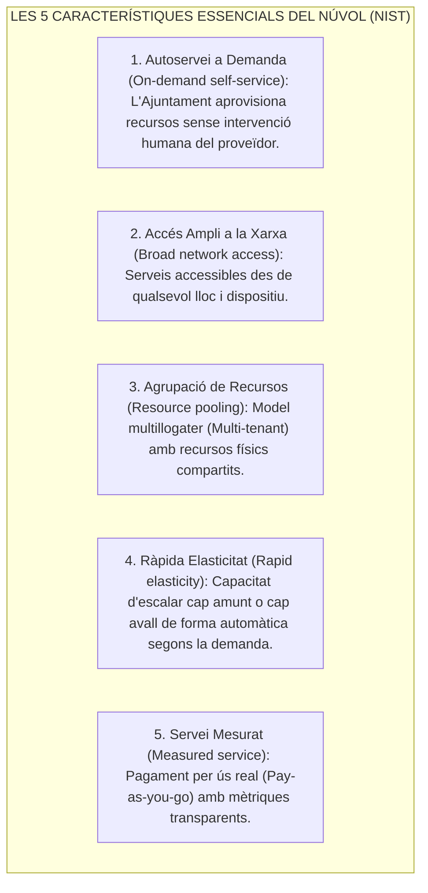
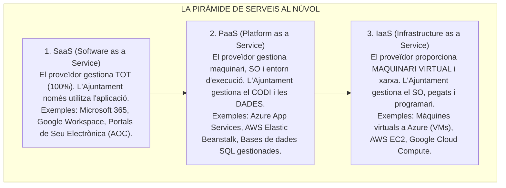
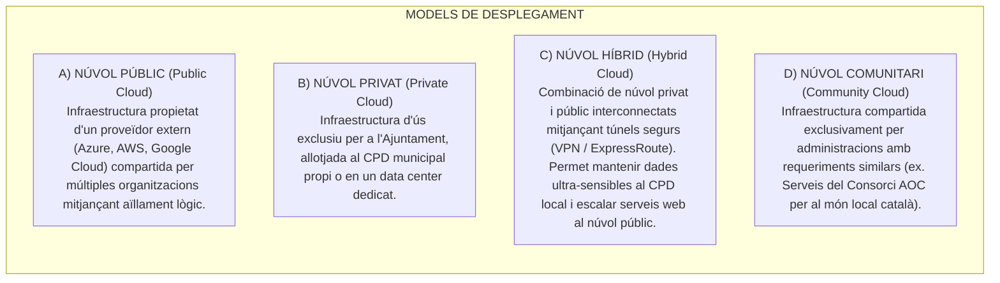

# Tema 62. Serveis al núvol: models de servei (IaaS, PaaS, SaaS), models de desplegament (públic, privat, híbrid), avantatges, inconvenients i seguretat ENS

> **Fonts i marcs de referència:** Esquema Nacional de Seguretat ([`CORPUS/ENS_2022.pdf`](file:///home/oriol/Projectes/OPOS/CORPUS/ENS_2022.pdf) - Art. 2 i Guia CCN-STIC 823 per a serveis al núvol), Llei 9/2017 de Contractes del Sector Públic ([`CORPUS/Contractes_2017.pdf`](file:///home/oriol/Projectes/OPOS/CORPUS/Contractes_2017.pdf) - Contractes de serveis TIC i subscripcions Cloud) i definicions estàndard del **NIST SP 800-145** i **ISO/IEC 17788**.

---

## 1. Concepte i Característiques Essencials del *Cloud Computing* (NIST SP 800-145)

El **Comput al Núvol (*Cloud Computing*)** és un model que permet l'accés ubic, còmode i a demanda per xarxa a un conjunt compartit de recursos de computació configurables (xarxes, servidors, emmagatzematge, aplicacions i serveis) que es poden aprovisionar i alliberar ràpidament amb un esforç mínim de gestió:

---

## 2. Models de Servei al Núvol: IaaS vs. PaaS vs. SaaS

La divisió clàssica de la computació al núvol s'estructura en funció del nivell de gestió que assumeix el proveïdor respecte al client (l'Ajuntament):

### 2.1. Matriu de Responsabilitat Compartida (*Shared Responsibility Model*)

| Capa Tecnològica | Tradicional (*On-Premise*) | IaaS (*Infraestructura*) | PaaS (*Plataforma*) | SaaS (*Programari*) |
| :--- | :---: | :---: | :---: | :---: |
| **Dades i Accés d'Usuaris** | 🏛️ Ajuntament | 🏛️ Ajuntament | 🏛️ Ajuntament | 🏛️ Ajuntament |
| **Aplicacions / Codi** | 🏛️ Ajuntament | 🏛️ Ajuntament | 🏛️ Ajuntament | ☁️ Proveïdor |
| **Entorn d'Execució (*Runtime*)** | 🏛️ Ajuntament | 🏛️ Ajuntament | ☁️ Proveïdor | ☁️ Proveïdor |
| **Sistema Operatiu i Pegats** | 🏛️ Ajuntament | 🏛️ Ajuntament | ☁️ Proveïdor | ☁️ Proveïdor |
| **Virtualització i Hipervisor** | 🏛️ Ajuntament | ☁️ Proveïdor | ☁️ Proveïdor | ☁️ Proveïdor |
| **Servidors Físics i Emmagatzematge** | 🏛️ Ajuntament | ☁️ Proveïdor | ☁️ Proveïdor | ☁️ Proveïdor |
| **Xarxa Física i Centre de Dades (CPD)** | 🏛️ Ajuntament | ☁️ Proveïdor | ☁️ Proveïdor | ☁️ Proveïdor |

> ⚠️ **Principi fonamental d'examen:** **La responsabilitat sobre la seguretat i la confidencialitat de les dades de la ciutadania SEMPRE és de l'Ajuntament (Responsable del Tractament)**, independentment que el servei estigui en IaaS, PaaS o SaaS.

---

## 3. Models de Desplegament del Núvol

---

## 4. Avantatges i Inconvenients a l'Administració Pública

| Àmbit | Avantatges del Núvol | Inconvenients / Riscos a Gestionar |
| :--- | :--- | :--- |
| **Econòmic i Financer** | **Pas de CapEx a OpEx:** S'elimina la gran inversió inicial en compra de servidors (CapEx) i es passa a una despesa operativa mensual (OpEx). | **Costos recurrents:** Si no hi ha una estricta governança (*FinOps*), el cost acumulat de les subscripcions mensuals pot superar la compra local. |
| **Operatiu i Manteniment** | **Alta Disponibilitat (HA) nativa i recuperació immediata de desastres.** Actualitzacions automàtiques de maquinari. | **Dependència de la connectivitat a Internet:** Si cau la línia de telecomunicacions, es perd l'accés als serveis externs. |
| **Agilitat i Innovació** | Aprovisionament de nous servidors i proves pilot en minuts en lloc de mesos de contractació pública. | **Dependència de Proveïdor (*Vendor Lock-in*):** Dificultat tècnica i cost de migrar dades i serveis a un altre proveïdor. |
| **Seguretat i Privacitat** | Protecció perimetral avançada i equips d'experts en ciberseguretat dels grans proveïdors. | **Transferències internacionals (RGPD):** Cal exigir que els centres de dades estiguin ubicats dins de la Unió Europea. |

---

## 5. Requisits de l'Esquema Nacional de Seguretat (ENS) per a Serveis Cloud

Segons l'article 2 de l'**ENS** ([`CORPUS/ENS_2022.pdf`](file:///home/oriol/Projectes/OPOS/CORPUS/ENS_2022.pdf)) i la Guia **CCN-STIC 823**:
1. **Certificació de Conformitat ENS del Proveïdor:** L'empresa proveïdora de serveis al núvol ha d'estar certificada oficialment en l'ENS amb una categoria igual o superior a la del sistema municipal que allotja (ex. Categoria ALTA per a padró i tràmits tributaris).
2. **Acords de Nivell de Servei (SLA - *Service Level Agreements*):** Els plecs de contractació pública ([`CORPUS/Contractes_2017.pdf`](file:///home/oriol/Projectes/OPOS/Contractes_2017.pdf)) han d'establir penalitzacions econòmiques per caigudes de servei (disponibilitat mínima habitual del **99,9% al 99,99%**).
3. **Pla de Sortida (*Exit Strategy*):** L'Ajuntament ha de garantir per contracte el dret a recuperar totes les seves dades en formats oberts i estàndards (ENI) en cas de rescissió o finalització del contracte.

---

## 6. Quadre Resum i Preguntes Típiques d'Examen Tipus Test

| Pregunta / Concepte Clau | Resposta Correcta / Trampa Freqüent |
| :--- | :--- |
| **Quina és la diferència clau entre IaaS, PaaS i SaaS?** | **IaaS** proporciona maquinari virtual; **PaaS** proporciona entorn d'execució i bases de dades; **SaaS** proporciona el programari final llest per utilitzar. |
| **En quin model de servei el client gestiona el sistema operatiu?** | En el model **IaaS (Infrastructure as a Service)**. |
| **Qui té la responsabilitat final sobre les dades personals al núvol segons el RGPD?** | **L'Ajuntament (el Responsable del Tractament)**, mai es pot delegar la responsabilitat legal. |
| **Què és un Núvol Comunitari (*Community Cloud*)?** | Un núvol **compartit per diverses organitzacions amb una missió comuna** (com els serveis AOC per als ens locals). |
| **Què és el concepte de Ràpida Elasticitat (*Rapid Elasticity*)?** | La capacitat d'**augmentar o reduir recursos de computació de forma automàtica** segons la demanda en temps real. |
| **Què exigeix l'ENS a un proveïdor de Cloud públic per a l'Ajuntament?** | Disposar d'una **Certificació de Conformitat amb l'ENS** d'igual o superior nivell al del servei contractat. |
