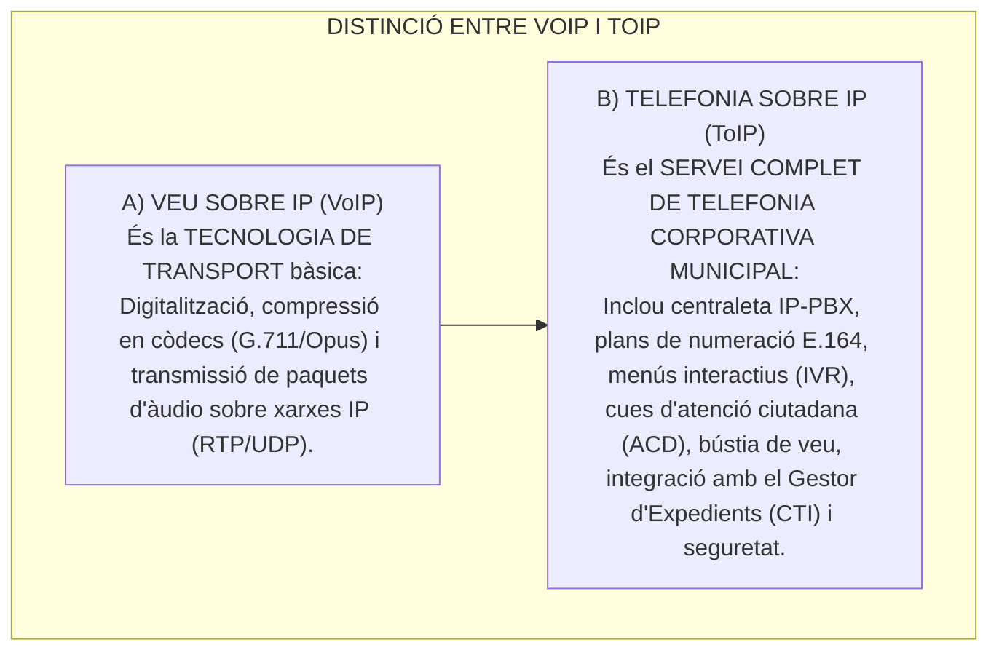
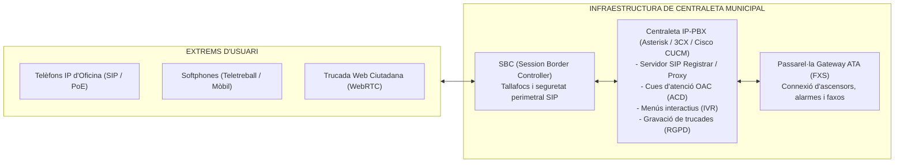
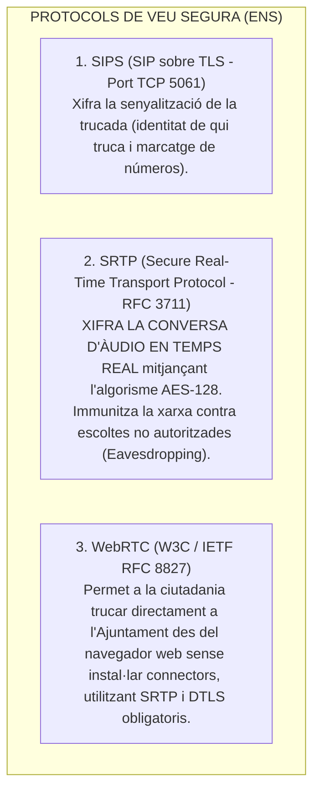

# Tema 63. Serveis de veu: Veu sobre IP (VoIP), Telefonia sobre IP (ToIP), protocols (SIP, RTP, SRTP), equipament (IP-PBX, SBC, Gateways) i qualitat de servei (QoS)

> **Fonts i marcs de referència:** Esquema Nacional de Seguretat ([`CORPUS/ENS_2022.pdf`](file:///home/oriol/Projectes/OPOS/CORPUS/ENS_2022.pdf) - Mesura `[mp.com.2]` Protecció de la telefonia i veu IP), Reglament General de Protecció de Dades ([`CORPUS/LOPD.pdf`](file:///home/oriol/Projectes/OPOS/CORPUS/LOPD.pdf) - Enregistrament de trucades) i estàndards internacionals de telecomunicacions **IETF (RFC 3261 SIP, RFC 3550 RTP, RFC 3711 SRTP)** i **ITU-T (G.114, G.711, P.800 MOS)**.

---

## 1. Diferència Conceptual: Veu sobre IP (VoIP) vs. Telefonia sobre IP (ToIP)

Tot i que sovint s'utilitzen com a sinònims, en enginyeria de telecomunicacions tenen un abast diferent:

---

## 2. Arquitectura d'un Sistema de Telefonia IP Municipal (ToIP)

### 2.1. Funcionalitats Avançades de Servei de Veu:
1. **IVR (*Interactive Voice Response*):** Menús d'encaminament vocal automàtic per a la ciutadania (*"Per a tràmits de Padró premi 1; per a Urbanisme premi 2..."*).
2. **ACD (*Automatic Call Distribution*):** Distribució intel·ligent de trucades als operadors de l'Oficina d'Atenció Ciutadana (OAC) per cues d'espera, temps de repòs o habilitats dels agents.
3. **Bústia de Veu a Correu (*Voicemail-to-Email*):** Els missatges de veu deixats al contestador es converteixen automàticament en fitxers d'àudio (`.wav`/`.mp3`) i s'envien a la bústia de correu de l'empleat.
4. **Gravació de Trucades (RGPD):** Obligatòria per a serveis d'emergència de la Policia Local, amb locució informativa prèvia d'acord amb la LOPDGDD.

---

## 3. Pila de Protocols i Seguretat de la Veu IP (ENS)

Per complir amb la mesura `[mp.com.2]` de l'Esquema Nacional de Seguretat, la telefonia municipal ha de xifrar tant la senyalització com l'àudio:

---

## 4. Equipament Clau de la Xarxa de Veu

1. **Centraleta IP-PBX (On-Premise o al Núvol):** Servidor de programari (ex. **Asterisk, FreePBX, 3CX, Cisco CallManager**) que gestiona el registre dels telèfons, taules d'encaminament i lògica de negoci.
2. **Controlador de Frontera de Sessió (SBC - *Session Border Controller*):**  
   Dispositiu de seguretat especialitzat que actua com a **tallafocs per a la telefonia IP**, filtrant atacs de denegació de servei (DoS/DDoS), evitant fraus de trucades internacionals (*Toll Fraud*) i traduint protocols entre la xarxa municipal i l'operador.
3. **Passarel·les de Veu (*Voice Gateways* / Adaptadors ATA):**
   - **Ports FXS (*Foreign eXchange Station*):** Proporcionen tensió elèctrica i to de trucada per connectar equips analògics tradicionals (faxos, telèfons d'emergència d'ascensors municipals).
   - **Ports FXO (*Foreign eXchange Office*):** Connecten la centraleta amb línies telefòniques analògiques externes de suport.

---

## 5. Mètriques de Qualitat de Servei (QoS) per a Veu

La veu humana és extremadament sensible al retard i la pèrdua de dades. Els estàndards internacionals de la **ITU-T** defineixen els límits màxims admissibles a la xarxa municipal:

| Mètrica de Qualitat | Valor Recomanat per a Veu IP (ITU-T) | Impacte en la Conversa si se supera |
| :--- | :--- | :--- |
| **Latència d'anada (*One-Way Delay*)** | **$< 150\text{ ms}$ (Recomanació ITU-T G.114)** | Si supera els 200-250 ms, els interlocutors es trepitgen en parlar. |
| **Jitter (Variació del retard)** | **$< 30\text{ ms}$** | Provoca distorsió metàl·lica i talls en la veu (es compensa amb un *Jitter Buffer*). |
| **Pèrdua de Paquets (*Packet Loss*)** | **$< 1\%$** | Síl·labes o paraules inintel·ligibles. |
| **Puntuació MOS (*Mean Opinion Score*)** | **$\ge 4,0$ (Escala d'1 a 5 segons ITU-T P.800)** | Mesura la qualitat subjectiva percebuda (4,0 a 4,5 és qualitat excel·lent tipus RDSI). |

---

## 6. Quadre Resum i Preguntes Típiques d'Examen Tipus Test

| Pregunta / Concepte Clau | Resposta Correcta / Trampa Freqüent |
| :--- | :--- |
| **Quina és la diferència principal entre VoIP i ToIP?** | **VoIP és la tecnologia de transport d'àudio per IP**; **ToIP és el servei global de telefonia avançada** (centraletes, IVR, cues). |
| **Quin protocol xifra la conversa d'àudio en temps real segons l'ENS?** | El protocol **SRTP (Secure Real-time Transport Protocol - RFC 3711)** amb AES-128. |
| **Quina és la funció d'un Session Border Controller (SBC)?** | Actuar com a **tallafocs especialitzat de telefonia IP**, protegint la centraleta contra atacs i fraus de trucades. |
| **Què és un adaptador ATA amb port FXS?** | Un dispositiu que permet **connectar equips analògics (faxos, ascensors) a la xarxa de telefonia IP**. |
| **Quin és el límit màxim de latència recomanat per la norma ITU-T G.114 per a veu?** | Un màxim de **150 mil·lisegons (150 ms)** d'anada. |
| **Què mesura l'índex MOS (Mean Opinion Score)?** | La **qualitat percebuda de la veu** en una escala d'1 (inacceptable) a 5 (excel·lent). |
