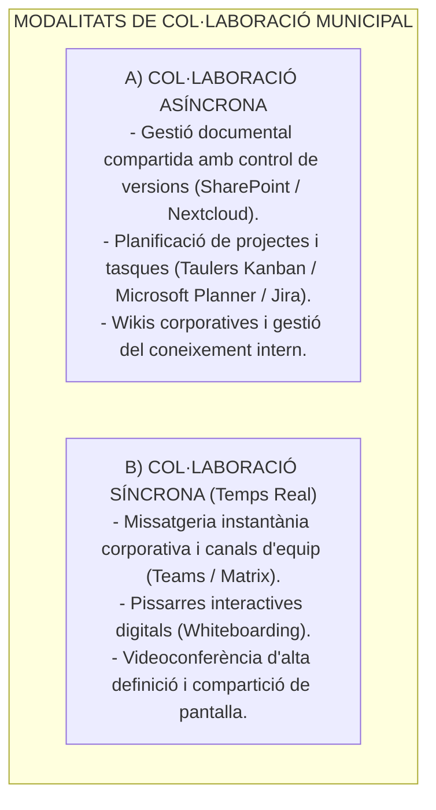
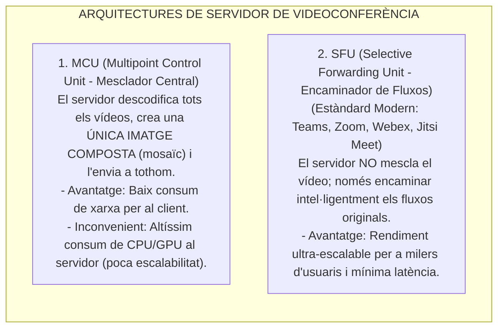
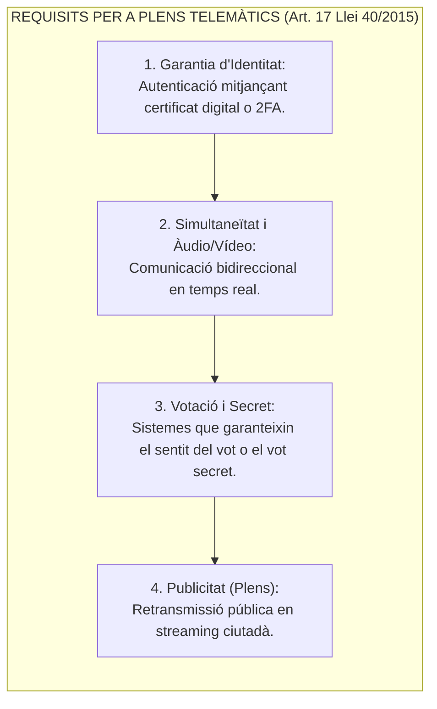

# Tema 64. Serveis de col·laboració: videoconferència, treball en grup (Groupware), plataformes UCaaS i retransmissió d'òrgans col·legiats

> **Fonts i marcs de referència:** Llei 40/2015 de Règim Jurídic ([`CORPUS/40_2015.pdf`](file:///home/oriol/Projectes/OPOS/CORPUS/40_2015.pdf) - Art. 17 Funcionament telemàtic d'òrgans col·legiats), Llei 7/1985 de Bases del Règim Local ([`CORPUS/LRBRL.pdf`](file:///home/oriol/Projectes/OPOS/CORPUS/LRBRL.pdf) - Art. 46 Plens telemàtics), Esquema Nacional de Seguretat ([`CORPUS/ENS_2022.pdf`](file:///home/oriol/Projectes/OPOS/CORPUS/ENS_2022.pdf) - Mesures `[mp.com]` i Guia CCN-STIC 823) i estàndards **WebRTC (W3C/IETF)**.

---

## 1. Concepte de Treball en Grup (*Groupware*) i Comunicacions Unificades (UCaaS)

El **treball col·laboratiu (*Groupware*)** engloba el conjunt d'eines tecnològiques dissenyades perquè els equips de treball de l'Ajuntament puguin cooperar eficientment compartint informació, coordinant tasques i comunicant-se en temps real o de forma asíncrona:

- **Plataformes UCaaS (*Unified Communications as a Service*):** Sistemes al núvol que unifiquen en una sola interfície la telefonia IP, les reunions de vídeo, el xat i l'emmagatzematge d'arxius (ex. **Microsoft Teams, Cisco Webex, Zoom Workplace**).

---

## 2. Tecnologies i Arquitectures de Videoconferència Multipunt

Quan múltiples usuaris es connecten a una reunió virtual, la distribució dels fluxos de vídeo pot realitzar-se segons dues arquitectures principals:

### 2.1. Còdecs de Vídeo i Protocols Clau
- **Tecnologia WebRTC (Web Real-Time Communication):** Estàndard del W3C/IETF que permet la videoconferència nativa directa des de navegadors web (Chrome, Edge, Firefox) sense instal·lar cap connector extern, amb xifratge **SRTP/DTLS** obligatori.
- **Còdecs de Vídeo Principals:**
  - **H.264 / AVC:** Còdec universal compatible amb el 100% de dispositius per maquinari.
  - **H.265 / HEVC:** Major compressió (50% menys d'amplada de banda que H.264 a igual qualitat).
  - **VP8 / VP9 i AV1:** Còdecs oberts d'alta eficiència lliures de patents.

---

## 3. Plens Municipals i Òrgans Col·legiats Telemàtics

La celebració telemàtica de plens municipals, juntes de govern local i comissions informatives té una regulació legal estricta a l'**article 17 de la Llei 40/2015** ([`CORPUS/40_2015.pdf`](file:///home/oriol/Projectes/OPOS/CORPUS/40_2015.pdf)) i l'**article 46 de la LRBRL** ([`CORPUS/LRBRL.pdf`](file:///home/oriol/Projectes/OPOS/CORPUS/LRBRL.pdf)):

- **Vídeoacta Municipal:** Gravació audiovisual del Ple Municipal acompanyada de la signatura electrònica qualificada del Secretari de l'Ajuntament i un segell de temps, tenint plena validesa jurídica d'acord amb la Llei 39/2015.
- **Protocols de Retransmissió Pública Ciutadana (*Streaming*):** Ús de protocols d'entrega de vídeo sobre HTTP com **HLS (*HTTP Live Streaming*)** o **DASH** per garantir que la ciutadania pugui seguir els plens des de qualsevol telèfon o televisor intel·ligent.

---

## 4. Alternatives de Codi Obert per a Sobirania Digital

Per als ajuntaments que requereixen el control absolut de les seves comunicacions sense dependre de proveïdors forans:

| Solució de Codi Obert | Arquitectura | Aplicació Principal a l'Ajuntament |
| :--- | :--- | :--- |
| **Jitsi Meet** | WebRTC + SFU (Jitsi Videobridge) | **Videoconferència municipal autoallotjada al CPD**, sense límit d'usuaris ni recollida de dades. |
| **Nextcloud Talk** | Integrada amb Nextcloud | Xat intern, trucades i compartició d'arxius associada al núvol de documents privat. |
| **Matrix / Element** | Protocol obert federat | Missatgeria instantània corporativa interoperable amb xifratge d'extrem a extrem (E2EE). |

---

## 5. Seguretat i Privacitat en Serveis de Videoconferència (ENS / RGPD)

1. **Xifratge d'Extrem a Extrem (E2EE - *End-to-End Encryption*):** Només els participants de la reunió tenen les claus per descodificar l'àudio i el vídeo (el servidor intermedi no pot visualitzar el contingut).
2. **Control d'Accés a les Reunions:**
   - Ús obligatori de **Sales d'Espera (*Lobby*)** per validar la identitat dels assistents abans d'admetre'ls.
   - Enllaços de reunió amb contrasenyes d'un sol ús per evitar intrusions no autoritzades (*Zoom-bombing*).
3. **Protecció de Dades en l'Enregistrament:** Abans d'iniciar la gravació d'una sessió de treball s'ha d'informar expressament a tots els participants, de conformitat amb el RGPD i la LOPDGDD ([`CORPUS/LOPD.pdf`](file:///home/oriol/Projectes/OPOS/CORPUS/LOPD.pdf)).

---

## 6. Quadre Resum i Preguntes Típiques d'Examen Tipus Test

| Pregunta / Concepte Clau | Resposta Correcta / Trampa Freqüent |
| :--- | :--- |
| **Quina arquitectura de servidor de videoconferència utilitzen Teams, Zoom i Jitsi?** | L'arquitectura **SFU (Selective Forwarding Unit)**, que reenvia fluxos sense recodificar. |
| **Quin estàndard permet videotrucades directes des del navegador sense connectors?** | La tecnologia **WebRTC (Web Real-Time Communication)**. |
| **Què exigeix l'Art. 17 de la Llei 40/2015 per a reunions telemàtiques d'òrgans col·legiats?** | **Garantir la identitat dels membres, la comunicació bidireccional en temps real i la votació**. |
| **Què és una Vídeoacta amb validesa jurídica?** | L'enregistrament audiovisual del ple **signat electrònicament pel Secretari amb segell de temps**. |
| **Quina eina de codi obert és líder per a videoconferències autoallotjades al CPD?** | **Jitsi Meet**. |
| **Quina mesura de seguretat impedeix intrusions no autoritzades a reunions virtuals?** | L'ús de **Sales d'Espera (*Lobby*)** i contrasenyes d'accés. |
