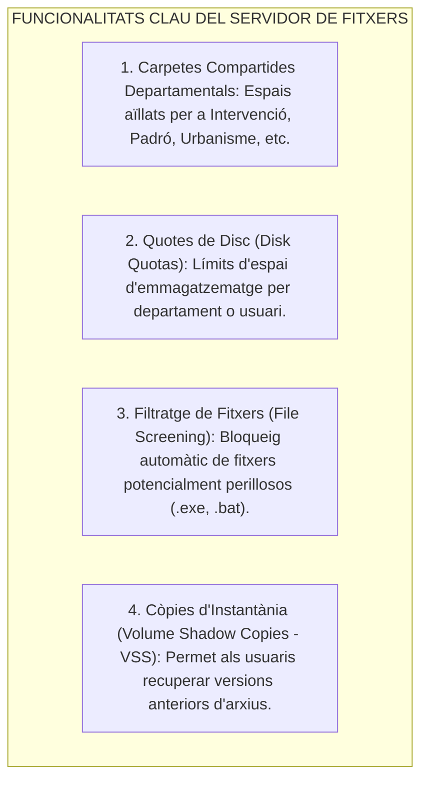
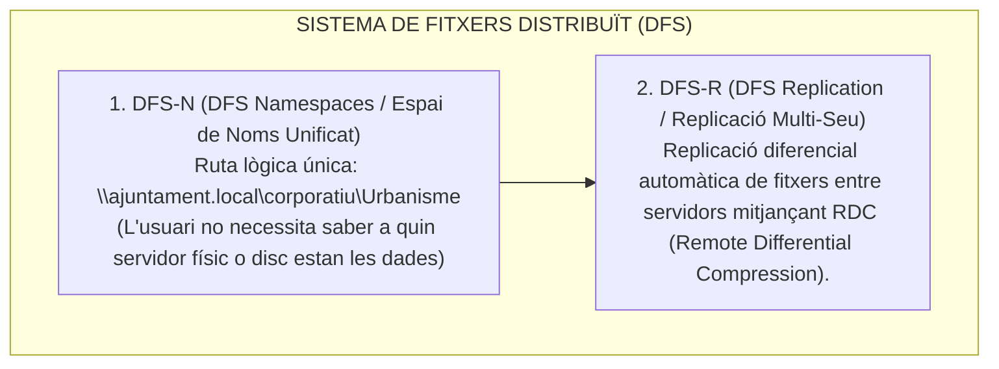
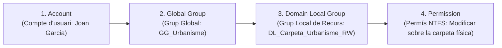
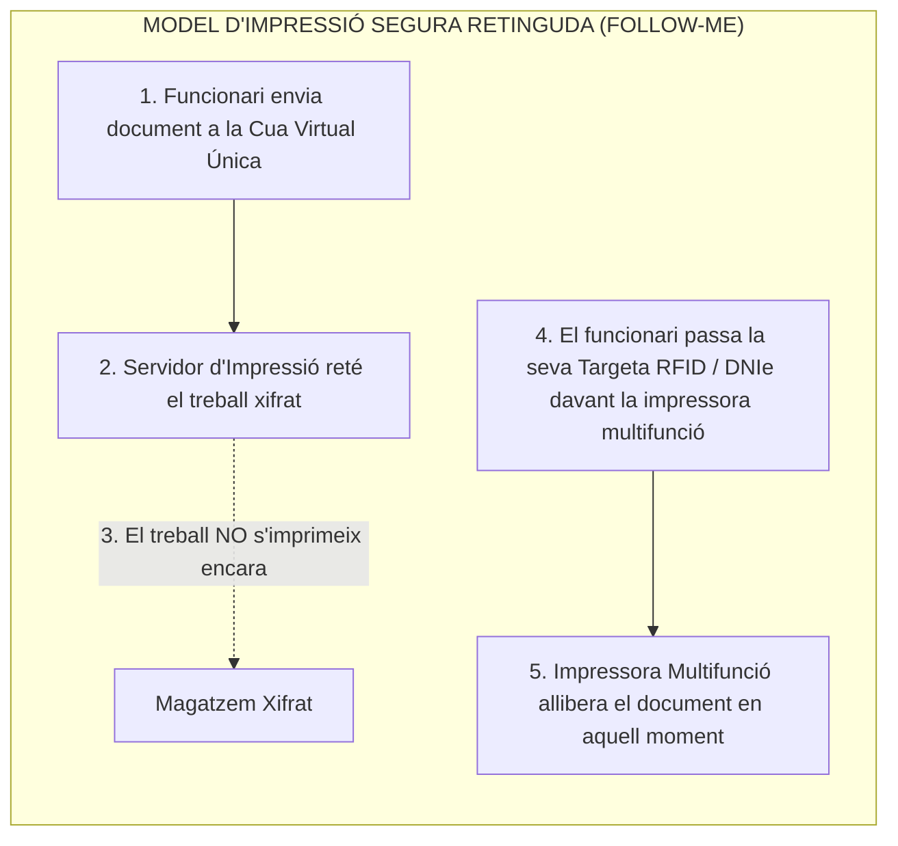

# Tema 65. Serveis d'impressió i de fitxers: protocols (SMBv3, NFSv4, IPPS), sistemes distribuïts (DFS), control d'accés (ACLs, AGDLP) i impressió segura (Follow-Me)

> **Fonts i marcs de referència:** Esquema Nacional de Seguretat ([`CORPUS/ENS_2022.pdf`](file:///home/oriol/Projectes/OPOS/CORPUS/ENS_2022.pdf) - Mesures `[op.acc]` Control d'accés i `[mp.com]` Xifratge de protocols de xarxa), Reglament General de Protecció de Dades ([`CORPUS/LOPD.pdf`](file:///home/oriol/Projectes/OPOS/CORPUS/LOPD.pdf) - Confidencialitat de documents) i especificacions **IETF (RFC 8010 IPP, RFC 7530 NFSv4, SMBv3)**.

---

## 1. Serveis de Fitxers Corporatius (*File Services*)

Els **serveis de fitxers** proporcionen una ubicació centralitzada, segura i estructurada al CPD municipal per emmagatzemar, compartir i gestionar els documents administratius dels departaments de l'Ajuntament:

---

## 2. Protocols de Compartició d'Arxius en Xarxa: SMB vs. NFS

| Protocol | Àmbit Principal | Versions i Seguretat (ENS) | Característiques Destacades |
| :--- | :--- | :--- | :--- |
| **SMB (*Server Message Block*)** | Entorns **Windows** i estacions de treball municipals (suportat a Linux amb **Samba**). | **SMBv3.1.1 (Obligatori per l'ENS):** Incorpora **xifratge natiu d'extrem a extrem (AES-128-GCM)** i signatura d'integritat per prevenir atacs *Man-in-the-Middle*. | Port **TCP 445**. Admet multicanal (*SMB Multichannel*) per sumar amplada de banda de targetes de xarxa. |
| **NFS (*Network File System*)** | Entorns **Linux / UNIX** i emmagatzematge per a servidors de virtualització (KVM/ESXi). | **NFSv4 / NFSv4.1 (RFC 7530):** Protocol orientat a connexió sobre TCP (Port **2049**), amb autenticació forta mitjançant **Kerberos (RPCSEC_GSS)** i suport d'ACLs. | Estat de sessió (*stateful*), eliminant la necessitat de dimonis auxiliars com *portmapper*. |

---

## 3. Sistemes de Fitxers Distribuïts (DFS - *Distributed File System*)

En un ajuntament amb diversos edificis municipals (Ajuntament, Policia Local, Serveis Socials, Brigada), s'utilitza **DFS**:

---

## 4. Mètodes d'Organització i Control d'Accés: Permisos i Estratègia AGDLP

Segons el principi de **mínim privilegi de l'ENS**, l'accés a carpetes departamentals s'ha d'estructurar de forma jeràrquica:

### 4.1. Permís Efectiu
- Quan un usuari accedeix per xarxa a una carpeta, s'avaluen dos tipus de permisos:
  1. **Permisos de Compartició (*Share Permissions*):** S'apliquen a la porta d'entrada de la xarxa.
  2. **Permisos del Sistema de Fitxers (*NTFS / POSIX ACLs*):** S'apliquen directament a les carpetes i fitxers locals.
- 📌 **Regla d'or:** **El permís efectiu final és SEMPRE EL MÉS RESTRICTIU dels dos**.

---

### 4.2. L'Estratègia Estàndard d'Assignació AGDLP:
Per evitar assignar permisos directament a usuaris individuals (pràctica prohibida a l'ENS):

---

## 5. Serveis d'Impressió Corporatius i Impressió Segura (*Follow-Me Printing*)

Els servidors d'impressió centralitzen la gestió de controladors (*drivers*), cues d'impressió (*Print Spooler*) i polítiques d'estalvi:

### 5.1. Protocols d'Impressió de Xarxa:
- **IPP / IPPS (*Internet Printing Protocol* - RFC 8010/8011 sobre HTTPS / Port 631):** Estàndard universal modern amb xifratge TLS i autenticació d'usuaris.
- **RAW / Port 9100 i LPR/LPD (RFC 1179):** Protocols antics sense xifratge (desaconsellats per l'ENS en xarxes obertes).
- **CUPS (*Common Unix Printing System*):** El servidor d'impressió lliure estàndard per a servidors Linux/UNIX.

### 5.2. Beneficis Municipals del *Follow-Me Printing*:
1. **Compliment Estricte del RGPD ([`CORPUS/LOPD.pdf`](file:///home/oriol/Projectes/OPOS/CORPUS/LOPD.pdf)):** Evita que documents confidencials amb dades personals de ciutadans quedin abandonats a la safata de sortida de la impressora.
2. **Estalvi i Sostenibilitat (*Green IT*):** Redueix més d'un 20-30% el consum de paper i tòner en eliminar treballs d'impressió erronis o no recollits.

---

## 6. Quadre Resum i Preguntes Típiques d'Examen Tipus Test

| Pregunta / Concepte Clau | Resposta Correcta / Trampa Freqüent |
| :--- | :--- |
| **Quina versió del protocol SMB és obligatòria a l'ENS pel seu xifratge natiu?** | **SMBv3 (SMBv3.1.1)**, que utilitza xifratge AES-128-GCM sobre el port TCP 445. |
| **Quin protocol de fitxers és estàndard a entorns Linux amb Kerberos?** | **NFSv4 (RFC 7530)** sobre el port TCP 2049. |
| **Quina és la regla entre permisos de Compartició i permisos NTFS?** | El permís final aplicat és **sempre el MÉS RESTRICTIU**. |
| **Què signifiquen les sigles de la metodologia d'accés AGDLP?** | **Account $\rightarrow$ Global Group $\rightarrow$ Domain Local Group $\rightarrow$ Permission**. |
| **Com funciona la impressió retinguda (*Follow-Me Printing*)?** | El treball queda retingut al servidor i **només s'imprimeix quan el funcionari s'identifica amb targeta a la màquina**. |
| **Quin és el protocol d'impressió segur basat en HTTP/HTTPS?** | **IPPS (Internet Printing Protocol sobre TLS / Port 631)**. |
