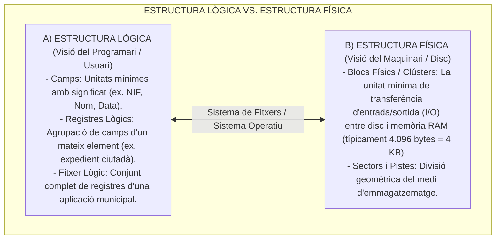
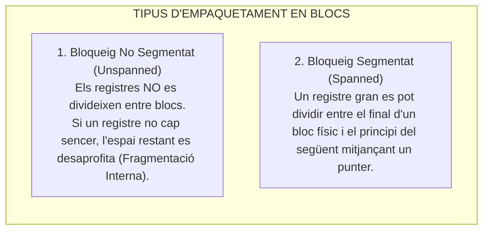
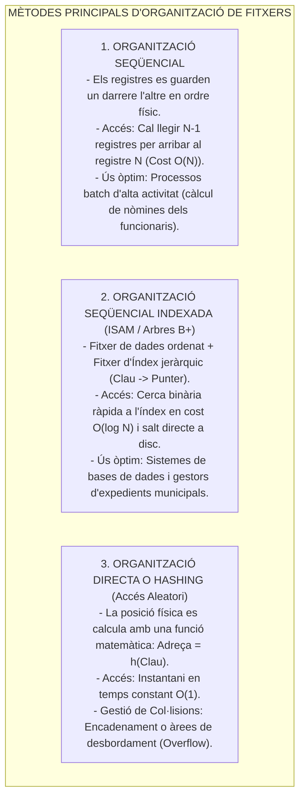
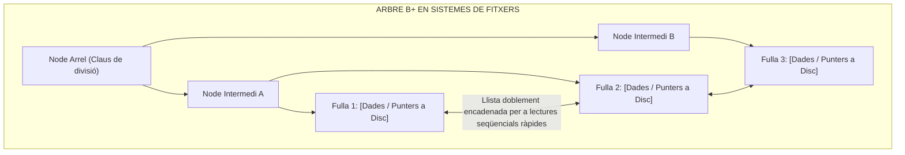

# Tema 66. Organització de fitxers: estructura lògica i física, tècniques d'accés (seqüencial, indexat, hash), factor de bloqueig, expansibilitat i volatilitat

> **Fonts i marcs de referència:** Esquema Nacional d'Interoperabilitat ([`CORPUS/ENI.pdf`](file:///home/oriol/Projectes/OPOS/CORPUS/ENI.pdf) - NTI de Document i Expedient Electrònic), teoria clàssica d'estructures de dades i fitxers (arbres B+, funcions de dispersió Hash) i arquitectura de sistemes de fitxers de sistemes operatius (NTFS, Ext4, ZFS).

---

## 1. Concepte de Fitxer: Estructura Lògica vs. Estructura Física

Un **fitxer** és una col·lecció organitzada de dades o registres relacionats lògicament que s'emmagatzemen com una sola unitat en un suport de memòria secundària no volàtil:

---

## 2. El Factor de Bloqueig (*Blocking Factor - Bfr*)

El **Factor de Bloqueig ($Bfr$)** és el nombre de registres lògics que es poden emmagatzemar dins d'un únic bloc físic de disc:

$$\text{Bfr} = \left\lfloor \frac{B}{R} \right\rfloor$$

- On $B$ és la mida del bloc físic (en bytes) i $R$ és la mida d'un registre lògic (en bytes).

---

## 3. Dinàmica i Paràmetres Característics dels Fitxers

| Paràmetre | Definició Tècnica | Exemple en l'Administració Local |
| :--- | :--- | :--- |
| **Volatilitat (*Volatility*)** | Freqüència i taxa d'**altes, baixes i modificacions** de registres al llarg del temps. | - **Alta volatilitat:** Taula de registre d'entrades i sortides diàries de l'OAC o fitxers de logs. - **Baixa volatilitat:** Catàleg de municipis de Catalunya o arxiu històric d'expedients tancats. |
| **Activitat (*Activity Ratio*)** | Percentatge de registres que es consulten o processen en una execució concreta: $\text{Ràtio} = \frac{\text{Registres processats}}{\text{Total registres}} \times 100$. | - **Alta activitat (>80%):** Procés nocturn massiu d'emissió de rebuts tributaris de l'IBI. - **Baixa activitat (<1%):** Consulta puntual del certificat d'empadronament d'un ciutadà concret. |
| **Expansibilitat (*Expandability*)** | Taxa de **creixement de la mida del fitxer** prevista a mitjà i llarg termini. | Permet calcular el dimensionament futur de les cabines de disc SAN del CPD (*Capacity Planning*). |

---

## 4. Tipus d'Organització de Fitxers i Mètodes d'Accés

L'organització d'un fitxer determina com s'ubiquen físicament els seus registres i quins algorismes s'utilitzen per recuperar-los:

---

## 5. Estructures d'Arbres B i B+ (*B-Trees / B+ Trees*)

En els sistemes de fitxers corporatius (com **NTFS, ext4, XFS o ZFS**) i en els motors de bases de dades relacionals (PostgreSQL, Oracle), l'estructura per excel·lència és l'**Arbre B+**:

- **Propietats de l'Arbre B+:**
  1. Arbre perfectament balancejat (totes les fulles estan al mateix nivell de profunditat).
  2. Els nodes interns només contenen claus per guiar la cerca; **totes les dades reals i punters a disc estan a les fulles**.
  3. Les fulles estan interconnectades de forma seqüencial, permetent tant cerques ràpides directes com cerques per rangs de valors (ex. *tots els expedients de l'any 2026*).

---

## 6. Quadre Resum i Preguntes Típiques d'Examen Tipus Test

| Pregunta / Concepte Clau | Resposta Correcta / Trampa Freqüent |
| :--- | :--- |
| **Com es calcula el Factor de Bloqueig (Bfr)?** | Dividint la mida del bloc físic entre la mida del registre lògic: $\text{Bfr} = \lfloor B / R \rfloor$. |
| **Què és la volatilitat d'un fitxer?** | La **freqüència d'altes, baixes i modificacions** que experimenta un fitxer. |
| **Quin mètode d'organització és més eficient per a processos d'alta activitat?** | L'**organització seqüencial** (ideal per a processos batch com nòmines o tributs). |
| **Quina complexitat temporal té l'accés directe per funció Hash?** | **Temps constant $O(1)$** en el cas ideal lliure de col·lisions. |
| **Per què s'utilitzen arbres B+ en lloc d'arbres binaris a discs?** | Perquè tenen un **factor de ramificació molt alt que minimitza el nombre d'operacions d'E/S a disc**. |
| **On s'emmagatzemen les dades reals en un Arbre B+?** | **Exclusivament en els nodes fulla**, que a més estan encadenats entre si. |
