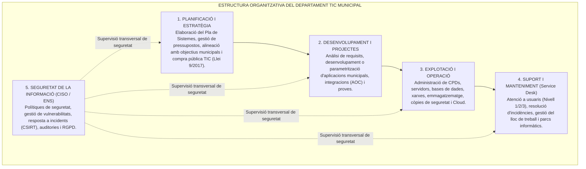

# Tema 67. Organització d'un departament TIC: planificació de projectes, desenvolupament de projectes, explotació i operació, manteniment i seguretat

> **Fonts i marcs de referència:** Esquema Nacional de Seguretat ([`CORPUS/ENS_2022.pdf`](file:///home/oriol/Projectes/OPOS/CORPUS/ENS_2022.pdf) - Marc organitzatiu `[org]`, Cicle de vida dels sistemes `[op.pl]` i Marc operacional `[op]`), Llei 40/2015 de Règim Jurídic ([`CORPUS/40_2015.pdf`](file:///home/oriol/Projectes/OPOS/CORPUS/40_2015.pdf) - Art. 156 Governança TIC) i estàndards internacionals de governança **ITIL v4**, **COBIT 2019** i **ISO/IEC 20000-1**.

---

## 1. L'Estructura Funcional d'un Departament TIC Municipal

En l'Administració Local, el departament de Sistemes d'Informació i Tecnologies de la Informació i Comunicació (TIC) s'estructura en **cinc àrees funcionals interconnectades**:

---

## 2. El Cicle de Vida Integral dels Serveis TIC Municipals (ITIL v4)

Segons el marc **ITIL v4 (*Information Technology Infrastructure Library*)**, el cicle de vida de qualsevol servei públic digital segueix la cadena de valor del servei (*Service Value Chain*):

---

## 3. Descripció de les Àrees de Gestió

### 3.1. Planificació i Desenvolupament de Projectes
- **Planificació:** Definició de l'abast, estimació de costos, gestió de riscos i redacció de plecs tècnics (PPT) per a licitacions públiques segons la Llei 9/2017 ([`CORPUS/Contractes_2017.pdf`](file:///home/oriol/Projectes/OPOS/CORPUS/Contractes_2017.pdf)).
- **Desenvolupament Segur (Mesura ENS `[op.pl.5]`):** Integració de la seguretat des del disseny (*DevSecOps*), revisió de codi estàtic (SAST) i compliment dels criteris d'interoperabilitat de l'ENI ([`CORPUS/ENI.pdf`](file:///home/oriol/Projectes/OPOS/CORPUS/ENI.pdf)).

### 3.2. Explotació, Operació i Manteniment
- **Operació Diària (Mesura ENS `[op.exp]`):** Execució de processos nocturns de càlcul tributari, supervisió de tasques programades (*cron jobs*), monitorització proactiva de recursos (CPU, memòria, xarxa) i gestió de la capacitat.
- **Tipus de Manteniment de Sistemes:**
  - **Manteniment Correctiu:** Resolució d'errors i avaries imprevistes.
  - **Manteniment Adaptatiu:** Modificació del programari per adaptar-se a canvis normatius (ex. nova llei tributària o canvis al padró).
  - **Manteniment Perfectiu / Evolutiu:** Incorporació de noves funcionalitats i millores de rendiment sol·licitades pels departaments.
  - **Manteniment Preventiu:** Aplicació de pegats de seguretat, neteja de discs i actualitzacions de maquinari.

### 3.3. Seguretat i Governança Transversal
- Separació de funcions: El **Responsable de Seguretat (CISO)** ha de tenir independència funcional del **Responsable del Sistema (TIC)** per evitar conflictes d'interès entre la rapidesa operativa i l'exigència de compliment de l'ENS.

---

## 4. Quadre Resum i Preguntes Típiques d'Examen Tipus Test

| Pregunta / Concepte Clau | Resposta Correcta / Trampa Freqüent |
| :--- | :--- |
| **Quins són els 4 tipus clàssics de manteniment de programari?** | **Correctiu** (arreglar errors), **Adaptatiu** (canvis normatius/entorn), **Perfectiu/Evolutiu** (millores) i **Preventiu** (inspecció i pegats). |
| **Quin principi organitzatiu exigeix l'ENS respecte al Responsable de Seguretat?** | La **separació de funcions i independència** respecte al Responsable d'Explotació/TIC per evitar conflictes d'interès. |
| **Quin marc de bones pràctiques és l'estàndard de facto en gestió de serveis TIC?** | **ITIL (versió 4)** / norma **ISO/IEC 20000-1**. |
| **Què és el manteniment adaptatiu?** | Modificacions necessàries per **adaptar el programari a canvis legals, normatius o del sistema operatiu**. |
| **Quina mesura de l'ENS regula el desenvolupament segur de programari?** | La mesura **`[op.pl.5]` (Adquisició i desenvolupament segur)**. |
