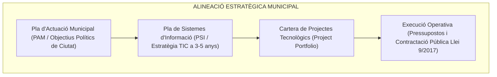

# Tema 68. La planificació estratègica dels sistemes d'informació i comunicació. Elaboració del Pla de Sistemes d'Informació (PSI)

> **Fonts i marcs de referència:** Llei 40/2015 de Règim Jurídic ([`CORPUS/40_2015.pdf`](file:///home/oriol/Projectes/OPOS/CORPUS/40_2015.pdf) - Art. 156 Transformació digital de les administracions públiques), Esquema Nacional d'Interoperabilitat ([`CORPUS/ENI.pdf`](file:///home/oriol/Projectes/OPOS/CORPUS/ENI.pdf)), metodologia **MÈTRICA Versió 3 (Planificació de Sistemes d'Informació - PSI)** i marcs de governança estratègica **COBIT 2019** i **TOGAF**.

---

## 1. Concepte i Objectius del Pla de Sistemes d'Informació (PSI)

El **Pla de Sistemes d'Informació (PSI)** és el document estratègic director que defineix l'estratègia tecnològica d'un ajuntament per a un horitzó temporal de **3 a 5 anys**, alineant les inversions en sistemes, aplicacions i comunicacions amb els objectius de govern del **Pla d'Actuació Municipal (PAM)**:

---

## 2. Fases Metodològiques d'Elaboració del PSI (MÈTRICA Versió 3)

La metodologia pública de referència **MÈTRICA Versió 3** estructura l'elaboració del Pla de Sistemes en les següents fases seqüencials:

### 2.1. Fase 1: Anàlisi de la Situació Actual (*As-Is*) i Diagnosi
- Recopilació de la informació dels departaments municipals (Urbanisme, Serveis Socials, Recursos Humans, Hisenda).
- **Inventari d'Actius TIC:** Catàleg d'aplicacions existents, estat dels servidors al CPD, arquitectura de xarxes, llicenciament i nivell de compliment de l'ENS ([`CORPUS/ENS_2022.pdf`](file:///home/oriol/Projectes/OPOS/CORPUS/ENS_2022.pdf)) i de l'ENI ([`CORPUS/ENI.pdf`](file:///home/oriol/Projectes/OPOS/CORPUS/ENI.pdf)).
- **Anàlisi DAFO TIC:** Debilitats (ex. aplicacions obsoletes), Amenaces (ciberatacs), Fortaleses (alta competència del personal) i Oportunitats (fons Next Generation UE / digitalització).

---

### 2.2. Fase 2: Definició de l'Arquitectura Objectiu (*To-Be*)
- **Arquitectura d'Informació:** Model unificat de dades corporatives per evitar duplicats (ciutadà únic / padró únic).
- **Arquitectura d'Aplicacions:** Modernització cap a serveis web, microserveis, integració amb serveis del Consorci AOC (Via Oberta, e-TRAM) i tramitació electrònica sense papers.
- **Arquitectura Tecnològica:** Migració d'infraestructures cap a models híbrids o Cloud (IaaS/PaaS/SaaS).

---

### 2.3. Fase 3: Anàlisi de Bretxa (*Gap Analysis*) i Cartera de Projectes
- Es comparen la situació actual (*As-Is*) i la desitjada (*To-Be*) per determinar les necessitats de canvi.
- **Priorització de Projectes:** Avaluació mitjançant matrius d'**Impacte Ciutadà vs. Complexitat/Cost**, establint projectes immediats (*Quick Wins*), projectes estratègics i projectes secundaris.
- **Pla Econòmic i Cronograma:** Estimació pressupostària plurianual i pla de contractacions públiques d'acord amb la Llei 9/2017 ([`CORPUS/Contractes_2017.pdf`](file:///home/oriol/Projectes/OPOS/CORPUS/Contractes_2017.pdf)).

---

## 3. Governança, Seguiment i Indicadors (Quadre de Comandament)

Per garantir que el pla no quedi en paper mullat, s'estableix un model de governança basat en **COBIT 2019**:
- **Comitè de Direcció TIC (*Steering Committee*):** Format per Alcaldia/Gerència, la Secretaria General, la Intervenció i el Director de Sistemes d'Informació per aprovar pressupostos i prioritzar iniciatives.
- **Quadre de Comandament Integral (CMI / *Balanced Scorecard*):**
  - Indicadors de progrés de projectes (% d'execució i desviació pressupostària).
  - Indicadors de valor públic (% de tràmits iniciats per Seu Electrònica vs. presencial).
  - Indicadors d'eficiència (temps mitjà de tramitació d'un expedient).

---

## 4. Quadre Resum i Preguntes Típiques d'Examen Tipus Test

| Pregunta / Concepte Clau | Resposta Correcta / Trampa Freqüent |
| :--- | :--- |
| **Quin és l'objectiu principal d'un Pla de Sistemes d'Informació (PSI)?** | **Alinear l'estratègia i inversions TIC amb els objectius estratègics de l'organització municipal (PAM)**. |
| **Quin és l'horitzó temporal habitual d'un PSI a l'administració local?** | Entre **3 i 5 anys** (coincident amb la planificació estratègica de mandat). |
| **Quina és la metodologia pública espanyola estàndard per a plans de sistemes?** | **MÈTRICA Versió 3 (procés PSI)** del Ministeri competent en Administració Pública. |
| **Què és una anàlisi de bretxa (*Gap Analysis*)?** | La comparació formal entre la **situació actual (*As-Is*) i la situació objectiu (*To-Be*)** per definir els projectes a executar. |
| **Quina funció té el Comitè de Direcció TIC (*Steering Committee*)?** | Òrgan de màxim nivell responsable de **prioritzar projectes, aprovar inversions i validar l'alineació estratègica**. |
