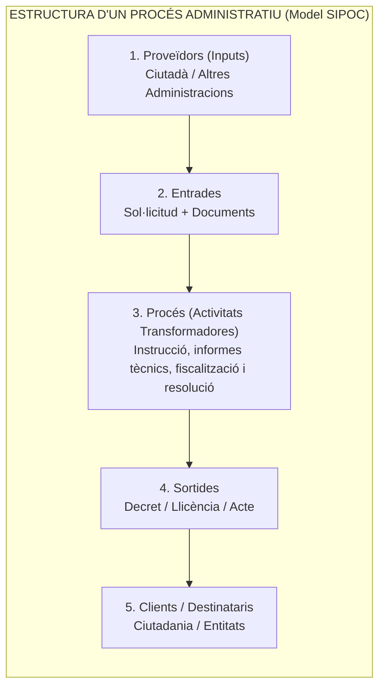
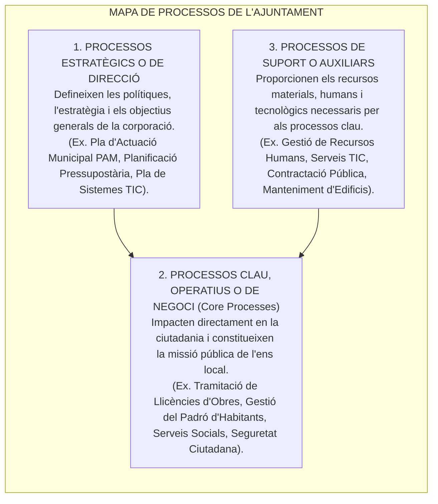
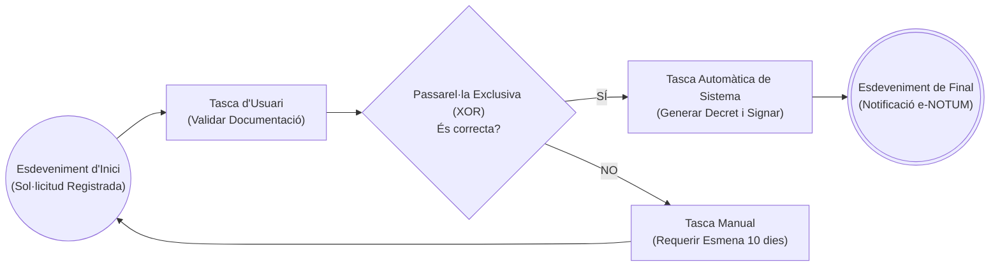
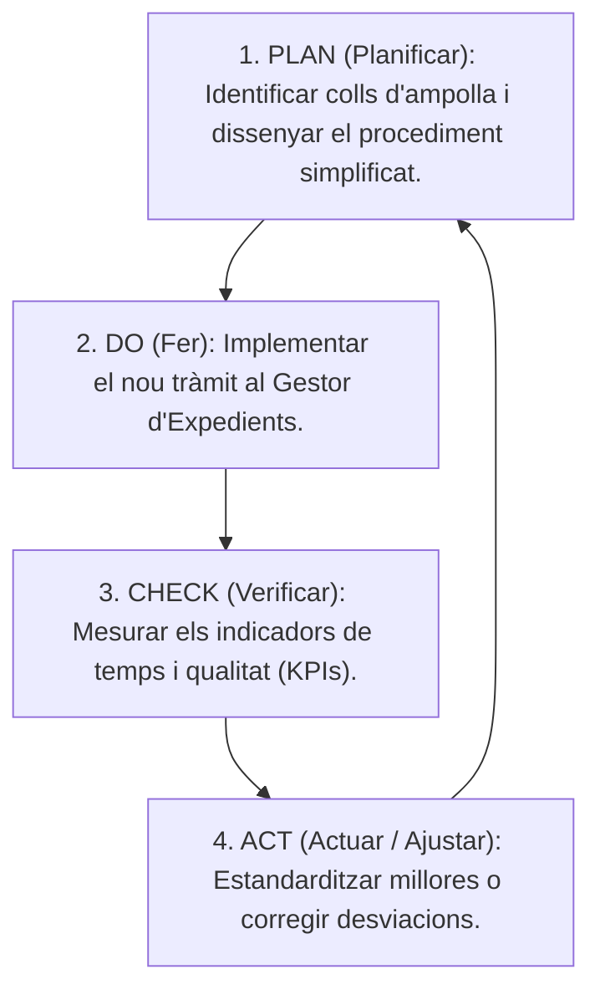

# Tema 69. La gestió basada en processos: definició, tipologia, mapa de processos, modelatge BPMN 2.0, seguiment i indicadors (KPIs)

> **Fonts i marcs de referència:** Llei 39/2015 del Procediment Administratiu Comú ([`CORPUS/39_2015.pdf`](file:///home/oriol/Projectes/OPOS/CORPUS/39_2015.pdf) - Simplificació administrativa i tràmits electrònics), Llei 40/2015 ([`CORPUS/40_2015.pdf`](file:///home/oriol/Projectes/OPOS/CORPUS/40_2015.pdf)), estàndard internacional **ISO 9001:2015** (Sistemes de Gestió de la Qualitat) i especificació de modelatge **BPMN 2.0 (ISO/IEC 19510)**.

---

## 1. Concepte de Gestió Basada en Processos (BPM)

La **Gestió per Processos (*Business Process Management - BPM*)** és un model de gestió organitzativa que substitueix la visió tradicional departamental fragmentada (*sitges funcionals*) per una **visió horitzontal i transversal**, centrada a aportar valor i serveis eficients a la ciutadania:

---

## 2. Tipologia de Processos en l'Administració Local

D'acord amb la norma internacional **ISO 9001:2015**, els processos d'un ajuntament es classifiquen en tres grans categories:

---

## 3. Identificació i Documentació: La Fitxa de Procés i el Modelatge BPMN 2.0

Per a cada procés municipal s'elabora una **Fitxa de Procés** que en defineix el responsable (*Process Owner*), objectius, límits inicials/finals, procediments associats i indicadors de control.

### 3.1. L'Estàndard de Modelatge BPMN 2.0 (ISO/IEC 19510)
Per dissenyar gràficament els fluxos de tramitació s'utilitza la notació **BPMN 2.0**:

- **Elements Gràfics Fonamentals de BPMN 2.0:**
  - **Esdeveniments (*Events* - Cercles):** Inici, intermedi o fi del procés.
  - **Activitats (*Tasks / Subprocesses* - Rectangles arrodonits):** Tasques manuals, d'usuari o de servei automàtic.
  - **Passarel·les de Decisió (*Gateways* - Rombes):** Exclusives (XOR - tria un sol camí), Paral·leles (AND - bifurca en múltiples tasques simultànies) o Inclusives (OR).
  - **Carrils (*Pools & Swimlanes*):** Representen els departaments o rols responsables (ex. Carril Ciutadà, Carril Administratiu OAC, Carril Tècnic d'Urbanisme).

---

## 4. Seguiment, Mesura i Millora Contínua (Cicle PDCA i KPIs)

La millora dels processos municipals segueix el **Cicle de Deming (PDCA)**:

### 4.1. Indicadors Clau de Rendiment (KPIs):
1. **Eficàcia:** Percentatge d'expedients resolts dins del termini legal establert per la Llei 39/2015 ($\text{Eficàcia} = \frac{\text{Expedients en termini}}{\text{Total resolts}} \times 100$).
2. **Eficiència:** Cost mitjà per tràmit realitzat o nombre d'hores dedicades per expedient.
3. **Qualitat i Satisfacció:** Percentatge d'errors o requeriments d'esmena i valoració ciutadana a les enquestes de l'OAC.
4. **Automatització (RPA):** Grau d'ús de mecanismes d'automatització robòtica de processos (RPA) per a tasques repetitives (com el trasllat automàtic de dades tributàries).

---

## 5. Quadre Resum i Preguntes Típiques d'Examen Tipus Test

| Pregunta / Concepte Clau | Resposta Correcta / Trampa Freqüent |
| :--- | :--- |
| **Quina diferència hi ha entre un procés clau i un procés de suport?** | El **procés clau té contacte directe amb la ciutadania** i genera valor públic; el **procés de suport proporciona recursos interns** (ex. TIC o RRHH). |
| **Quin estàndard internacional defineix la notació gràfica de processos BPMN 2.0?** | La norma **ISO/IEC 19510 (BPMN 2.0)**. |
| **Què representa una passarel·la exclusiva (XOR) en un diagrama BPMN?** | Un punt de decisió on el flux continua per **un sol camí possible dels disponibles**. |
| **Quines són les 4 fases del cicle de millora contínua de Deming (PDCA)?** | **Planificar (Plan), Fer (Do), Verificar (Check) i Actuar (Act)**. |
| **Com es mesura l'eficàcia d'un procés administratiu?** | Mitjançant el **grau de compliment dels objectius i terminis legals previstos**, independentment dels recursos utilitzats. |
